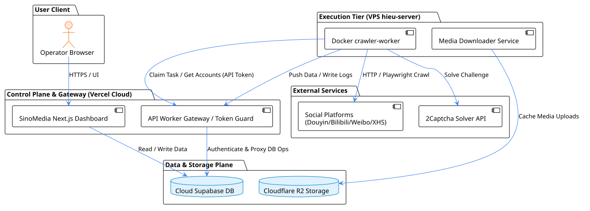
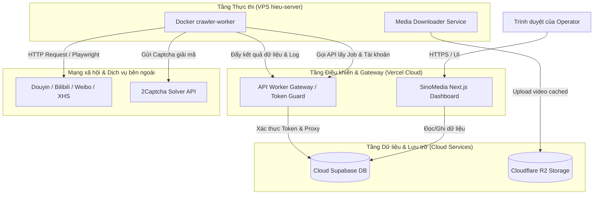
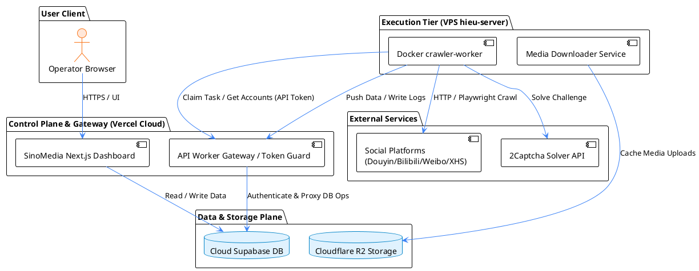

# Tài liệu Kiến trúc Hệ thống SinoMedia (System Architecture)

Tài liệu này mô tả sơ đồ kiến trúc tổng quan và các thành phần cốt lõi của hệ thống SinoMedia — nền tảng quản lý crawler mạng xã hội và vận hành Google Play Release Ops. 

Hệ thống được thiết kế theo mô hình phân tách hoàn toàn giữa **Tầng Điều khiển (Control Plane)** và **Tầng Thực thi (Execution Tier)** để đảm bảo tính bảo mật và khả năng mở rộng.

---

## 1. Sơ đồ Kiến trúc Tổng quan (High-Level System Architecture)

---

### Bản vẽ Mermaid (Đã sửa cú pháp)

---

### Bản vẽ PlantUML

---

## 2. Các Thành phần Hệ thống (Core Components)

Hệ thống SinoMedia được cấu thành từ 4 khối chính:

### A. Dashboard & API Gateway (Vercel Cloud)
Được triển khai trên nền tảng Vercel (`https://creative.lutech.vn`), đóng vai trò là bộ não điều phối của toàn hệ thống.
* **Dashboard (Next.js App Router)**: Cung cấp giao diện quản trị cho Operator để theo dõi trạng thái Crawler, quản lý tài khoản mạng xã hội, quản lý proxy, phân quyền thành viên và giám sát các chỉ số tăng trưởng.
* **API Gateway (Token Guard)**: Cổng bảo mật trung gian tiếp nhận các kết nối từ xa của Worker. Nó thực hiện xác thực API Token (bằng thuật toán băm SHA-256) và proxy các câu lệnh đọc/ghi vào cơ sở dữ liệu để đảm bảo an toàn cho tầng lưu trữ.

### B. Crawler Worker (VPS hieu-server / Docker)
Triển khai trên VPS `hieu-server` dưới dạng Docker Container (`crawler-worker`). Hoạt động hoàn toàn tự động ở chế độ chạy ngầm (headless).
* **Queue Poller**: Chạy vòng lặp tuần hoàn để thăm dò và nhận job từ API Gateway.
* **Crawling Engines**: Tích hợp các bộ thư viện HTTP Client chuyên dụng và Playwright Chromium để thu thập thông tin bài viết, tác giả và bình luận từ các mạng xã hội.
* **Media Downloader**: Tải stream video thô về VPS, kiểm tra định dạng magic bytes và đẩy lên kho lưu trữ đám mây.

### C. Cloud Database & Storage (Supabase & R2)
* **Supabase Cloud**: Lưu trữ toàn bộ dữ liệu quan hệ, hàng đợi công việc, thông tin cấu hình và log hệ thống. Mọi quyền truy cập trực tiếp từ IP bên ngoài đều bị chặn qua chính sách RLS.
* **Cloudflare R2**: Lưu trữ tệp tin đa phương tiện (video/hình ảnh) thu thập được từ các chiến dịch nhằm phục vụ mục đích lưu trữ lâu dài.

### D. Automation Test (Playwright)
Bộ test suite độc lập giúp chạy smoke test tự động và kiểm thử hồi quy trước mỗi lần triển khai hoặc cập nhật hệ thống.

---

## 3. Triết lý Thiết kế Hệ thống (Design Philosophy)

* **Bảo mật tuyệt đối (Zero Direct DB Access)**: Các Worker trên VPS không bao giờ được phép kết nối trực tiếp với cơ sở dữ liệu Supabase. Mọi truy vấn bắt buộc phải đi qua cổng bảo mật API Gateway trên Vercel.
* **Decoupling (Phân tách độc lập)**: Dashboard và Crawler chạy trên các máy chủ vật lý hoàn toàn khác nhau. Khi một bên gặp sự cố (ví dụ VPS bị OOM), hệ thống Dashboard vẫn hoạt động bình thường để ghi nhận trạng thái lỗi.
* **Tự động hóa triển khai (CI/CD)**: Code mới cập nhật lên GitHub sẽ kích hoạt GitHub Actions tự động build ảnh Docker đẩy lên Container Registry (GHCR), dịch vụ Watchtower trên VPS sẽ tự động phát hiện và cập nhật container mà không cần thao tác thủ công.
