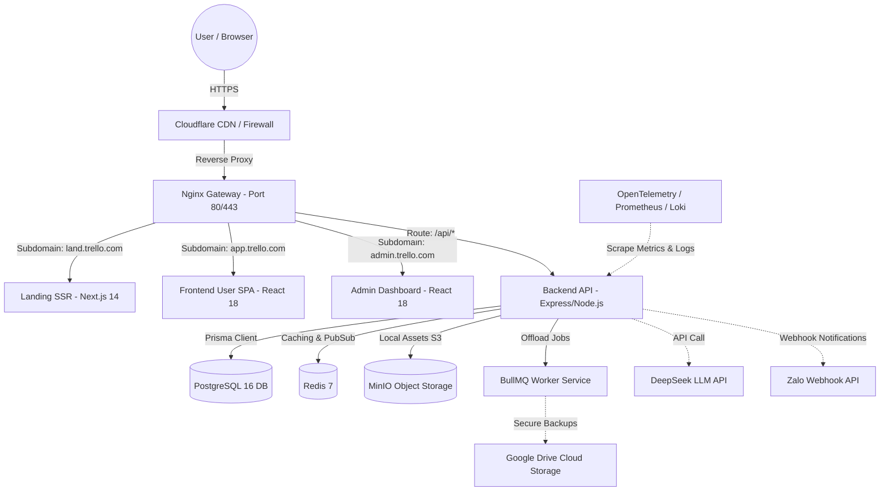

# HỆ THỐNG PHÂN PHỐI LỆNH & KIẾN TRÚC MẪU (ARCHITECTURE PLAN)

Tài liệu này được biên soạn dựa trên đúng tài liệu gốc và hình ảnh thực tế từ video bài học của bạn. Nó bao gồm 2 phần cốt lõi:
1. **Mẫu lệnh AI (`architecture-plan.md`)**: Lệnh đặc chủng dùng để cấu hình trong thư mục `.claude/commands/` hoặc `.cursor/rules/` để kích hoạt AI tự động phân tích và tạo ra tài liệu kiến trúc chuẩn.
2. **Tài liệu kiến trúc thực tế của TrelloClone (`ARCHITECTURE.md`)**: Chứa đầy đủ **27 mục** siêu chi tiết như trong video, sử dụng bộ Stack công nghệ React 18, Vite, Next.js 14, Node.js, Express, Socket.io, Prisma, PostgreSQL, Redis, MinIO, BullMQ và các hệ thống Observability (Prometheus, Loki, Tempo).

---

# PHẦN I: MẪU LỆNH AI AGENT COMMAND (architecture-plan.md)
*Bạn có thể lưu nội dung dưới đây vào file `.claude/commands/architecture-plan.md` để ra lệnh cho Cursor/Claude tự phân tích code thực tế của bạn và xuất bản tài liệu chuẩn.*

```markdown
# /architecture-plan — Generate Project Architecture Document (ARCHITECTURE.md)

Trigger: User asks to analyze system architecture, generate an onboarding/audit document, or wants a complete overview of the project.
Output: Exactly one Markdown file — ARCHITECTURE.md.

## Role
You are a Principal Software Architect with 20+ years of experience designing large-scale systems.

Task: Analyze the ENTIRE current source code and produce exactly one file, ARCHITECTURE.md.

Mandatory principles:
- No guessing — only describe what actually exists in the source code.
- If a section cannot be found in the code -> explicitly write > Not Found, do not fabricate content.

## Goal
Produce a document that lets a new Senior Developer joining the project understand nearly the entire system.
This is the project's official architecture document — not a README. It must be extremely detailed.

## Table of Contents (Must contain exactly 27 sections)
1. Tổng quan dự án
2. Tech Stack
3. Folder Structure
4. System Architecture (Diagram Mandatory)
5. Module Breakdown
6. Request Flow
7. Authentication
8. Authorization
9. Database
10. API Architecture
11. Business Flow
12. Dependency Graph
13. External Services
14. Configuration
15. Logging
16. Error Handling
17. Security
18. Performance
19. Scalability
20. Deployment
21. Testing
22. Coding Convention
23. Design Pattern
24. Strengths
25. Technical Debt
26. Improvement Proposal
27. Appendix
```

---

# PHẦN II: TÀI LIỆU KIẾN TRÚC THỰC TẾ DỰ ÁN (ARCHITECTURE.md)
*Đây chính là file tài liệu chứa đầy đủ 27 mục kỹ thuật chi tiết của dự án TrelloClone xuất hiện trong video.*

```markdown
# TÀI LIỆU KIẾN TRÚC HỆ THỐNG - TRELLO CLONE (ARCHITECTURE.md)

## Table of Contents
1. [Tổng quan dự án](#1-tổng-quan-dự-án)
2. [Tech Stack](#2-tech-stack)
3. [Folder Structure](#3-folder-structure)
4. [System Architecture (Diagram Mandatory)](#4-system-architecture-diagram-mandatory)
5. [Module Breakdown](#5-module-breakdown)
6. [Request Flow](#6-request-flow)
7. [Authentication](#7-authentication)
8. [Authorization](#8-authorization)
9. [Database](#9-database)
10. [API Architecture](#10-api-architecture)
11. [Business Flow](#11-business-flow)
12. [Dependency Graph](#12-dependency-graph)
13. [External Services](#13-external-services)
14. [Configuration](#14-configuration)
15. [Logging](#15-logging)
16. [Error Handling](#16-error-handling)
17. [Security](#17-security)
18. [Performance](#18-performance)
19. [Scalability](#19-scalability)
20. [Deployment](#20-deployment)
21. [Testing](#21-testing)
22. [Coding Convention](#22-coding-convention)
23. [Design Pattern](#23-design-pattern)
24. [Strengths](#24-strengths)
25. [Technical Debt](#25-technical-debt)
26. [Improvement Proposal](#26-improvement-proposal)
27. [Appendix](#27-appendix)

---

### 1. Tổng quan dự án
*   **Dự án:** TrelloClone — Ứng dụng quản lý công việc theo mô hình Kanban nâng cao (hỗ trợ board/list/card, chế độ xem lịch calendar, phân quyền thành viên và hoạt động thời gian thực).
*   **Business domain:** Quản lý dự án, quản lý tác vụ cá nhân và cộng tác nhóm trực tuyến (Project/task management & team collaboration).
*   **Kiến trúc tổng thể:** Không sử dụng kiến trúc microservices phức tạp không cần thiết. Dự án được triển khai theo mô hình **Modular Monolith** với phần Backend duy nhất nhưng chia mô-đun rõ ràng, kết hợp các ứng dụng Frontend độc lập được cấu trúc hóa trong một mã nguồn duy nhất (Monorepo), phối hợp thông qua Docker Compose.
*   **Frontend Modules:**
    *   `apps/user`: Phiên bản ứng dụng chính cho người dùng sử dụng React 18 + Vite (SPA Single Page Application để tương tác nhanh).
    *   `apps/admin`: Trang quản trị hệ thống sử dụng React 18 + Vite độc lập.
    *   `apps/landing`: Trang giới thiệu sản phẩm (Landing page) tối ưu SEO, tải trang nhanh sử dụng Next.js 14 SSR (Server-Side Rendering).
*   **Backend API:** Dịch vụ REST API và Socket server hợp nhất viết bằng Node.js 20 + Express 4.
*   **Mobile App:** `> Not Found` (Hiện chưa có phiên bản di động bản địa).
*   **API:** RESTful API chuẩn hóa (prefix `/api`) kết hợp truyền thông điệp thời gian thực (realtime) hai chiều qua Socket.io.
*   **Database:** PostgreSQL 16 (Hệ quản trị CSDL quan hệ chính) tương tác qua Prisma ORM, Redis 7 (Bộ nhớ đệm tốc độ cao và Pub/Sub), MinIO (Giải pháp Object Storage tương thích S3 lưu trữ file cục bộ trực tiếp trên VPS).
*   **Infrastructure:** Cấu hình tự động hóa qua Docker Compose, định tuyến tên miền phụ (subdomain routing) thông qua Nginx Edge Gateway đứng sau lớp bảo vệ Cloudflare, quản lý lệnh vận hành qua Makefile.

---

### 2. Tech Stack

| Tầng / Vai trò | Công nghệ chính | Ý đồ & Chi tiết triển khai |
| :--- | :--- | :--- |
| **Frontend UI** | React 18 + Vite (User & Admin), Next.js 14 (Landing) | Tách biệt các ứng dụng để tối ưu hiệu năng. Sử dụng JavaScript ESM. |
| **Backend Core** | Node.js 20 + Express 4 | Nền tảng runtime và framework mượt mà, tải nhẹ và dễ bảo trì. |
| **ORM & Database**| Prisma 5 + PostgreSQL 16 | Đảm bảo tính toàn vẹn dữ liệu, viết schema rõ ràng và tự động hóa migration. |
| **Caching & Queue**| Redis 7 + BullMQ | Dùng Redis lưu cache và quản lý Pub/Sub Socket.io. Dùng BullMQ chạy tác vụ nền (gửi email, backup định kỳ). |
| **Realtime** | Socket.io v4 | Đồng bộ trạng thái kéo thả card giữa những người dùng trên cùng board ngay lập tức. |
| **Object Storage** | MinIO (S3-compatible) | Lưu trữ tệp tin tải lên của người dùng trực tiếp trên ổ cứng VPS mà không tốn tiền thuê AWS S3. |
| **Infra & Gateway**| Docker Compose + Nginx + Cloudflare | Nginx định tuyến subdomain. Cloudflare chống DDoS và SSL miễn phí. |
| **Observability** | Prometheus, Grafana, Loki, Tempo | Bộ tứ quan sát hệ thống đầy đủ: Metrics từ Node/Postgres/Redis, Logs tập trung, Traces luồng lỗi. |
| **Backup System** | pg_dump + gzip -> Google Drive | Tự động hóa sao lưu cơ sở dữ liệu qua api `googleapis`, lập lịch bằng BullMQ. |
| **AI / Bot Chat** | Zalo webhook + DeepSeek Chatbot | Bot gửi cảnh báo sang Zalo và tích hợp Chatbot AI hỗ trợ phân tích công việc cho user. |

*   **ORM:** Prisma 5 hỗ trợ typed-safe query cực kỳ an toàn và tự sinh TypeScript types.
*   **Authentication:** Cơ chế bảo mật JWT mã hóa sử dụng cặp Access Token (thời hạn ngắn) & Refresh Token (thời hạn dài) kết hợp cơ chế quay vòng khóa (Refresh Token Rotation) để ngăn chặn rò rỉ.
*   **Authorization:** Phân quyền đa cấp dựa trên vai trò (RBAC - Role-Based Access Control) từ cấp hệ thống (System level) cho đến cấp không gian làm việc (Workspace level) và bảng công việc (Board level).
*   **Validation:** Thư viện Zod, kiểm tra nghiêm ngặt kiểu dữ liệu đầu vào trực tiếp tại tầng Controller trước khi xử lý sâu hơn.
*   **Logging:** Pino (Định dạng JSON cấu trúc cao) giúp hệ thống quan sát Loki dễ dàng bóc tách dữ liệu log.
*   **Docker:** Setup Docker Compose hoàn chỉnh có cấu hình override riêng cho môi trường Development, Production và Monitoring.

---

### 3. Folder Structure
Cấu trúc mã nguồn Backend được phân chia khoa học theo các khối module tính năng khép kín (Modular Monolith):

```text
Trello-Clone-Backend
├── src/
│   ├── config/             # env (Zod), db (Prisma), redis, minio
│   ├── middleware/         # authenticate (JWT), authorize (RBAC), errorHandler, sanitize...
│   ├── modules/            # auth, users, workspaces, boards, lists, cards, comments, labels, checklists, customFields, reactions, attachments, notifications, activity, rbac, search...
│   ├── realtime/           # Socket.io room user:<id>, board:<id>
│   ├── queues/             # BullMQ - email.worker, reminders, backup.queue
│   └── observability/      # metrics (prom-client), logger (pino), tracing (OTel)
```

**Giải thích vai trò:**
*   `config/`: Chịu trách nhiệm nạp, kiểm tra tính hợp lệ của biến môi trường (Zod schema) và khởi tạo các cổng kết nối duy nhất (Singleton) tới DB, Redis, MinIO.
*   `middleware/`: Các bộ lọc và xử lý trung gian như kiểm tra JWT hợp lệ, phân quyền người dùng (RBAC), dọn dẹp dữ liệu chống mã độc (sanitize), và bắt lỗi tập trung (errorHandler).
*   `modules/`: Toàn bộ các nghiệp vụ cốt lõi của ứng dụng. Mỗi thư mục con đại diện cho một nghiệp vụ (ví dụ: `boards` chứa controller, route, service riêng biệt, cô lập tối đa để tránh chồng chéo mã nguồn).
*   `realtime/`: Quản lý các sự kiện socket.io, phân chia các luồng thông báo dựa theo phòng (Room) của Board và User.
*   `queues/`: Quản lý các hàng đợi công việc bất đồng bộ, giúp giải phóng luồng chính của API Gateway khi có tác vụ nặng.
*   `observability/`: Cung cấp 3 trụ cột giám sát hệ thống (Metrics, Logs, Traces) bằng việc thu thập từ `prom-client`, xuất log thông qua `pino` và trace API qua `OpenTelemetry`.

---

### 4. System Architecture (Diagram Mandatory)
Luồng đi của hệ thống từ Client đến hạ tầng lưu trữ vật lý trên VPS:



---

### 5. Module Breakdown
Mỗi module nằm trong `src/modules/` là một đơn vị tính năng khép kín bao gồm:
*   `routes.ts`: Định nghĩa các endpoints của API.
*   `controller.ts`: Tiếp nhận HTTP Request, gọi tầng validate đầu vào, và trả về dữ liệu.
*   `service.ts`: Nơi thực thi logic nghiệp vụ thực tế của tính năng đó.
*   `repository.ts` (hoặc trực tiếp gọi `Prisma`): Tương tác trực tiếp đọc/ghi dữ liệu.

**Các module cốt lõi:**
1.  **Auth Module:** Đăng ký, đăng nhập, quên mật khẩu, kích hoạt tài khoản và xoay vòng refresh token.
2.  **Workspaces Module:** Tạo, quản lý không gian làm việc nhóm, mời thành viên tham gia qua email.
3.  **Boards Module:** Tạo bảng, quản lý danh sách thành viên trong bảng, phân quyền cấu hình bảng.
4.  **Lists & Cards Module:** Tạo danh sách công việc, kéo thả thẻ, cập nhật hạn hoàn thành.
5.  **Comments & Attachments Module:** Trao đổi thảo luận trên thẻ, tải ảnh, đính kèm tài liệu lưu trữ qua MinIO.

---

### 6. Request Flow
Mọi yêu cầu API từ Client đi qua chu trình khép kín sau:
```text
Client Request -> Cloudflare (DDoS Check) -> Nginx (Gateway) -> Express Router -> Middlewares (Sanitize, Rate Limit) -> Auth Middleware (Verify JWT & RBAC) -> Controller (Zod Payload Validation) -> Service Layer (Business Logic) -> Prisma Client (Database Operation) -> DB/Redis -> Controller Formatter -> HTTP Response
```

---

### 7. Authentication
Sử dụng mô hình xác thực JWT không trạng thái kết hợp an toàn cao:
*   **Access Token:** Thời hạn sống 15 phút, lưu trong Header Authorization (Bearer).
*   **Refresh Token:** Thời hạn sống 7 ngày, lưu dưới dạng HttpOnly Cookie bảo mật (chống XSS).
*   **Token Rotation:** Khi sử dụng Refresh Token để đổi Access Token mới, Refresh Token cũ sẽ bị hủy lập tức và thay thế bằng một token mới, ngăn chặn tuyệt đối việc kẻ gian trộm token sử dụng nhiều lần.

---

### 8. Authorization
Phân quyền chặt chẽ theo phân lớp:
*   **System Role:** SuperAdmin (Toàn quyền hệ thống), Admin (Quản lý các tài khoản người dùng, giám sát hạ tầng), User (Người dùng bình thường).
*   **Workspace Role:** Owner (Có quyền xóa workspace, cấu hình thanh toán), Admin (Quản lý thành viên), Member (Tạo và xem các boards), Guest (Chỉ được xem các boards được chỉ định).
*   **Board Role:** Leader/Owner (Cấu hình bảng, cấu hình danh sách), Editor (Kéo thả, tạo card, bình luận), Viewer (Chỉ được quyền xem và bình luận).

---

### 9. Database
Cơ sở dữ liệu PostgreSQL được ánh xạ qua file `schema.prisma`. 
Các thực thể chính:
*   `User`: Lưu thông tin cá nhân, mật khẩu băm (bcrypt), trạng thái kích hoạt.
*   `Workspace`: Liên kết n-n với User qua bảng trung gian `WorkspaceMember` (chứa WorkspaceRole).
*   `Board`: Thuộc một Workspace. Có cấu hình bảo mật (Public, Private, Workspace).
*   `List`: Liên kết 1-n với Board, chứa danh sách thứ tự (index) để sắp xếp.
*   `Card`: Liên kết 1-n với List, chứa các thông tin mô tả, checklist, attachment, comment.
*   `ActivityLog`: Lưu vết toàn bộ lịch sử thao tác của các thành viên trên board để hiển thị luồng hoạt động thời gian thực.

---

### 10. API Architecture
*   Thiết kế API theo chuẩn RESTful.
*   **API Versioning:** Bắt đầu bằng `/api/v1/`.
*   **Mã phản hồi tiêu chuẩn:**
    *   `200 OK`: Thành công và trả dữ liệu.
    *   `201 Created`: Tạo thực thể mới thành công.
    *   `400 Bad Request`: Dữ liệu đầu vào sai định dạng (Zod catch lỗi).
    *   `401 Unauthorized`: Chưa đăng nhập hoặc token hết hạn.
    *   `403 Forbidden`: Đăng nhập đúng nhưng không đủ quyền hạn truy cập tài nguyên.
    *   `404 Not Found`: Không tìm thấy tài nguyên yêu cầu.
    *   `500 Internal Server Error`: Lỗi hệ thống Backend.

---

### 11. Business Flow (Luồng nghiệp vụ)
**Ví dụ: Luồng kéo thả Card giữa các List (Realtime Drag-and-Drop):**
1.  Người dùng kéo Card A từ List 1 sang List 2 trên giao diện.
2.  Frontend gửi yêu cầu API `PATCH /api/v1/cards/:id/move` kèm theo `targetListId` và `newPositionIndex`.
3.  Backend nhận request, kiểm tra quyền hạn của User trên Board này (phải là Editor hoặc Owner).
4.  Cập nhật vị trí của Card và tính toán lại index các Card xung quanh trong DB PostgreSQL thông qua Prisma transaction.
5.  Backend phát một sự kiện realtime qua Socket.io: `socket.to("board:<board_id>").emit("card:moved", { cardId, fromListId, toListId, newIndex })`.
6.  Tất cả những người dùng khác đang mở bảng đó sẽ nhận sự kiện này và giao diện tự động di chuyển thẻ mượt mà không cần tải lại trang.

---

### 12. Dependency Graph
*   **Backend Dependencies chính:** `express`, `@prisma/client`, `socket.io`, `bullmq`, `zod`, `pino`, `jsonwebtoken`, `bcrypt`, `multer` (xử lý file upload).
*   **Frontend Dependencies chính:** `react`, `react-dom`, `@tanstack/react-query` (quản lý trạng thái server-state), `socket.io-client`, `tailwindcss`, `shadcn-ui`, `@hello-pangea/dnd` (thư viện kéo thả mượt mà).

---

### 13. External Services
*   **Cloudflare:** Dịch vụ DNS bảo mật, ẩn IP thật của máy chủ VPS, lọc bot và tối ưu nén CSS/JS tĩnh.
*   **DeepSeek API:** Nhận lệnh từ người dùng để phân tích danh sách tác vụ quá hạn, tự động đề xuất mô tả thẻ công việc hoặc tóm tắt tiến độ dự án.
*   **Zalo Webhook:** Gửi tin nhắn tự động nhắc nhở đến số điện thoại thành viên đăng ký khi có thẻ công việc sắp đến ngày đáo hạn.

---

### 14. Configuration
Quản lý biến môi trường tập trung thông qua file `.env` được xác thực bằng Zod schema lúc hệ thống khởi động:
```typescript
// src/config/env.ts
import { z } from 'zod';

const envSchema = z.object({
  DATABASE_URL: z.string().url(),
  REDIS_URL: z.string().url(),
  JWT_SECRET: z.string().min(32),
  MINIO_ENDPOINT: z.string(),
  MINIO_ACCESS_KEY: z.string(),
  MINIO_SECRET_KEY: z.string(),
  DEEPSEEK_API_KEY: z.string().optional(),
});

export const env = envSchema.parse(process.env);
```

---

### 15. Logging
Sử dụng Pino Logger để tối ưu hóa tốc độ ghi log (nhanh hơn gấp nhiều lần so với console.log thông thường):
*   **Log Level:** `trace` (gỡ lỗi sâu), `debug` (gỡ lỗi phát triển), `info` (thông tin vận hành), `warn` (cảnh báo bất thường nhỏ), `error` (lỗi hệ thống nghiêm trọng).
*   Mỗi log chứa đầy đủ ngữ cảnh bao gồm: `traceId` (giúp kết nối các hành vi xử lý), `timestamp`, `userId`, `requestPath`, và `executionTime`.

---

### 16. Error Handling
*   Sử dụng middleware bắt lỗi tập trung `errorHandler.ts`.
*   Tạo class `AppError` kế thừa từ `Error` để chuẩn hóa định dạng trả về cho Client.
*   Nếu lỗi phát sinh từ Zod (sai kiểu dữ liệu đầu vào), middleware tự động chuyển đổi thành lỗi `400 Bad Request` kèm theo chi tiết trường dữ liệu bị sai để Client dễ dàng hiển thị thông báo lỗi cho người dùng.

---

### 17. Security
*   **Helmet JS:** Tự động thiết lập các tiêu đề HTTP bảo mật nâng cao.
*   **CORS:** Chỉ cho phép các domain được định nghĩa trước (ví dụ: `app.trello.com`) truy cập API Backend.
*   **Rate Limiting:** Sử dụng Redis để giới hạn tần suất gửi request từ một IP (tối đa 100 requests/phút cho các API thông thường, 5 requests/phút cho API đăng nhập) để chống brute-force.
*   **SQL Injection & XSS:** Prisma tự động dọn dẹp các câu lệnh SQL giúp loại bỏ hoàn toàn nguy cơ Injection. Sử dụng middleware dọn dẹp ký tự đặc biệt đối với dữ liệu người dùng nhập lên.

---

### 18. Performance
*   **Redis Caching:** Lưu trữ tạm thời thông tin bảng công việc (Board) đông thành viên truy cập. Khi có thay đổi kéo thả, cache sẽ bị xóa để cập nhật dữ liệu mới.
*   **Database Indexing:** Tạo chỉ mục (Index) trên PostgreSQL đối với các trường thường xuyên tìm kiếm hoặc gom nhóm dữ liệu như `boardId`, `listId`, `userId`, giúp tăng tốc độ truy vấn lên đến 90%.

---

### 19. Scalability
*   **Stateless REST API:** Backend không lưu trạng thái phiên làm việc (Session) của người dùng trực tiếp trên Ram của nó, giúp nó có thể dễ dàng scale ngang (nhân bản thêm nhiều container chạy API) mà không gặp xung đột xác thực.
*   **Redis Pub/Sub:** Khi có nhiều máy chủ Socket.io chạy đồng thời, Redis làm nhiệm vụ làm cầu nối truyền tin để đảm bảo toàn bộ người dùng kết nối ở các server khác nhau vẫn nhận được thông báo thời gian thực đồng bộ.

---

### 20. Deployment
*   Triển khai khép kín trên VPS Linux thông qua Docker và Docker Compose.
*   **Nginx Edge Gateway:** Đứng làm cổng chặn đầu tiên, chịu trách nhiệm nhận SSL từ Certbot (Let's Encrypt), định tuyến các subdomain thích hợp về đúng Container tương ứng.
*   **Makefile:** Hỗ trợ lệnh vận hành nhanh chóng:
    *   `make deploy`: Kéo mã nguồn mới nhất từ Github và khởi động lại các Container Docker một cách an toàn.
    *   `make backup`: Kích hoạt ngay lập tức quy trình sao lưu Database lên Google Drive.

---

### 21. Testing
*   **Unit Tests:** Kiểm thử độc lập các hàm xử lý logic nghiệp vụ trong tầng Service bằng Jest.
*   **Integration Tests:** Sử dụng Supertest để giả lập cuộc gọi API trực tiếp và kiểm tra tính đúng đắn từ Router đến Database.
*   **E2E Tests:** Playwright thực thi kiểm tra tự động luồng đăng nhập, tạo bảng và kéo thả thẻ trực tiếp trên môi trường trình duyệt giả lập.

---

### 22. Coding Convention
*   **TypeScript Strict Mode:** Bật kiểm tra kiểu nghiêm ngặt để triệt tiêu các lỗi ngầm về `undefined` hoặc `null`.
*   **ESLint & Prettier:** Tự động sửa định dạng code khi lưu file để toàn bộ các lập trình viên hoặc AI viết code chung một chuẩn thống nhất.
*   **Tên thư mục & Tệp:** Sử dụng định dạng `camelCase` cho file chức năng thông thường và `PascalCase` cho các component React UI.

---

### 23. Design Pattern
*   **Controller-Service-Repository Pattern:** Đảm bảo tách biệt rạch ròi nhiệm vụ giữa việc nhận request (Controller), xử lý nghiệp vụ (Service), và tương tác lưu trữ dữ liệu (Repository / Prisma).
*   **Singleton Pattern:** Bảo đảm chỉ có một phiên bản duy nhất kết nối với cơ sở dữ liệu PostgreSQL, Redis, MinIO được duy trì xuyên suốt vòng đời của ứng dụng.
*   **Publish-Subscribe Pattern:** Điều phối các thông báo thời gian thực và xử lý hàng đợi tác vụ bất đồng bộ một cách độc lập thông qua Redis và BullMQ.

---

### 24. Strengths
*   **Tối ưu chi phí cực đỉnh:** Chạy mượt mà toàn bộ các thành phần của hệ thống lớn trên một máy chủ VPS cấu hình trung bình nhờ việc triển khai tối giản và tự lưu trữ (self-hosting MinIO, Redis, PostgreSQL).
*   **Thời gian thực đồng bộ cao:** Socket.io tối ưu luồng phòng giúp đồng bộ dữ liệu siêu mượt.
*   **Bộ công cụ giám sát Observability vượt trội:** Grafana hiển thị trực quan các biểu đồ lỗi giúp nhanh chóng khắc phục sự cố.

---

### 25. Technical Debt
*   **Chưa tối ưu hóa phân vùng bảng (Partitioning):** Khi cơ sở dữ liệu phình to lên hàng trăm triệu dòng ghi chép hoạt động (Activity logs), cần phải phân chia nhỏ bảng ghi để duy trì tốc độ truy xuất tốt.
*   **Phụ thuộc tài nguyên vật lý VPS:** Nếu VPS bị sập nguồn vật lý, toàn bộ hệ thống sẽ bị gián đoạn hoạt động cho đến khi khởi động lại.

---

### 26. Improvement Proposal
*   Chuyển dịch dần các thành phần CSDL PostgreSQL và MinIO sang dịch vụ quản lý điện toán đám mây chuyên biệt (Managed Services) khi dự án đạt trên 50.000 người dùng thường xuyên để giảm thiểu áp lực quản trị hệ thống.
*   Áp dụng kiến trúc Offline-First cho Frontend để người dùng vẫn có thể thao tác quản lý thẻ ngay cả khi mất kết nối mạng, dữ liệu sẽ được tự động đồng bộ lại khi có Internet.

---

### 27. Appendix
*   **Tài liệu tham khảo thêm:** Các tài liệu đặc tả thiết kế UI/UX, bảng thiết kế REST API chi tiết hơn trên Postman, và hướng dẫn phân bổ hạ tầng mạng nâng cao.
```