# Release Ops — Architecture Document

> Scope: Tài liệu kiến trúc cho module **Release Ops** trong hệ thống SinoMedia. Được viết dựa trên source code thực tế — không fabrication.

## Table of Contents

- [1. Project Overview](#1-project-overview)
- [2. Tech Stack](#2-tech-stack)
- [3. Folder Structure](#3-folder-structure)
- [4. System Architecture](#4-system-architecture)
- [5. Module Breakdown](#5-module-breakdown)
- [6. Request Flow](#6-request-flow)
- [7. Authentication](#7-authentication)
- [8. Authorization](#8-authorization)
- [9. Database](#9-database)
- [10. API Architecture](#10-api-architecture)
- [11. Business Flow](#11-business-flow)
- [12. Dependency Graph](#12-dependency-graph)
- [13. External Services](#13-external-services)
- [14. Configuration](#14-configuration)
- [15. Logging](#15-logging)
- [16. Error Handling](#16-error-handling)
- [17. Security](#17-security)
- [18. Performance](#18-performance)
- [19. Scalability](#19-scalability)
- [20. Deployment](#20-deployment)
- [21. Testing](#21-testing)
- [22. Coding Convention](#22-coding-convention)
- [23. Design Pattern](#23-design-pattern)
- [24. Strengths](#24-strengths)
- [25. Technical Debt](#25-technical-debt)
- [26. Improvement Proposal](#26-improvement-proposal)
- [27. Appendix](#27-appendix)

---

## 1. Project Overview

**Business domain:** Google Play Store release lifecycle management — upload AAB, staged rollout, promote/halt, batch operations, ASO analytics, Target SDK compliance, and worker fleet orchestration.

**Overall architecture:** Modular monolith embedded inside the SinoMedia Next.js 16 dashboard.

| Layer | Technology |
| --- | --- |
| Frontend | Next.js 16 App Router, React 19, `use client` pages |
| Backend | Next.js Server Actions + Service Layer + Repository Layer |
| Database | Supabase (PostgreSQL) — 10 `release_ops_*` tables |
| Worker Runtime | Windows Server 2012 VPS fleet (outbound polling, not yet implemented in SinoMedia) |
| External | Google Play Publishing API, Reporting GCS |
| Infrastructure | Vercel (dashboard hosting), Supabase (DB + Auth + Realtime) |

**Current state:**
- Dashboard: 9 pages, all using real Supabase data
- Data layer: 9 repositories, 1 service file (877 lines), 21 server actions
- Worker Gateway API: Not yet implemented
- Worker Runtime: External project (`release-ops`), not integrated into SinoMedia

---

## 2. Tech Stack

| Category | Technology | Evidence |
| --- | --- | --- |
| Language | TypeScript | All `.ts` / `.tsx` files |
| Framework | Next.js 16 (App Router) | `dashboard/package.json` |
| UI Library | React 19 | `dashboard/package.json` |
| Icons | Lucide React | Imports throughout pages |
| Styling | Tailwind CSS + CSS Variables | `className` utility classes |
| Authentication | Supabase Auth | `lib/supabase/auth-helper.ts` — `requireAdmin()` |
| Authorization | Role-based — Admin only | `requireAdmin()` guard on every action |
| CSRF Protection | Custom `verifyCSRF()` | `lib/csrf.ts` — verified on all write actions |
| Database | Supabase (PostgreSQL) | `createClientServer()` + `createServiceClient()` |
| ORM | Supabase Client SDK (query builder) | `db.from('table').select()` pattern |
| Realtime | Supabase Realtime (planned) | Target: `release_ops_jobs`, `release_ops_job_events`, `release_ops_releases` |
| CI/CD | GitHub Actions | `.github/workflows/deploy-crawler.yml` (crawler only) |
| Docker | Docker Compose | `crawler-pipeline/docker-compose.yml` (crawler only) |
| Monitoring | > Not Found | No OpenTelemetry, Prometheus, or Loki in source |
| Testing | > Not Found | No test files for release-ops module |
| Caching | > Not Found | No Redis, no in-memory cache |
| Queue | Supabase table-based job queue | `release_ops_jobs` with `queued` → `claimed` → `running` lifecycle |

---

## 3. Folder Structure

```
dashboard/
├── app/(main)/dash/release-ops/       # Release Ops page routes
│   ├── layout.tsx                     # Shared layout for all release-ops pages
│   ├── loading.tsx                    # Loading skeleton
│   ├── page.tsx                       # Root redirect
│   ├── overview/page.tsx              # Pipeline overview, CI builds chart
│   ├── reports/page.tsx               # Store Performance Report 20 Cột (552 lines)
│   ├── apps/page.tsx                  # App Registry + Onboard wizard (320 lines)
│   ├── releases/page.tsx              # Releases, Rollouts, Promote/Halt (515 lines)
│   ├── upload/page.tsx                # Upload AAB, Pre-check, Job Queue
│   ├── accounts/                      # Play Developer Accounts
│   │   ├── page.tsx
│   │   └── add-account-panel.tsx      # Add account side panel
│   ├── aso/page.tsx                   # ASO Analytics, CR Trend, GEO Scan
│   ├── batch/page.tsx                 # Batch Operations
│   ├── sdk/page.tsx                   # Target SDK Compliance Mandate (150 lines)
│   └── dashboard/                     # Empty — not implemented
│
├── components/dashboard/release-ops/  # Shared Release Ops components
│   ├── ReleaseOpsNavTabs.tsx          # 9-tab navigation bar (58 lines)
│   ├── ReleaseOpsHeader.tsx           # Stats header with getOverviewStats()
│   └── ReleaseOpsSubNav.tsx           # Sub-navigation
│
├── lib/actions/
│   └── release-ops.actions.ts         # 21 Server Actions (178 lines)
│
├── lib/services/
│   └── release-ops.service.ts         # Service layer (877 lines, 30+ functions)
│
├── lib/repositories/                  # 9 Release Ops repositories
│   ├── release-ops-app.repo.ts        # release_ops_apps (3,610 B)
│   ├── release-ops-release.repo.ts    # release_ops_releases (2,965 B)
│   ├── release-ops-job.repo.ts        # release_ops_jobs (4,030 B)
│   ├── release-ops-play-account.repo.ts # release_ops_play_accounts (2,311 B)
│   ├── release-ops-aso.repo.ts        # release_ops_aso_metrics (1,363 B)
│   ├── release-ops-worker.repo.ts     # release_ops_workers (1,263 B)
│   ├── release-ops-audit.repo.ts      # release_ops_audits (1,678 B)
│   ├── release-ops-batch.repo.ts      # release_ops_batch_operations (977 B)
│   └── release-ops-report.repo.ts     # release_ops_aso_metrics (reports view, 1,624 B)
│
├── types/
│   ├── release-ops.ts                 # Domain types: AppRegistryItem, AppReleaseItem, etc.
│   └── supabase.ts                    # Generated Supabase DB types
│
└── lib/guards/
    └── token.guard.ts                 # SHA-256 token guard (shared with crawler)
```

---

## 4. System Architecture

### 4.1 Main System Architecture (6 Layers)

```mermaid
flowchart TB
    subgraph L1["Layer 1 — Client / Hosting"]
        User(("Operator / Browser"))
        Host["Dashboard Host / Vercel"]
        Middleware["Next.js Middleware<br/>/dash/*, /login, /sign-up"]
        User -->|HTTPS| Host
        Host --> Middleware
    end

    subgraph L2["Layer 2 — App / API"]
        Dashboard["Dashboard — Next.js 16<br/>SSR + App Router"]

        subgraph CrawlerAPIGroup["Crawler Control API"]
            AppBackend["Server Actions / Services / Repositories"]
            WorkerAPI["Worker Gateway API<br/>/api/worker/rest/v1/*"]
            TokenGuard["Token Guard<br/>SHA-256 + crawler scopes"]
        end

        subgraph ReleaseAPIGroup["Release Ops Control API"]
            ReleaseOpsBackend["Release Ops Services / Repositories<br/>apps / releases / upload / batch / ASO / reports"]
            ReleaseOpsAPI["Release Ops Worker Gateway API<br/>/api/release-ops/worker/v1/*"]
            ReleaseOpsGuard["Release Ops Token Guard<br/>SHA-256 + release_ops scopes"]
        end

        Middleware -->|/dash/*| Dashboard
        Host -->|crawler worker API| WorkerAPI
        Host -->|release worker API| ReleaseOpsAPI

        Dashboard --> AppBackend
        Dashboard --> ReleaseOpsBackend

        WorkerAPI --> TokenGuard
        ReleaseOpsAPI --> ReleaseOpsGuard
    end

    subgraph L3A["Layer 3A — Supabase Auth"]
        SupabaseAuth["Supabase Auth<br/>users / sessions"]
    end

    subgraph L3B["Layer 3B — Supabase Database / RPC"]
        SupabaseDB[("Core DB + RPC<br/>api_tokens / crawler_tasks / crawler_logs<br/>crawler_accounts / crawled_*")]
        ReleaseOpsDB[("Release Ops DB + RPC<br/>release_ops_apps / releases / artifacts<br/>workers / jobs / events / aso_metrics / audits")]
    end

    subgraph L3C["Layer 3C — Supabase Realtime"]
        SupabaseRealtime["Realtime<br/>crawler_tasks + crawler_logs"]
        ReleaseOpsRealtime["Realtime<br/>release_ops_jobs + events + releases"]
    end

    subgraph L4["Layer 4 — Execution / Physical Storage"]
        subgraph CrawlerRuntime["Crawler VPS Runtime"]
            VPSPath["/opt/crawler-pipeline"]
            Docker["Docker Compose<br/>crawler-worker"]
            Worker["crawler-pipeline<br/>Queue Worker"]
            OutputDisk["Physical VPS Disk<br/>/opt/crawler-pipeline/output"]
            DockerLogs["Docker json-file logs<br/>50MB x 3"]

            VPSPath --> Docker
            Docker --> Worker
            Docker --> OutputDisk
            Docker --> DockerLogs
        end

        subgraph ReleaseRuntime["Release Ops Worker Fleet"]
            ReleaseFleet["Many Win Server 2012 VPS<br/>release-ops-worker service<br/>outbound polling only"]
            ReleaseWorkerDisk["Local temp / logs / artifact cache<br/>per Windows VPS"]
            ReleaseFleet --> ReleaseWorkerDisk
        end
    end

    subgraph L5["Layer 5 — External / Optional"]
        CrawlerExternal["Social Platforms + 2Captcha<br/>Douyin / Bilibili / Kuaishou / Tieba<br/>Weibo / XHS / Zhihu"]
        ReleaseExternal["Google Play + Reports + CI Artifacts<br/>Publishing API / Reporting-GCS / AAB builds"]
    end

    subgraph L6["Layer 6 — Missing Ops Layer"]
        Missing["Not Found in current source<br/>Nginx / Redis / MinIO / BullMQ<br/>OpenTelemetry / Prometheus / Loki / Backups"]
    end

    Middleware -->|refresh session / get user| SupabaseAuth
    Dashboard -->|login / session| SupabaseAuth

    TokenGuard -->|verify crawler token + service_role proxy| SupabaseDB
    ReleaseOpsGuard -->|verify release_ops token + service_role proxy| ReleaseOpsDB

    AppBackend -->|read/write + create crawler tasks| SupabaseDB
    ReleaseOpsBackend -->|read/write release ops state| ReleaseOpsDB

    SupabaseDB -.->|publication changes| SupabaseRealtime
    SupabaseRealtime -.->|live crawler updates| Dashboard

    ReleaseOpsDB -.->|publication changes| ReleaseOpsRealtime
    ReleaseOpsRealtime -.->|live release/job updates| Dashboard

    Worker -->|INTERNAL_API_URL + API_TOKEN| WorkerAPI
    Worker -->|crawl / captcha| CrawlerExternal

    ReleaseFleet -->|RELEASE_OPS_API_URL + RELEASE_OPS_TOKEN| ReleaseOpsAPI
    ReleaseFleet -->|upload / promote / sync reports| ReleaseExternal

    classDef missing fill:#3a1414,stroke:#e06666,color:#fff,stroke-dasharray:4 3
    classDef storage fill:#172033,stroke:#75a7ff,color:#fff
    classDef exec fill:#14261a,stroke:#4ad98a,color:#fff
    classDef app fill:#1d1a2e,stroke:#b48cff,color:#fff
    classDef release fill:#2a1d33,stroke:#e0aaff,color:#fff

    class Missing missing
    class SupabaseDB,ReleaseOpsDB,OutputDisk,DockerLogs,ReleaseWorkerDisk storage
    class VPSPath,Docker,Worker,ReleaseFleet exec
    class Dashboard,AppBackend,Middleware,WorkerAPI,TokenGuard,SupabaseAuth,SupabaseRealtime app
    class ReleaseOpsBackend,ReleaseOpsAPI,ReleaseOpsGuard,ReleaseOpsRealtime,ReleaseExternal release
```

### 4.2 Dashboard Internal Data Flow

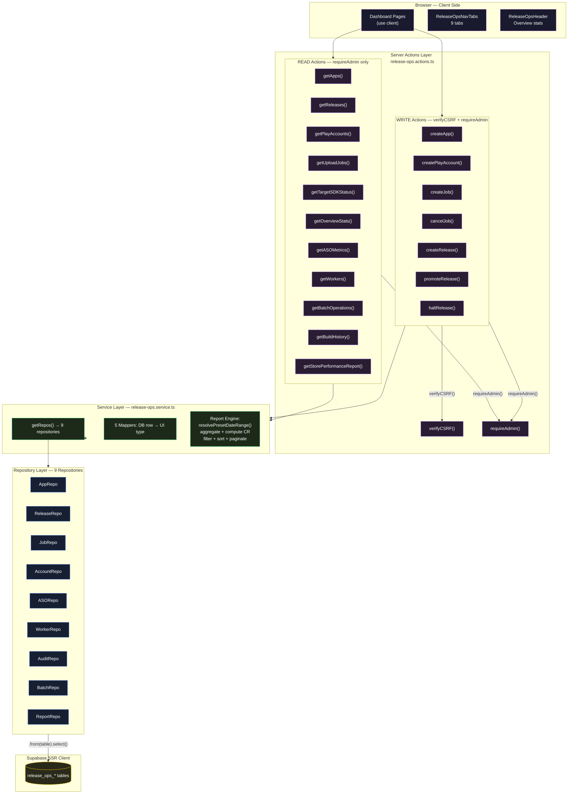

### 4.3 Page ↔ Server Action ↔ Data Mapping

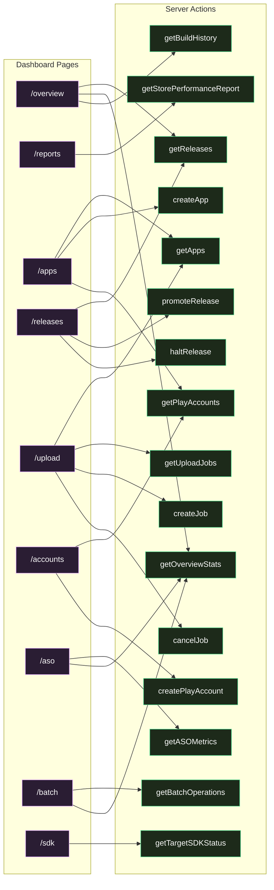

### 4.4 Store Performance Report 20-Column Pipeline

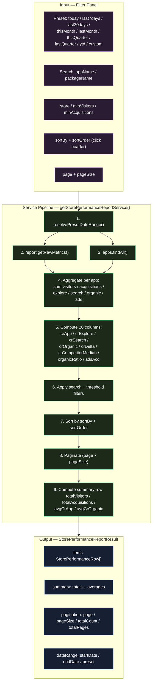

### 4.5 Worker Job State Machine

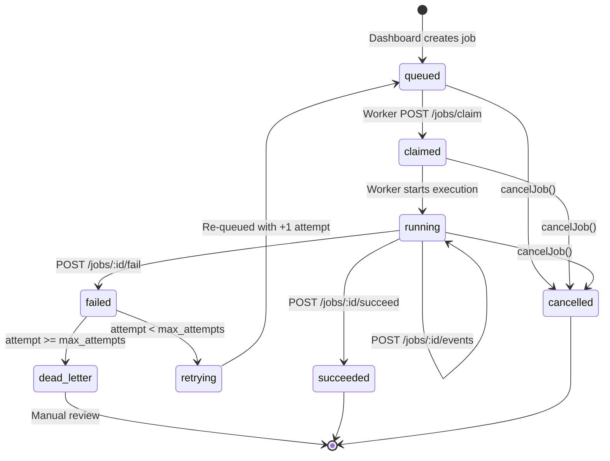

---

## 5. Module Breakdown

### 5.1 App Registry Module

- **Purpose:** Quản lý danh mục ứng dụng — package name, Play account, target SDK, policy readiness.
- **Repository:** [release-ops-app.repo.ts](file:///d:/Python/SinoMedia/dashboard/lib/repositories/release-ops-app.repo.ts) — `findAll()`, `findById()`, `create()`, `update()`
- **Table:** `release_ops_apps`
- **UI:** [apps/page.tsx](file:///d:/Python/SinoMedia/dashboard/app/(main)/dash/release-ops/apps/page.tsx) — 320 lines, Onboard wizard form nối thật `createApp()`
- **Dependencies:** `release_ops_play_accounts` (FK join)

### 5.2 Release Lifecycle Module

- **Purpose:** Theo dõi vòng đời release: draft → uploading → rolling_out → live/halted.
- **Repository:** [release-ops-release.repo.ts](file:///d:/Python/SinoMedia/dashboard/lib/repositories/release-ops-release.repo.ts) — `findAll()`, `findById()`, `create()`, `updateStatus()`
- **Table:** `release_ops_releases`
- **UI:** [releases/page.tsx](file:///d:/Python/SinoMedia/dashboard/app/(main)/dash/release-ops/releases/page.tsx) — 515 lines, Promote/Halt nối thật
- **Business flow:** `promoteRelease()` → update DB + create job + write audit. `haltRelease()` → update status 'halted' + create job + write audit.

### 5.3 Job Queue Module

- **Purpose:** Table-based job queue. Worker claim, heartbeat, events, succeed/fail.
- **Repository:** [release-ops-job.repo.ts](file:///d:/Python/SinoMedia/dashboard/lib/repositories/release-ops-job.repo.ts) — `findAll()`, `create()`, `updateStatus()`, `cancel()`
- **Table:** `release_ops_jobs`
- **Job types:** `upload`, `promote`, `halt`, `sync_report`, `batch_step`, `build`, `publish`
- **UI:** [upload/page.tsx](file:///d:/Python/SinoMedia/dashboard/app/(main)/dash/release-ops/upload/page.tsx) — create job + cancel job

### 5.4 Play Account Module

- **Purpose:** Quản lý Google Play Developer accounts — metadata, email, status.
- **Repository:** [release-ops-play-account.repo.ts](file:///d:/Python/SinoMedia/dashboard/lib/repositories/release-ops-play-account.repo.ts)
- **Table:** `release_ops_play_accounts`
- **UI:** [accounts/page.tsx](file:///d:/Python/SinoMedia/dashboard/app/(main)/dash/release-ops/accounts/page.tsx) + [add-account-panel.tsx](file:///d:/Python/SinoMedia/dashboard/app/(main)/dash/release-ops/accounts/add-account-panel.tsx)

### 5.5 ASO Analytics Module

- **Purpose:** Lưu trữ ASO metrics — visitors, acquisitions, conversion rates theo store/geo.
- **Repository:** [release-ops-aso.repo.ts](file:///d:/Python/SinoMedia/dashboard/lib/repositories/release-ops-aso.repo.ts)
- **Table:** `release_ops_aso_metrics`
- **UI:** [aso/page.tsx](file:///d:/Python/SinoMedia/dashboard/app/(main)/dash/release-ops/aso/page.tsx)

### 5.6 Store Performance Report Module (20 Cột)

- **Purpose:** Tổng hợp 20 cột hiệu suất store từ ASO metrics — filter, sort, paginate, summary row.
- **Repository:** [release-ops-report.repo.ts](file:///d:/Python/SinoMedia/dashboard/lib/repositories/release-ops-report.repo.ts) — `getRawMetrics()`
- **Service:** `getStorePerformanceReportService()` — 222 lines, aggregation pipeline
- **UI:** [reports/page.tsx](file:///d:/Python/SinoMedia/dashboard/app/(main)/dash/release-ops/reports/page.tsx) — 552 lines
- **20 columns:** store, appName, pic, crAppYtd, crCompetitorMedian, totalVisitors, exploreVisitors, searchVisitors, totalAcquisitions, exploreAcquisitions, searchAcquisitions, crDelta, organicVisitors, organicVisitorRatio, organicAcquisitions, organicAcquisitionRatio, crOrganic, adsAcquisitions, crExplore, crSearch

### 5.7 Batch Operations Module

- **Purpose:** Multi-app operations — canary rollout, mass promote, SDK upgrade, halt all.
- **Repository:** [release-ops-batch.repo.ts](file:///d:/Python/SinoMedia/dashboard/lib/repositories/release-ops-batch.repo.ts) — `findAll()`
- **Table:** `release_ops_batch_operations`
- **Service:** `getBatchOperations()` — enriches với job counts (succeeded, running, failed, pending)
- **UI:** [batch/page.tsx](file:///d:/Python/SinoMedia/dashboard/app/(main)/dash/release-ops/batch/page.tsx)

### 5.8 Target SDK Compliance Module

- **Purpose:** Track Target SDK mandate compliance — đếm ngược deadline, compliance status.
- **Service:** `getTargetSDKStatus()` → `mapDbAppToSDKItem()`
- **UI:** [sdk/page.tsx](file:///d:/Python/SinoMedia/dashboard/app/(main)/dash/release-ops/sdk/page.tsx) — 150 lines
- **Policy config:** Hardcoded Google Play mandate: API 34, deadline 2026-08-31

### 5.9 Worker Fleet Module

- **Purpose:** Track worker machines — heartbeat, capacity, status.
- **Repository:** [release-ops-worker.repo.ts](file:///d:/Python/SinoMedia/dashboard/lib/repositories/release-ops-worker.repo.ts)
- **Table:** `release_ops_workers`
- **Server Action:** `getWorkers()` — exists but **no UI page yet**

### 5.10 Audit Module

- **Purpose:** Append-only audit log — track promote/halt/create actions.
- **Repository:** [release-ops-audit.repo.ts](file:///d:/Python/SinoMedia/dashboard/lib/repositories/release-ops-audit.repo.ts) — `create()`
- **Table:** `release_ops_audits`
- **Auto-write:** `promoteRelease()` and `haltRelease()` automatically write audit records
- **UI:** > No audit log page yet

---

## 6. Request Flow

Luồng xử lý cho một request từ dashboard UI đến database:

```
1. Browser (React page "use client")
   │
   ├── import { getApps } from '@/lib/actions/release-ops.actions'
   │
2. Server Action (release-ops.actions.ts)
   │
   ├── await requireAdmin()              ← Verify admin session via Supabase Auth
   ├── await verifyCSRF()                ← CSRF token check (write actions only)
   │
3. Service Layer (release-ops.service.ts)
   │
   ├── const { apps, releases, ... } = await getRepos()
   │   ├── createServiceClient() or createClientServer()    ← Supabase SSR client
   │   └── new ReleaseOpsAppRepository(db)                  ← Inject db client
   │
   ├── const rows = await apps.findAll()                    ← Repository call
   │
4. Repository Layer (release-ops-app.repo.ts)
   │
   ├── this.db.from("release_ops_apps")
   │     .select("*, release_ops_play_accounts(*)")
   │     .order("created_at", { ascending: false })
   │     .limit(200)
   │
5. Supabase PostgreSQL
   │
   └── Returns rows
   │
6. Service Layer
   │
   ├── rows.map(mapDbAppToRegistryItem)                     ← DB row → UI domain type
   │
7. Server Action
   │
   └── return result                                         ← Serialized to client
   │
8. Browser
   │
   └── setState(result)                                      ← React re-render
```

---

## 7. Authentication

**Dashboard user authentication:**

| Mechanism | Implementation |
| --- | --- |
| Provider | Supabase Auth (email/password) |
| Session | Cookie-based SSR session via `createClientServer()` |
| Middleware | Next.js middleware intercepts `/dash/*`, refreshes session |
| Guard | `requireAdmin()` in `lib/supabase/auth-helper.ts` — called by every Server Action |

**Worker authentication (planned):**

| Mechanism | Implementation |
| --- | --- |
| Token type | Bearer token via `Authorization` header or `x-api-key` |
| Verification | SHA-256 hash comparison against `api_tokens.token_hash` |
| Guard | `token.guard.ts` — reused from crawler worker API |
| Scope check | Required `release_ops:*` scopes per endpoint |

---

## 8. Authorization

| Role | Permissions |
| --- | --- |
| Admin | Full access — all read + write Server Actions require `requireAdmin()` |
| User | No access to Release Ops — all actions reject non-admin |
| Worker | Scoped token access — `release_ops:job:claim`, `release_ops:job:event`, etc. |
| Guest | No access — middleware redirects to login |

Recommended Release Ops worker scopes:

| Scope | Purpose |
| --- | --- |
| `release_ops:worker:register` | Worker registration |
| `release_ops:worker:heartbeat` | Worker fleet health |
| `release_ops:job:claim` | Claim queued jobs |
| `release_ops:job:heartbeat` | Extend job lease |
| `release_ops:job:event` | Write job progress events |
| `release_ops:job:complete` | Write final result (succeed/fail) |
| `release_ops:artifact:read` | Read artifact metadata |
| `release_ops:report:write` | Write report sync output |

---

## 9. Database

### 9.1 Table Inventory

| Table | Purpose | Repository |
| --- | --- | --- |
| `release_ops_apps` | App registry | ✅ `ReleaseOpsAppRepository` |
| `release_ops_play_accounts` | Play developer accounts | ✅ `ReleaseOpsPlayAccountRepository` |
| `release_ops_releases` | Release lifecycle | ✅ `ReleaseOpsReleaseRepository` |
| `release_ops_jobs` | Job queue | ✅ `ReleaseOpsJobRepository` |
| `release_ops_job_events` | Job event timeline | ❌ No repository |
| `release_ops_workers` | Worker fleet | ✅ `ReleaseOpsWorkerRepository` |
| `release_ops_artifacts` | Build artifacts | ❌ No repository |
| `release_ops_batch_operations` | Batch ops | ✅ `ReleaseOpsBatchRepository` |
| `release_ops_aso_metrics` | ASO / store metrics | ✅ `ReleaseOpsASORepository` + `ReleaseOpsReportRepository` |
| `release_ops_audits` | Audit log | ✅ `ReleaseOpsAuditRepository` |

### 9.2 Migration Status

> Migration SQL files for `release_ops_*` tables are **NOT FOUND** in `supabase/migrations/`. Tables exist in the remote Supabase instance but were created outside version-controlled migrations.

### 9.3 ER Diagram

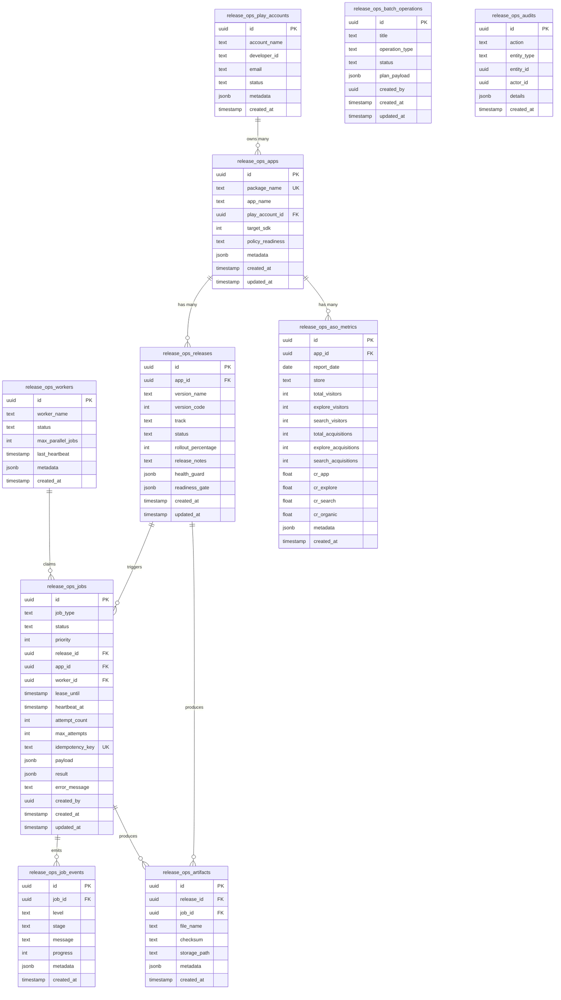

### 9.4 Release Status Enum

```
draft → queued → validating → uploading → uploaded → submitted → in_review → rolling_out → live
                                                                                    ↓
                                                                                  halted
                                              ↓ (at any point)
                                         rejected / failed / policy_blocked
```

---

## 10. API Architecture

### 10.1 Dashboard API (Server Actions)

| Pattern | Detail |
| --- | --- |
| Protocol | Next.js Server Actions (internal RPC, not REST) |
| Entry point | `import { fn } from '@/lib/actions/release-ops.actions'` |
| Auth | `requireAdmin()` on every action |
| CSRF | `verifyCSRF()` on every write action |
| Error format | `throw new Error("message")` → caught by React error boundary |
| Response format | Direct TypeScript return value (serialized by Next.js) |
| Pagination | Service-level: `page`, `pageSize`, `totalCount`, `totalPages` on reports |
| Filtering | Service-level: `search`, `store`, `minVisitors`, `minAcquisitions` |
| Sorting | Service-level: `sortBy`, `sortOrder` (asc/desc) |

### 10.2 Worker Gateway API (Planned — Not Implemented)

| Pattern | Detail |
| --- | --- |
| Protocol | REST over HTTPS |
| Base route | `/api/release-ops/worker/v1/*` |
| Auth | Bearer token → SHA-256 hash → `api_tokens.token_hash` match |
| Versioning | `/v1/` prefix |

Planned endpoints:

| Method | Path | Scope | Purpose |
| --- | --- | --- | --- |
| `POST` | `/workers/register` | `release_ops:worker:register` | Register worker |
| `POST` | `/workers/heartbeat` | `release_ops:worker:heartbeat` | Worker health check |
| `POST` | `/jobs/claim` | `release_ops:job:claim` | Atomic job claim |
| `POST` | `/jobs/:id/heartbeat` | `release_ops:job:heartbeat` | Extend lease |
| `POST` | `/jobs/:id/events` | `release_ops:job:event` | Append progress |
| `POST` | `/jobs/:id/succeed` | `release_ops:job:complete` | Mark success |
| `POST` | `/jobs/:id/fail` | `release_ops:job:complete` | Mark failure |
| `GET` | `/artifacts/:id` | `release_ops:artifact:read` | Artifact download |
| `POST` | `/reports/sync-result` | `release_ops:report:write` | Store sync result |

---

## 11. Business Flow

### 11.1 Upload AAB Flow

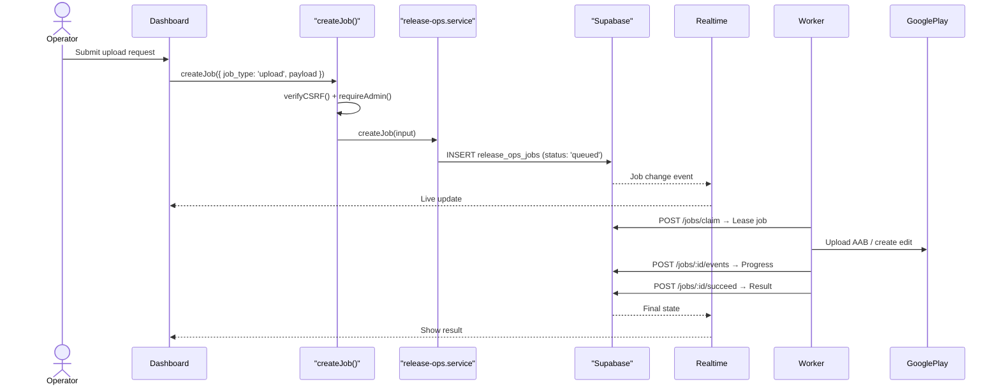

### 11.2 Promote Release Flow

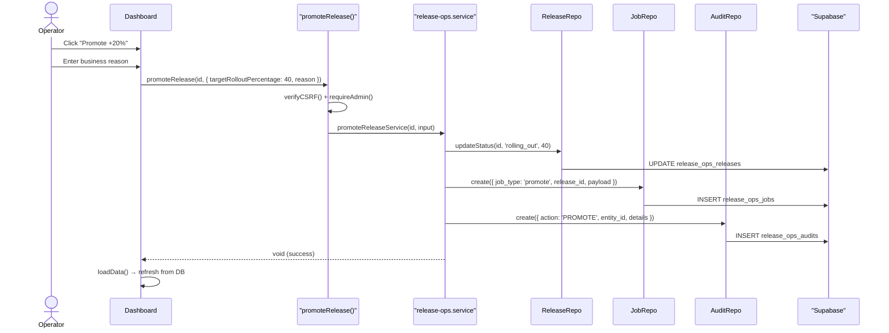

### 11.3 Halt Release Flow

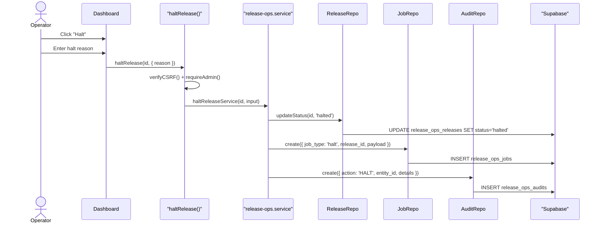

### 11.4 Store Performance Report Query

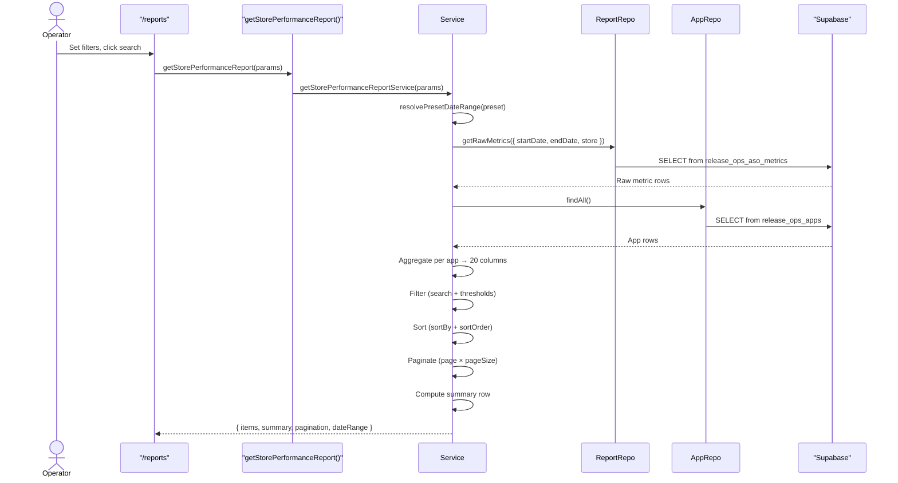

---

## 12. Dependency Graph

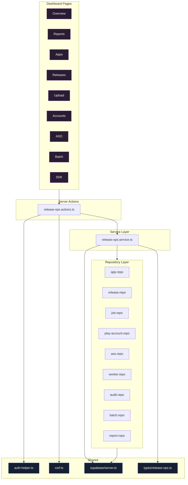

---

## 13. External Services

| Service | Integration | Status |
| --- | --- | --- |
| **Supabase Auth** | Login, session, user identity | ✅ Active |
| **Supabase Database** | PostgreSQL via Supabase Client SDK | ✅ Active |
| **Supabase Realtime** | Planned for `release_ops_jobs`, `release_ops_releases` | ❌ Not configured |
| **Google Play Publishing API** | Upload AAB, promote/halt rollout, create edits | ❌ Worker-side only (external project) |
| **Google Play Reporting GCS** | Download CSV reports → parse → upsert metrics | ❌ Worker-side only (external project) |
| **2Captcha** | Not used by Release Ops | N/A (crawler only) |
| **Redis** | > Not Found | |
| **MinIO / S3** | > Not Found | |

---

## 14. Configuration

### Dashboard environment variables

| Variable | Purpose |
| --- | --- |
| `NEXT_PUBLIC_SUPABASE_URL` | Supabase project URL |
| `SUPABASE_SERVICE_ROLE_KEY` | Server-side privileged access |
| `RELEASE_OPS_ARTIFACT_STORAGE_BUCKET` | Planned: durable artifact bucket |

### Worker environment variables (planned)

| Variable | Purpose |
| --- | --- |
| `RELEASE_OPS_API_URL` | Worker gateway base URL |
| `RELEASE_OPS_TOKEN` | Scoped worker API token |
| `RELEASE_OPS_WORKER_ID` | Stable worker identity |
| `GOOGLE_APPLICATION_CREDENTIALS` | Service account credentials |
| `RELEASE_OPS_TEMP_DIR` | Local temp folder |
| `RELEASE_OPS_LOG_DIR` | Local worker logs |
| `RELEASE_OPS_CACHE_DIR` | Local artifact/report cache |

---

## 15. Logging

| Type | Implementation |
| --- | --- |
| Request Log | > Not Found — no request logging middleware for release-ops |
| Audit Log | ✅ `release_ops_audits` table — `promoteRelease()` and `haltRelease()` auto-write with action, entity_type, entity_id, details |
| Error Log | `console.error()` in Server Actions catch blocks |
| Job Event Log | `release_ops_job_events` table (append-only) — structured `{ level, stage, message, progress, metadata }` |
| Access Log | > Not Found — relies on Vercel/platform-level logs |

---

## 16. Error Handling

| Layer | Strategy |
| --- | --- |
| Server Actions | `throw new Error("message")` — propagated to client |
| Server Actions (createPlayAccount) | Try/catch → `{ success: false, error: "message" }` return pattern |
| Service Layer | `throw new Error("Release không tồn tại.")` — validation before mutation |
| Repository Layer | Supabase `{ data, error }` — `if (error) throw error` |
| UI Layer | `try/catch` in `loadData()` → `console.error()` |
| CSRF failure | `throw new Error("Xác thực bảo mật CSRF thất bại.")` |
| Global Error Boundary | > Not Found — no release-ops-specific error boundary |
| Retry / Fallback | > Not Found at dashboard level — retry logic planned for worker job queue |

---

## 17. Security

| Control | Status | Implementation |
| --- | --- | --- |
| CSRF Protection | ✅ | `verifyCSRF()` on all 7 write actions |
| Admin Guard | ✅ | `requireAdmin()` on all 21 actions |
| Token Guard (Worker) | Planned | SHA-256 hash + scope check via `token.guard.ts` |
| Idempotency Key | Planned | `release_ops_jobs.idempotency_key` (UNIQUE constraint) |
| Audit Trail | ✅ | Auto-write on promote/halt |
| Input Validation | Partial | Service validates release exists before promote/halt. Full validation (package name, version code, track, checksum) planned. |
| Secret Exposure | Safe | Server Actions are server-side only; `SUPABASE_SERVICE_ROLE_KEY` never exposed to client |
| XSS | ✅ | React auto-escapes. No `dangerouslySetInnerHTML` found. |
| SQL Injection | ✅ | Supabase SDK parameterized queries |
| Rate Limit | > Not Found | |

---

## 18. Performance

| Technique | Status | Detail |
| --- | --- | --- |
| Pagination | ✅ | Store Performance Report: `page`, `pageSize`, `totalPages` |
| Sorting | ✅ | Reports: sortable 20-column headers |
| Filtering | ✅ | Reports: preset dates, search, store, thresholds |
| Lazy Loading | Partial | Pages load data in `useEffect` on mount |
| Batch Query | Partial | `getBatchOperations()` does N+1: `findAll(500)` per batch to filter jobs — potential performance issue |
| Index | Unknown | No migration files to verify indexes on `release_ops_*` tables |
| Connection Pool | ✅ | Supabase client manages pooling via PostgREST |
| Caching | > Not Found | No in-memory or Redis caching |
| Streaming | > Not Found | |
| Compression | > Not Found at app level — Vercel handles gzip |

---

## 19. Scalability

| Scale | Potential Issue |
| --- | --- |
| 100 apps | No issue — current architecture handles fine |
| 1,000 jobs | `getBatchOperations()` loads ALL jobs (`findAll(500)`) per batch → N+1 query explosion |
| 10,000 ASO metrics | `getStorePerformanceReportService()` loads ALL raw metrics then filters in JS → should use DB-side aggregation |
| 100 concurrent workers | Job claim needs atomic `UPDATE ... WHERE status='queued' LIMIT 1 RETURNING *` via Supabase RPC — not yet implemented |
| Multi-tenant | Not applicable — single-tenant admin dashboard |

---

## 20. Deployment

| Component | Deployment | Evidence |
| --- | --- | --- |
| Dashboard | Vercel | Host evidence in architecture diagram |
| Supabase | Managed cloud | `NEXT_PUBLIC_SUPABASE_URL` |
| Crawler Worker | Docker Compose on VPS | `crawler-pipeline/docker-compose.yml` |
| Release Ops Worker | Windows Server 2012 VPS | Target architecture (not implemented in SinoMedia) |
| CI/CD | GitHub Actions | `.github/workflows/deploy-crawler.yml` (crawler only) |
| Release Ops CI/CD | > Not Found | |

---

## 21. Testing

> Not Found — no test files exist for the release-ops module. No unit tests, integration tests, or E2E tests.

---

## 22. Coding Convention

| Convention | Pattern | Evidence |
| --- | --- | --- |
| File naming | `kebab-case` | `release-ops-app.repo.ts`, `release-ops.service.ts` |
| Class naming | `PascalCase` | `ReleaseOpsAppRepository`, `ReleaseOpsReleaseRepository` |
| Function naming | `camelCase` | `getApps()`, `createApp()`, `promoteRelease()` |
| Type naming | `PascalCase` | `AppRegistryItem`, `StorePerformanceRow` |
| DB column naming | `snake_case` | `package_name`, `play_account_id`, `created_at` |
| Server Action file | `{module}.actions.ts` | `release-ops.actions.ts` |
| Service file | `{module}.service.ts` | `release-ops.service.ts` |
| Repository file | `{module}-{entity}.repo.ts` | `release-ops-app.repo.ts` |
| Type file | `{module}.ts` in `types/` | `types/release-ops.ts` |
| Repository class | Injects `DbClient` via constructor | `constructor(private readonly db: DbClient)` |
| Mapper functions | `mapDb{Entity}To{UIType}()` | `mapDbAppToRegistryItem()`, `mapDbReleaseToItem()` |
| Server Action guards | Read: `requireAdmin()` / Write: `verifyCSRF()` + `requireAdmin()` | Consistent across all 21 actions |
| Page directive | `"use client"` | All release-ops pages |
| Comments | Vietnamese | `/** Lấy batch operations */` |

---

## 23. Design Pattern

| Pattern | Where Detected |
| --- | --- |
| **Repository Pattern** | 9 repository classes encapsulating Supabase table access |
| **Service Layer** | `release-ops.service.ts` — business logic between actions and repos |
| **Server Action Pattern** | Next.js `"use server"` functions as API boundary |
| **Guard Pattern** | `requireAdmin()`, `verifyCSRF()` — access control decorators |
| **Factory / DI** | `getRepos()` creates all 9 repos with injected `DbClient` |
| **Mapper Pattern** | 5 `mapDbXxxToYyy()` functions — DB row → UI domain type |
| **Pipeline / Builder** | `getStorePerformanceReportService()` — 9-step aggregation pipeline |
| **State Machine** | `release_ops_jobs.status` — `queued → claimed → running → succeeded/failed/dead_letter` |
| **Audit Trail** | `promoteRelease()` / `haltRelease()` auto-append to `release_ops_audits` |
| **Table-based Queue** | `release_ops_jobs` as job queue (claim, heartbeat, lease) |

---

## 24. Strengths

| Aspect | Assessment |
| --- | --- |
| **Architecture** | Clean layered separation: Page → Action → Service → Repository → DB. No leaky abstractions. |
| **Consistency** | All 21 actions follow identical guard pattern. All repos follow identical class structure. |
| **Data integrity** | Promote/Halt atomically creates: (1) release update, (2) job record, (3) audit record. |
| **Feature completeness** | 20-column report with full aggregation pipeline is enterprise-grade. |
| **Code organization** | Single service file keeps all logic discoverable. 9 focused repos prevent table access sprawl. |
| **Security** | CSRF + Admin on every write. No raw SQL. No client-exposed secrets. |

---

## 25. Technical Debt

| Issue | Severity | Location |
| --- | --- | --- |
| **N+1 query in getBatchOperations()** | High | [release-ops.service.ts:463](file:///d:/Python/SinoMedia/dashboard/lib/services/release-ops.service.ts#L463) — `findAll(500)` per batch |
| **In-memory aggregation for reports** | Medium | `getStorePerformanceReportService()` loads all raw metrics then filters in JS |
| **No migration files** | High | `release_ops_*` tables exist remotely but not in `supabase/migrations/` |
| **No tests** | High | Zero test coverage for release-ops module |
| **Missing repositories** | Medium | `release_ops_job_events` and `release_ops_artifacts` have no repo |
| **Unused actions** | Low | `getApp(id)`, `getRelease(id)`, `getJobs()`, `getWorkers()`, `createRelease()` — no UI caller |
| **Empty dashboard directory** | Low | `release-ops/dashboard/` exists but is empty |
| **God Service file** | Medium | `release-ops.service.ts` is 877 lines — could split into domain services |
| **Hardcoded SDK policy** | Low | [sdk/page.tsx:8](file:///d:/Python/SinoMedia/dashboard/app/(main)/dash/release-ops/sdk/page.tsx#L8) — should be DB-configurable |

---

## 26. Improvement Proposal

### High Priority

| # | Proposal | Reason |
| --- | --- | --- |
| 1 | **Add `release_ops_*` migration SQL files** | Schema not version-controlled — cannot reproduce DB from scratch |
| 2 | **Implement Worker Gateway API** | Core feature not built — workers cannot connect |
| 3 | **Fix N+1 in getBatchOperations()** | Current code loads ALL jobs for every batch — `O(B × J)` |
| 4 | **Add missing pages** | Workers, Jobs, Audit, Detail pages — actions exist but no UI |

### Medium Priority

| # | Proposal | Reason |
| --- | --- | --- |
| 5 | **Move report aggregation to DB** | `getStorePerformanceReportService()` does in-memory aggregation — should use Supabase RPC for scalability |
| 6 | **Split service file** | 877 lines → split into `release-ops-release.service.ts`, `release-ops-report.service.ts`, etc. |
| 7 | **Add repos for job_events + artifacts** | 2 tables without repositories |
| 8 | **Add test coverage** | Zero tests — at minimum unit tests for service functions |

### Low Priority

| # | Proposal | Reason |
| --- | --- | --- |
| 9 | **Make SDK policy DB-configurable** | Currently hardcoded in page component |
| 10 | **Clean up unused actions** | Remove or wire up `getApp(id)`, `getRelease(id)`, etc. |
| 11 | **Enable Supabase Realtime** | Live updates for job/release status changes |
| 12 | **Add error boundary for release-ops** | Graceful error handling instead of white screen |

---

## 27. Appendix

### All Mermaid Diagrams Index

| # | Type | Section | Description |
| --- | --- | --- | --- |
| 1 | Flowchart | [4.1](#41-main-system-architecture-6-layers) | Main System Architecture — 6 layers |
| 2 | Flowchart | [4.2](#42-dashboard-internal-data-flow) | Dashboard Internal Data Flow — Actions → Service → Repos |
| 3 | Flowchart | [4.3](#43-page--server-action--data-mapping) | Page ↔ Server Action Mapping |
| 4 | Flowchart | [4.4](#44-store-performance-report-20-column-pipeline) | Report 20-Column Aggregation Pipeline |
| 5 | State Diagram | [4.5](#45-worker-job-state-machine) | Worker Job State Machine |
| 6 | ER Diagram | [9.3](#93-er-diagram) | Full ER Diagram — 10 tables |
| 7 | Sequence | [11.1](#111-upload-aab-flow) | Upload AAB Flow |
| 8 | Sequence | [11.2](#112-promote-release-flow) | Promote Release Flow |
| 9 | Sequence | [11.3](#113-halt-release-flow) | Halt Release Flow |
| 10 | Sequence | [11.4](#114-store-performance-report-query) | Store Performance Report Query |
| 11 | Flowchart | [12](#12-dependency-graph) | Module Dependency Graph |

### Source File Reference

| File | Lines | Purpose |
| --- | --- | --- |
| [release-ops.actions.ts](file:///d:/Python/SinoMedia/dashboard/lib/actions/release-ops.actions.ts) | 178 | 21 Server Actions |
| [release-ops.service.ts](file:///d:/Python/SinoMedia/dashboard/lib/services/release-ops.service.ts) | 877 | Service layer (30+ functions) |
| [release-ops-app.repo.ts](file:///d:/Python/SinoMedia/dashboard/lib/repositories/release-ops-app.repo.ts) | 101 | App repository |
| [release-ops-release.repo.ts](file:///d:/Python/SinoMedia/dashboard/lib/repositories/release-ops-release.repo.ts) | — | Release repository |
| [release-ops-job.repo.ts](file:///d:/Python/SinoMedia/dashboard/lib/repositories/release-ops-job.repo.ts) | — | Job repository |
| [release-ops-play-account.repo.ts](file:///d:/Python/SinoMedia/dashboard/lib/repositories/release-ops-play-account.repo.ts) | — | Play account repository |
| [release-ops-aso.repo.ts](file:///d:/Python/SinoMedia/dashboard/lib/repositories/release-ops-aso.repo.ts) | — | ASO repository |
| [release-ops-worker.repo.ts](file:///d:/Python/SinoMedia/dashboard/lib/repositories/release-ops-worker.repo.ts) | — | Worker repository |
| [release-ops-audit.repo.ts](file:///d:/Python/SinoMedia/dashboard/lib/repositories/release-ops-audit.repo.ts) | — | Audit repository |
| [release-ops-batch.repo.ts](file:///d:/Python/SinoMedia/dashboard/lib/repositories/release-ops-batch.repo.ts) | — | Batch operations repository |
| [release-ops-report.repo.ts](file:///d:/Python/SinoMedia/dashboard/lib/repositories/release-ops-report.repo.ts) | — | Report (ASO metrics) repository |
| [ReleaseOpsNavTabs.tsx](file:///d:/Python/SinoMedia/dashboard/components/dashboard/release-ops/ReleaseOpsNavTabs.tsx) | 58 | 9-tab navigation |
| [reports/page.tsx](file:///d:/Python/SinoMedia/dashboard/app/(main)/dash/release-ops/reports/page.tsx) | 552 | Store Performance Report 20 Cột |
| [releases/page.tsx](file:///d:/Python/SinoMedia/dashboard/app/(main)/dash/release-ops/releases/page.tsx) | 515 | Releases + Promote/Halt |
| [apps/page.tsx](file:///d:/Python/SinoMedia/dashboard/app/(main)/dash/release-ops/apps/page.tsx) | 320 | App Registry + Onboard |
| [sdk/page.tsx](file:///d:/Python/SinoMedia/dashboard/app/(main)/dash/release-ops/sdk/page.tsx) | 150 | Target SDK Compliance |
| [types/release-ops.ts](file:///d:/Python/SinoMedia/dashboard/types/release-ops.ts) | — | Domain types |
