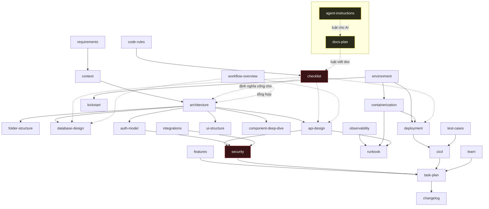

# Tài liệu SinoMedia

Nền tảng điều phối crawl dữ liệu 7 mạng xã hội Trung Quốc, cộng một phân hệ vận hành phát hành Android.

**Ba tiến trình, một cơ sở dữ liệu:** dashboard Next.js 16 trên Vercel · crawler worker Node + Playwright trong Docker trên VPS · Supabase Postgres 17.

> **Luật số một:** nguồn sự thật là **code**. Bộ này là bằng chứng đã đối chiếu, không phải nguồn thay thế. Mâu thuẫn thì code thắng.
>
> `old-docs/` là **bản ghi lịch sử**. Nó mô tả nhiều thứ chưa bao giờ được build — đừng dùng làm sự thật. Lý do đầy đủ ở [learn.md](learn.md) §3.

Bộ này dựng lại ngày **2026-08-13**. Phương pháp: [docs-plan.md](docs-plan.md).

---

## 1. Tôi là ai thì đọc gì

| Bạn là… | Đọc theo thứ tự |
|---|---|
| **Lần đầu chạm dự án** | [requirements.md](requirements.md) → [context.md](context.md) → [architecture.md](architecture.md) → [workflow-overview.md](workflow-overview.md) |
| **Cần dựng máy để chạy** | [kickstart.md](kickstart.md) → [environment.md](environment.md) |
| **Sắp sửa code** | [folder-structure.md](folder-structure.md) → [code-rules.md](code-rules.md) → [checklist.md](checklist.md) |
| **Sửa dashboard** | [ui-structure.md](ui-structure.md) → [auth-model.md](auth-model.md) |
| **Sửa worker gateway** | [api-design.md](api-design.md) → [security.md](security.md) §3 — **bắt buộc**, đây là bề mặt bảo mật |
| **Sửa crawler** | [component-deep-dive.md](component-deep-dive.md) → [containerization.md](containerization.md) |
| **Sửa schema** | [database-design.md](database-design.md) → [checklist.md](checklist.md) §3 |
| **Đang trực, có sự cố** | [runbook.md](runbook.md) |
| **Sắp deploy** | [deployment.md](deployment.md) → [checklist.md](checklist.md) §5 |
| **Muốn biết đang có gì thật** | [features.md](features.md) — đọc kỹ §5 "chưa có" |
| **Muốn biết làm gì tiếp** | [task-plan.md](task-plan.md) |
| **Là AI** | [agent-instructions.md](agent-instructions.md) — **đọc trước tiên** |

**Nếu chỉ đọc được ba file:** [architecture.md](architecture.md), [features.md](features.md), [learn.md](learn.md).

---

## 2. Toàn bộ tài liệu

### Meta

| File | Trả lời câu hỏi |
|---|---|
| [README.md](README.md) | Đọc gì, ai sở hữu sự thật nào |
| [docs-plan.md](docs-plan.md) | Bộ này được dựng thế nào, cố ý không viết gì |
| [agent-instructions.md](agent-instructions.md) | AI cư xử thế nào trên repo này |

### Định hướng

| File | Trả lời câu hỏi |
|---|---|
| [requirements.md](requirements.md) | Làm cái gì, xong là như thế nào, cái gì **ngoài** phạm vi |
| [context.md](context.md) | Ranh giới hệ thống, cái gì **không** chịu trách nhiệm |
| [architecture.md](architecture.md) | Chia thành gì, và **vì sao không chọn cách khác** |
| [folder-structure.md](folder-structure.md) | Cái gì ở đâu, luật phụ thuộc |

### Thiết kế

| File | Trả lời câu hỏi |
|---|---|
| [database-design.md](database-design.md) | 53 bảng, hợp đồng nội dung hợp nhất, RLS, RPC |
| [api-design.md](api-design.md) | Worker Gateway, 10 scope, 9 lớp lọc, video proxy |
| [auth-model.md](auth-model.md) | Đăng nhập, vai, **mỗi quyền cưỡng chế ở đâu** |
| [ui-structure.md](ui-structure.md) | Route, component, server state vs client state |
| [component-deep-dive.md](component-deep-dive.md) | Tầng chống-phát-hiện của crawler — hệ con mong manh nhất |
| [integrations.md](integrations.md) | Dịch vụ bên thứ ba, khoá theo môi trường, đối soát |
| [security.md](security.md) | Ranh giới tin cậy, **4 nợ bảo mật đã biết** |

### Vận hành

| File | Trả lời câu hỏi |
|---|---|
| [environment.md](environment.md) | **Chủ sở hữu duy nhất** của biến môi trường; 4 môi trường |
| [kickstart.md](kickstart.md) | Máy trắng → chạy được |
| [containerization.md](containerization.md) | Đóng gói crawler, Docker và systemd |
| [deployment.md](deployment.md) | Deploy, rollback, đường ra Internet |
| [cicd.md](cicd.md) | Pipeline **đang** chạy — và cái gì nó **không** chặn |
| [observability.md](observability.md) | Log gì, đo gì, **bình thường trông như thế nào** |
| [runbook.md](runbook.md) | Triệu chứng → hành động |
| [workflow-overview.md](workflow-overview.md) | Toàn cảnh đầu-cuối + **7 hiểu nhầm thường gặp** |

### Chất lượng và tiến độ

| File | Trả lời câu hỏi |
|---|---|
| [features.md](features.md) | **Đang có** gì (không phải sẽ có) |
| [test-cases.md](test-cases.md) | Kiểm cái gì, phủ tới đâu, thiếu gì |
| [code-rules.md](code-rules.md) | Code trông như thế nào, và chỗ code thật lệch luật |
| [checklist.md](checklist.md) | Cổng chặn, và đổi X thì sửa doc nào |
| [learn.md](learn.md) | Đã hỏng gì, và **hướng nào không hiệu quả** |
| [task-plan.md](task-plan.md) | Làm gì tiếp, theo thứ tự nào (ID `T-xx`) |
| [changelog.md](changelog.md) | Đã đổi gì, ngày nào |

---

## 3. Bảng chủ sở hữu sự thật

Một sự thật có **đúng một chủ**. Cần nhắc tới nó ở file khác thì **trỏ link**, không chép lại. Chép ba dòng vào file thứ tư nghĩa là lần sau đổi một cờ phải sửa bốn chỗ.

| Sự thật | Chủ sở hữu |
|---|---|
| Biến môi trường, giá trị mặc định, 4 môi trường | [environment.md](environment.md) §2 §3 §4 |
| Danh sách scope worker + bảng (path, method) → scope | [api-design.md](api-design.md) §2 |
| 9 lớp lọc của gateway | [api-design.md](api-design.md) §4 |
| Bảng, cột, RPC, RLS, publication realtime | [database-design.md](database-design.md) |
| Ai được làm gì, và cưỡng chế ở đâu | [auth-model.md](auth-model.md) §2 §3 |
| Nợ bảo mật đã biết | [security.md](security.md) §2 |
| Bản đồ route và danh sách trang | [ui-structure.md](ui-structure.md) §1 |
| Luật phụ thuộc giữa các tầng | [folder-structure.md](folder-structure.md) §4 |
| Quyết định kiến trúc + **phương án đã loại** | [architecture.md](architecture.md) |
| Trạng thái ✅/🟨/⬜ của từng tính năng | [features.md](features.md) |
| Cái gì **chưa** có | [features.md](features.md) §5 |
| Triệu chứng → hành động | [runbook.md](runbook.md) |
| Cấu hình Docker, systemd, hạn mức | [containerization.md](containerization.md) |
| Pipeline CI đang chạy và không chạy | [cicd.md](cicd.md) |
| Danh sách test và khoảng trống | [test-cases.md](test-cases.md) |
| Cổng chặn + bảng "đổi X sửa doc nào" | [checklist.md](checklist.md) |
| Việc cần làm, ID `T-xx` | [task-plan.md](task-plan.md) |
| Sự cố đã gặp + hướng đã thử mà không hiệu quả | [learn.md](learn.md) |
| Phạm vi và **Out of scope** | [requirements.md](requirements.md) §3 |
| Thứ cố ý không viết tài liệu | [docs-plan.md](docs-plan.md) §3 |

---

## 4. Quan hệ giữa các file



---

## 5. Ba chỗ hỏng lớn nhất — biết trước khi đọc tiếp

Để không ai đọc bộ này rồi tưởng hệ thống đã hoàn chỉnh.

| # | Vấn đề | Chi tiết | Mục |
|---|---|---|---|
| 1 | **Đường vòng qua xác thực trên đường chạy production** — cookie `sinomedia_dev_user` cho ra quyền admin, không có cờ môi trường chặn | [security.md](security.md) §2.1 | T-03 |
| 2 | **10 bảng `release_ops_*` không có migration** — máy trắng không tái tạo được hệ thống | [database-design.md](database-design.md) §6 | T-01 |
| 3 | **CI không chặn được gì** — 42 test Playwright không bao giờ chạy tự động | [cicd.md](cicd.md) §2 | T-04 |

Và một cảnh báo giả đáng nhớ: healthcheck của container Docker **luôn xanh**. Worker treo vẫn báo `healthy` — [containerization.md](containerization.md) §2.

---

## 6. Giữ bộ này không trôi

Thêm file mới vào `docs/` thì phải làm **ba việc** ở [docs-plan.md](docs-plan.md) §5. Kiểm bằng:

```bash
cd docs

# Link gãy
for f in *.md; do
  grep -oE '\]\(([^)#]+)' "$f" | sed 's/](//' | while read -r l; do
    [ -e "$l" ] || echo "BROKEN: $f -> $l"
  done
done

# File mồ côi — có trong docs/ mà README không nhắc
for f in *.md; do
  [ "$f" = "README.md" ] && continue
  grep -q "$f" README.md || echo "MỒ CÔI: $f"
done
```

Mọi bảng "chép trạng thái" trong bộ này có một dòng `<!-- gen: ... -->` ngay trên nó — đó là lệnh chạy lại để kiểm bảng còn đúng không.

Và một con số nên nhìn định kỳ:

```bash
find docs -name '*.md' | xargs wc -l | tail -1                    # dòng tài liệu
find automation-test/tests -name '*.spec.ts' | xargs wc -l | tail -1   # dòng test
```

Đo ngày 2026-08-13: **4.161 dòng doc / 694 dòng test ≈ 6:1**.

Tỉ lệ vượt khoảng 5:1 nghĩa là đã dồn vốn vào tầng **mô tả** và bỏ tầng **cưỡng chế**. Bộ docs này **làm tỉ lệ đó tệ đi**, không tốt lên — nó thêm 4.161 dòng mô tả và 0 dòng cưỡng chế. Đó là lý do [task-plan.md](task-plan.md) xếp T-04 (dựng CI) lên nhóm "làm ngay". Viết xong docs không phải là xong việc — [cicd.md](cicd.md) §3.
