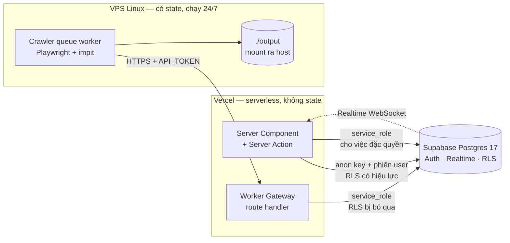
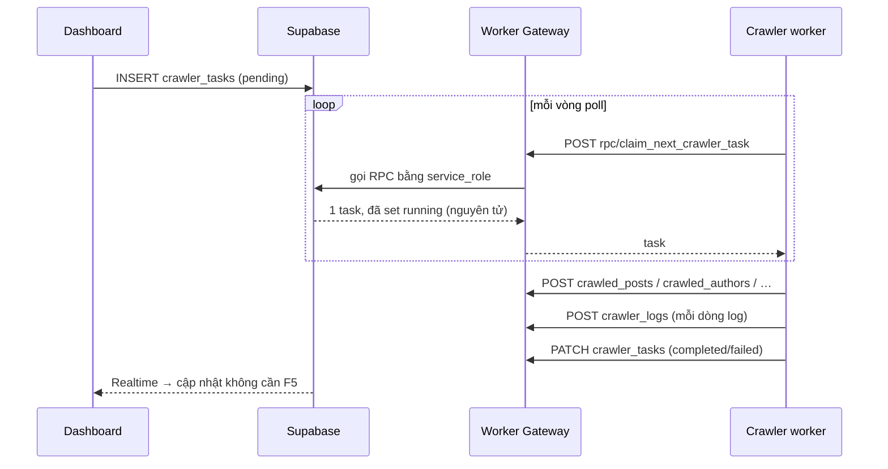

# Kiến trúc — chia thành gì, và vì sao không chọn cách khác

Ranh giới hệ thống ở [context.md](context.md). File này lo phần **bên trong**: tại sao nó có hình dạng như hiện tại.

---

## 1. Ba tiến trình, một cơ sở dữ liệu



Phân chia không theo nghiệp vụ mà theo **cái gì chạy được ở đâu**:

| Tiến trình | Vì sao phải tách | Ràng buộc gốc |
|---|---|---|
| Dashboard trên Vercel | Muốn deploy tự động, SSR, không quản server | Serverless: không tiến trình nền, không state trong RAM |
| Crawler trên VPS | Cần trình duyệt thật, phiên chạy hàng chục phút, IP ổn định để không bị chặn | Playwright không chạy trên Vercel |
| Postgres do Supabase quản lý | Cần auth + realtime + RLS sẵn, đội nhỏ không muốn tự vận hành DB | — |

Hệ quả trực tiếp: **hàng đợi phải nằm trong DB.** Không có tiến trình nền để giữ hàng đợi trong RAM, và không có Redis. Đó là gốc của thiết kế ở §3.

---

## 2. Bên trong dashboard — bốn tầng, một chiều

```
Page (Server hoặc Client Component)
   ↓  import từ lib/actions/*.actions.ts
Server Action        ← cổng bảo mật: requireUser/requireAdmin + verifyCSRF
   ↓
Service              ← toàn bộ business rule, mapper DB→UI, tổng hợp
   ↓
Repository           ← tầng DUY NHẤT chạm .from("<table>")
   ↓
Supabase client
```

Luật phụ thuộc **một chiều**, không có ngoại lệ nào trong code hiện tại:

| Tầng | Được import | Cấm |
|---|---|---|
| Page | actions, types, components | repositories, supabase client trực tiếp |
| Action | services, types | repositories |
| Service | repositories, supabase client, utils | actions |
| Repository | supabase client, types | services, actions |

<!-- gen: grep -rl "from(\"" dashboard/lib/services dashboard/app | grep -v repositories -->

Kiểm luật này bằng: không file nào ngoài `lib/repositories/` được gọi `.from("<table>")`.

### Vì sao có tầng Service, không gộp thẳng Action → Repository

Thử nghiệm ngược lại đã có sẵn để so sánh trong chính repo này: `getStorePerformanceReport` cần 9 bước — giải preset ngày, lấy metric thô, lấy danh sách app, gộp theo app, tính 20 cột dẫn xuất, lọc, sắp, phân trang, tính dòng tổng. Nếu 9 bước đó nằm trong Server Action thì action không test được nếu không có phiên đăng nhập, và không tái dùng được. Ở tầng service, nó là hàm thuần nhận tham số.

**Đánh đổi đã chấp nhận:** service phình. [release-ops.service.ts](../dashboard/lib/services/release-ops.service.ts) hiện **992 dòng**. Đây là nợ đã biết, không phải tai nạn — xem [task-plan.md](task-plan.md) T-06.

### Phương án đã loại

| Phương án | Vì sao loại |
|---|---|
| **REST API riêng cho dashboard** (`/api/*` cho mọi thao tác) | Thêm một tầng serialize + client fetch mà không thêm khả năng nào. Server Action đã cho type an toàn xuyên biên giới. Chỉ giữ route handler cho **máy** gọi (worker, video proxy) — thứ không dùng được Server Action |
| **Gọi thẳng Supabase từ Client Component** | Nhanh hơn lúc viết, nhưng mọi business rule chạy trên máy người dùng và toàn bộ bảo mật dồn vào RLS. Với 23 bảng và ma trận quyền theo vai, RLS-là-tất-cả không kiểm được bằng mắt |
| **ORM (Prisma/Drizzle)** | Đã có `types/supabase.ts` sinh tự động từ schema thật. Thêm ORM là thêm nguồn sự thật thứ hai cho schema, và mất PostgREST — thứ mà worker gateway đang proxy |
| **Repository là hàm rời, không phải class** | Class nhận `DbClient` qua constructor cho phép cùng một repo chạy với client `anon` (RLS có hiệu lực) hoặc `service_role` (bỏ qua RLS) tuỳ ngữ cảnh gọi. Hàm rời phải truyền client qua từng lời gọi |

---

## 3. Hàng đợi nằm trong bảng, không phải trong broker

Crawler worker **kéo** việc về, dashboard không đẩy:



Tính nguyên tử nằm trong **một hàm Postgres**, [`claim_next_crawler_task`](../supabase/migrations/20260703090507_claim_task_rpc.sql) — không nằm trong code ứng dụng. Hai worker cùng poll thì chỉ một nhận được task, vì `UPDATE … RETURNING` khoá hàng ở tầng DB.

### Phương án đã loại

| Phương án | Vì sao loại |
|---|---|
| **Redis + BullMQ** | Thêm một thứ phải vận hành, backup, giám sát — cho một hàng đợi có lưu lượng vài chục task/ngày. Postgres đã có `SELECT … FOR UPDATE SKIP LOCKED` |
| **Webhook: dashboard đẩy task tới worker** | Worker nằm sau NAT trên VPS, không có domain, không có TLS. Kéo ra thì không cần mở cổng vào |
| **Cron trên Vercel** | Không giải quyết được gì: việc nặng vẫn cần trình duyệt thật |

**Giá phải trả:** worker poll liên tục kể cả khi rỗng, và độ trễ nhận task bằng chu kỳ poll. Chấp nhận được ở quy mô này.

---

## 4. Worker Gateway là proxy PostgREST đã siết, không phải API tài nguyên

Đây là quyết định dễ hiểu nhầm nhất trong hệ thống. Toàn bộ giao tiếp worker đi qua **một** route catch-all:

`app/api/worker/rest/v1/[...path]/route.ts` — chỉ export `GET`, `POST`, `PATCH`.

Worker gọi bằng cú pháp PostgREST (`?platform=eq.douyin&status=eq.active&order=…`), gateway xác thực rồi chuyển tiếp tới `${SUPABASE_URL}/rest/v1/<path>` bằng `service_role`.

Lý do chọn: worker cần đọc/ghi **8 bảng với hình dạng dữ liệu rất khác nhau**, và hình dạng đó đổi mỗi khi thêm trường crawl. Viết REST tài nguyên nghĩa là 8–10 endpoint phải sửa mỗi lần schema đổi. Proxy thì chỉ sửa **một danh sách cột**.

**Giá phải trả — và nó không nhỏ:** một khi request qua được gateway thì nó chạy bằng `service_role`, tức là **RLS bị bỏ qua hoàn toàn**. Không còn hàng rào nào phía sau. Vì thế gateway phải tự làm hết phần lọc mà RLS lẽ ra làm:

| Lớp lọc | Chặn cái gì |
|---|---|
| `determineRequiredScopes()` trả `null` cho mọi cặp (path, method) không khớp | Bảng và method ngoài danh sách → 403 |
| Token có `*` bị từ chối (`allowWildcard = false`) | Token vạn năng dùng nhầm chỗ |
| Cấm `or=`, `and=`, và mọi giá trị `not.` | Truy vấn ghép để lách filter |
| `limit` bắt buộc ≤ 100 | Rút cả bảng |
| `order` phải khớp regex, cột phải trong `ALLOWED_COLUMNS` | Bơm cú pháp qua tham số order |
| `select` cấm `*`, cấm `(`, `)`, `.`, `:` | Join sang bảng khác, alias |
| `PATCH_WHITELISTS` + bắt buộc `id=eq.<uuid>` | Sửa hàng loạt, sửa cột ngoài ý định |
| `POST_WHITELISTS` | Ghi cột ngoài ý định |
| `crawler_accounts` GET có **hai chế độ** với `select` bị cưỡng chế | Rút cookie của toàn bộ tài khoản |

Chi tiết từng luật ở [api-design.md](api-design.md).

### Phương án đã loại

| Phương án | Vì sao loại |
|---|---|
| **Worker gọi thẳng Supabase bằng `service_role`** | Từng là thiết kế cũ, còn dấu vết trong [.env.example](../crawler-pipeline/.env.example) đã lỗi thời. Đặt `service_role` lên VPS nghĩa là lộ VPS = lộ toàn bộ DB, không thu hồi được từng máy. Token có scope thì revoke được một máy |
| **RLS theo vai worker thay vì proxy** | RLS không diễn đạt được "chỉ được đọc 3 cột này khi lọc theo đúng thứ tự này" — mà đó chính là luật cần cho `crawler_accounts` |
| **REST tài nguyên `/tasks`, `/posts`, …** | 8 endpoint phải sửa mỗi lần schema đổi, đổi lấy một API đẹp mà chỉ có một client duy nhất dùng |

---

## 5. Realtime chỉ dùng ở nơi người đang nhìn

Bốn bảng nằm trong publication `supabase_realtime`:

<!-- gen: grep -rhiE "publication supabase_realtime add table" supabase/migrations -->

| Bảng | Ai nghe | Vì sao cần |
|---|---|---|
| `crawler_tasks` | Trang `/dash/tasks` | Task chạy hàng chục phút; F5 để xem tiến độ là trải nghiệm hỏng |
| `crawler_logs` | Trang `/dash/tasks` | Log là thứ duy nhất cho biết worker còn sống |
| `post_metric_snapshots` | Trang creative | Số liệu cập nhật khi worker refresh metric |
| `author_metric_snapshots` | như trên | như trên |

[lib/realtime/subscriptions.ts](../dashboard/lib/realtime/subscriptions.ts) là **file duy nhất** được import Supabase browser client. Luật này giữ cho việc dọn channel (`unsubscribe` khi unmount) nằm một chỗ — channel rò rỉ là lỗi khó thấy vì nó chỉ hiện ra sau nhiều lần điều hướng.

Các bảng `release_ops_*` **không** có realtime. Đó là chủ ý cho tới khi có worker thật sinh ra sự kiện: realtime cho bảng không ai ghi vào là WebSocket rỗng.

---

## 6. Ba mẫu lặp lại khắp code

| Mẫu | Ở đâu | Vì sao |
|---|---|---|
| **Repository nhận `DbClient` qua constructor** | 23 repo trong [lib/repositories/](../dashboard/lib/repositories/) | Cùng một repo chạy được với client `anon` (RLS có hiệu lực) hoặc `service_role` tuỳ ngữ cảnh |
| **Mapper `mapDb<Entity>To<UIType>()`** | trong service | Type DB sinh tự động thay đổi mỗi lần `types:gen`. Mapper là chỗ duy nhất chịu cú sốc đó; UI không thấy `snake_case` |
| **Cổng bảo mật đặt ở Server Action, không ở service** | mọi file `*.actions.ts` | Action là biên giới duy nhất mà client chạm được. Đặt cổng ở service thì mỗi lời gọi nội bộ cũng phải qua auth |

---

## 7. Bốn chỗ kiến trúc **chưa** khớp thiết kế

Ghi thẳng để không ai đọc §1–§6 rồi tưởng mọi thứ đã xong.

| # | Lệch | Hệ quả thật |
|---|---|---|
| A-01 | 10 bảng `release_ops_*` + 6 RPC tồn tại trên DB, **không có migration nào** | `supabase db reset` dựng lại được crawler nhưng **không** dựng lại được Release Ops. Máy trắng không tái tạo được hệ thống |
| A-02 | Không có gateway cho Release Ops worker | RPC `claim_next_job`, `succeed_job`, `fail_job` có trên DB mà không ai gọi được. Job tạo ra rồi nằm mãi ở `queued` |
| A-03 | `getCurrentUser()` có đường dự phòng đọc cookie `sinomedia_dev_user`, **không có cờ môi trường chặn** | Đây là đường vòng qua xác thực trên đường chạy production. Xem [security.md](security.md) §2 — mục nghiêm trọng nhất |
| A-04 | `lib/fixtures/` rỗng nhưng vẫn được nhắc trong [dashboard/README.md](../dashboard/README.md) | Nhiễu. Doc module chưa được đồng bộ với bộ này |

---

## 8. Bộ tài liệu này KHÔNG mô tả cái gì

- **Concurrency thật.** Chỉ có đúng một điểm tranh chấp: `claim_next_crawler_task`. Nó được giải bằng một RPC nguyên tử, và tính đúng đắn của nó **không** kiểm được bằng tài liệu — phải là test chạy song song. Chưa có test đó.
- **Cách ly đa người thuê.** Có bảng `workspaces` nhưng không có ranh giới cách ly. Xem Out of scope ở [requirements.md](requirements.md) §3.
- **Hệ thống thị giác của UI.** [ui-structure.md](ui-structure.md) lo cấu trúc và state, không lo màu, khoảng cách, chuyển động.
