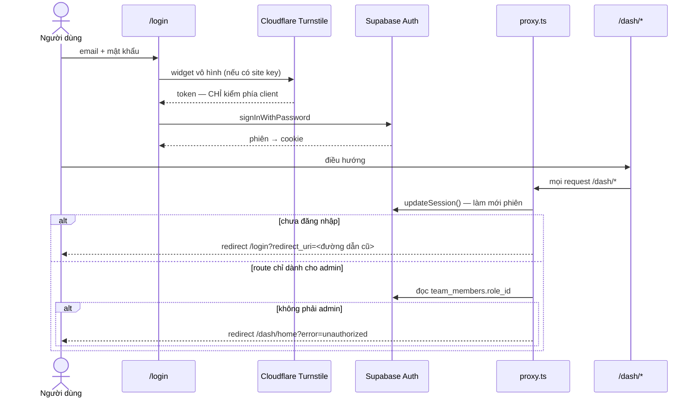

# Mô hình xác thực và phân quyền

Hai loại danh tính hoàn toàn tách biệt. Chúng dùng chung DB nhưng không dùng chung cơ chế nào.

| Danh tính | Là ai | Xác thực bằng | Cưỡng chế ở |
|---|---|---|---|
| **Người** | Operator, Admin | Supabase Auth — email/mật khẩu, phiên trong cookie | `proxy.ts` + `requireUser()`/`requireAdmin()` trong mỗi Server Action |
| **Máy** | Crawler worker | Token thô → SHA-256 → `api_tokens` | `verifyApiToken()` trong route handler |

Phần máy nằm ở [api-design.md](api-design.md) §3. File này lo phần người.

---

## 1. Luồng đăng nhập



---

## 2. Hai điểm cưỡng chế, không phải một

Đây là điều dễ hiểu sai nhất. `proxy.ts` **không** đủ.

| Điểm | Bảo vệ cái gì | Không bảo vệ cái gì |
|---|---|---|
| `proxy.ts` — `config.matcher` chỉ khớp `/dash/:path*`, `/login`, `/sign-up`, `/forgot-password` | Việc **điều hướng trang** | Server Action (gọi thẳng, không qua matcher) và `/api/*` |
| `requireUser()` / `requireAdmin()` trong từng Server Action | Việc **thực thi** | — |

Bỏ `requireAdmin()` trong một action nhưng vẫn giữ route trong `ADMIN_ONLY_PREFIXES` thì trang bị chặn còn action thì không: một người dùng thường vẫn gọi được action đó từ console. **Cổng thật nằm ở action.**

### Route chỉ dành cho admin

<!-- gen: sed -n '/ADMIN_ONLY_PREFIXES/,/\]/p' dashboard/proxy.ts -->

7 tiền tố trong [proxy.ts](../dashboard/proxy.ts):

`/dash/manage-account/members` · `/dash/accounts` · `/dash/tasks` · `/dash/proxies` · `/dash/audit-logs` · `/dash/settings` · `/dash/data/management`

**`/dash/release-ops/*` không có trong danh sách này** — nhưng cả 24 Server Action của Release Ops đều gọi `requireAdmin()`. Kết quả: người dùng thường **vào được trang**, thấy giao diện, rồi bị đá về `/dash/home` khi trang nạp dữ liệu. Không phải lỗ hổng, nhưng là trải nghiệm hỏng và một mâu thuẫn nên dọn.

### Cổng theo từng file action

<!-- gen: for f in dashboard/lib/actions/*.ts; do echo "$f: csrf=$(grep -c verifyCSRF $f) admin=$(grep -c requireAdmin $f) user=$(grep -c requireUser $f)"; done -->

| File action | `verifyCSRF` | `requireAdmin` | `requireUser` |
|---|---|---|---|
| `release-ops.actions.ts` | 9 | 27 | 0 |
| `member.actions.ts` | 9 | 9 | 0 |
| `crawler.actions.ts` | 8 | 12 | 0 |
| `system.actions.ts` | 5 | 8 | 0 |
| `settings.actions.ts` | 3 | 4 | 0 |
| `data.actions.ts` | 0 | 3 | 5 |
| `creative.actions.ts` | 0 | 0 | 9 |
| `dashboard.actions.ts` | 0 | 0 | 5 |
| `auth.actions.ts` | 0 | 0 | 0 |

Luật rút ra từ bảng: **đọc thì `requireUser`, ghi thì `verifyCSRF` + `requireAdmin`.** `creative` và `dashboard` chỉ đọc nên `verifyCSRF = 0` là đúng. `auth.actions.ts` bằng 0 cả ba là đúng — nó *là* đường đăng nhập.

---

## 3. Vai và quyền

Vai lấy từ `team_members.role_id`. Chỉ có hai giá trị được cưỡng chế trong code: `admin` và mọi thứ khác.

| Vai | Xem creative, dữ liệu, trang tổng quan | Tạo task, quản trị, cài đặt, Release Ops |
|---|---|---|
| `admin` | ✅ | ✅ |
| `user` | ✅ | ❌ |
| chưa đăng nhập | ❌ | ❌ |

Bảng `team_roles` và `team_role_permissions` tồn tại và có UI quản lý, nhưng **không có điểm nào trong code đọc `team_role_permissions` để quyết định cho phép hay không**. Ma trận quyền chi tiết hiện là dữ liệu, chưa phải luật. Ghi ở [features.md](features.md) với dấu 🟨.

---

## 4. Ba chỗ nguy hiểm trong đường xác thực

Cả ba là **hành vi thật của code hôm nay**, không phải giả định.

### 4.1 Đường vòng qua xác thực bằng cookie — ⚠️ nghiêm trọng nhất

[auth-helper.ts](../dashboard/lib/supabase/auth-helper.ts) — `getCurrentUser()`:

1. Thử `supabase.auth.getUser()`.
2. **Nếu bước 1 không trả về user**, đọc cookie `sinomedia_dev_user`. Có giá trị → trả về một user giả với `id = "dev-admin-id"` nếu chuỗi chứa `"admin"`.

Và `proxy.ts` có:

```ts
if (user.id === "dev-admin-id") { isAdmin = true; }
```

**Không có kiểm tra `NODE_ENV`, không có cờ môi trường, không có allowlist.** Đường này chạy trên cùng đoạn code với production. Ai đặt được cookie đó trong trình duyệt thì thành admin.

Chi tiết và cách xử lý: [security.md](security.md) §2. Đây là mục T-03 ở [task-plan.md](task-plan.md).

### 4.2 Suy ra vai từ email

`requireUser()` có hai đường dự phòng khi truy vấn `team_members` lỗi hoặc không có bản ghi:

```ts
role: member?.role_id || (user.email.includes("admin") ? "admin" : "user")
```

Email chứa chuỗi `admin` ở **bất cứ đâu** thì thành admin — kể cả `notadmin@…` hay `admin.intern@…`. Dự phòng này chạy cả khi Supabase chỉ chập chờn một nhịp.

### 4.3 Turnstile chỉ kiểm ở client

`NEXT_PUBLIC_TURNSTILE_SITE_KEY` được dùng để render widget, và form chặn submit khi `turnstileState !== "success"`. **Không có lời gọi `siteverify` nào ở phía server** — không có `TURNSTILE_SECRET_KEY` trong code.

```bash
grep -rn "siteverify\|TURNSTILE_SECRET" dashboard --include=*.ts --include=*.tsx   # rỗng
```

Nghĩa là Turnstile chặn được bot chạy trình duyệt thật ở mức cơ bản, nhưng không chặn được script gọi thẳng Supabase Auth. Nó là lớp giảm ồn, **không phải** cổng bảo mật.

---

## 5. CSRF

[lib/csrf.ts](../dashboard/lib/csrf.ts) — `verifyCSRF()` kiểm `Origin`, dự phòng `Referer`:

| Chấp nhận | Nguồn |
|---|---|
| `NEXT_PUBLIC_SITE_URL` | biến môi trường |
| `https://$VERCEL_URL`, `https://$VERCEL_BRANCH_URL` | Vercel tự đặt |
| `http://localhost:3000` | cứng trong code |
| `http://<host>`, `https://<host>` | header `host` của chính request |
| **mọi host kết thúc bằng `.vercel.app`** | luật `endsWith` |

Luật cuối là chỗ nới rộng đáng chú ý: **bất kỳ** deployment Vercel nào, kể cả của người khác, đều qua được cổng CSRF. Đổi lấy sự tiện: preview URL sinh ngẫu nhiên mỗi lần deploy nên không allowlist trước được.

Cần siết thì thay `endsWith(".vercel.app")` bằng so khớp tiền tố dự án. Ghi ở [task-plan.md](task-plan.md) T-09.

---

## 6. Phiên

| Thứ | Giá trị |
|---|---|
| Nơi lưu | Cookie do `@supabase/ssr` quản lý |
| Làm mới | `updateSession()` trong [lib/supabase/middleware.ts](../dashboard/lib/supabase/middleware.ts), gọi từ `proxy.ts` mỗi request khớp matcher |
| Đăng xuất | Supabase xoá cookie |
| Sau khi đăng nhập | Quay lại `redirect_uri` đã lưu lúc bị chặn |
| Đã đăng nhập mà vào `/login` | Đá về `/dash/home` |

Thời hạn access token và refresh token do cấu hình dự án Supabase quyết định, **không** nằm trong repo. `old-docs` ghi "1 giờ / 30 ngày" — con số đó không kiểm được từ code, nên không chép lại ở đây.
