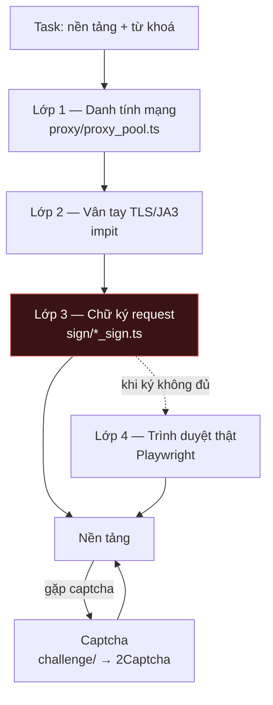

# Đi sâu: tầng chống-phát-hiện của crawler

Hệ con mong manh nhất trong toàn hệ thống, và là hệ con duy nhất **thường xuyên hỏng vì lý do nằm ngoài repo**.

Chủ sở hữu duy nhất: `crawler-pipeline/src/` — bốn thư mục `sign/`, `challenge/`, `proxy/`, và các file `*_client.ts` trong `src/crawl/<nền-tảng>/`.

---

## 1. Vì sao hệ con này cần một file riêng

Mọi phần khác của hệ thống hỏng vì **code mình viết sai**. Phần này hỏng vì **bên kia đổi luật chơi** — và không báo trước.

Ba hệ quả buộc phải thiết kế khác:

| Đặc điểm | Hệ quả |
|---|---|
| Nền tảng chủ động chống lại | Không có API ổn định. Cái chạy hôm nay có thể 403 vào tuần sau mà không đổi một dòng code nào |
| Hỏng **theo từng nền tảng** | Douyin gãy không kéo Bilibili gãy. Kiến trúc phải cô lập được lỗi ở mức nền tảng |
| Không test được bằng mock | Mock luôn xanh. Chỉ có gọi thật vào nền tảng thật mới biết còn chạy không |

---

## 2. Bốn lớp nguỵ trang, theo thứ tự dễ bị phát hiện

| Lớp | Chống cái gì | Chi phí | Gãy như thế nào |
|---|---|---|---|
| **1. Proxy** ([proxy_pool.ts](../crawler-pipeline/src/proxy/proxy_pool.ts)) | Chặn theo IP, giới hạn theo IP | Tiền thuê proxy | Proxy chết dần và im lặng; tự đánh dấu `inactive` khi health check trượt |
| **2. `impit`** | Vân tay TLS/JA3 — nhận ra "đây là Node.js, không phải Chrome" | Một dependency native, không chạy được ở vài môi trường (xem §5) | Bật `DISABLE_IMPIT` là tụt xuống `undici` thuần và lộ ngay |
| **3. Ký request** (`sign/`) | Tham số ký bắt buộc: `X-Bogus`/`a_bogus` (Douyin), `wbi` (Bilibili), `x-zse` (Zhihu) | Phải đọc lại thuật toán mỗi lần nền tảng đổi | **Chỗ gãy thường xuyên nhất.** Nền tảng đổi thuật toán → 403/401 ngay lập tức |
| **4. Playwright** | Mọi thứ còn lại: JS challenge, DOM động, hành vi | RAM lớn, chậm hơn nhiều lần | Selector đổi khi nền tảng đổi giao diện |

Chỉ **3 trong 7** nền tảng có module ký riêng — `douyin_sign.ts`, `bilibili_sign.ts`, `zhihu_sign.ts`. Bốn nền tảng còn lại (Kuaishou, Tieba, Weibo, XHS) đi bằng cookie + Playwright, không có bước ký. Đó là lý do chúng ổn định hơn nhưng chậm hơn.

<!-- gen: ls crawler-pipeline/src/sign crawler-pipeline/src/crawl -->

---

## 3. Vì sao dùng lớp thấp nhất mà chạy được, không dùng Playwright cho tất cả

Playwright chắc ăn nhất và cũng đắt nhất: mỗi phiên tốn hàng trăm MB RAM, và container bị giới hạn **2 GB** ([docker-compose.yml](../crawler-pipeline/docker-compose.yml)). Chạy Playwright cho mọi request thì OOM ở mức đồng thời rất thấp.

Nên luật là: **dùng lớp thấp nhất còn chạy được, chỉ leo lên khi lớp dưới trượt.** Douyin có `http_client.ts` (impit + ký) *và* `client.ts` (Playwright) — hai đường cho cùng một nền tảng, dùng đường rẻ trước.

### Phương án đã loại

| Phương án | Vì sao loại |
|---|---|
| Playwright cho mọi request | OOM ở mức đồng thời rất thấp với hạn mức 2 GB; chậm hơn khoảng một bậc |
| Chỉ HTTP + ký, không có Playwright | Douyin và XHS có bước challenge JS mà HTTP thuần không qua nổi |
| Mua API bên thứ ba thay vì tự crawl | Không phủ đủ 7 nền tảng, và mất quyền kiểm soát trường dữ liệu lấy về |
| Tự giải captcha bằng model | Mở một dự án con. 2Captcha đủ dùng ở lưu lượng hiện tại |

---

## 4. Phiên và cookie — nơi giữ trạng thái đắt nhất

Đăng nhập một tài khoản mạng xã hội là thao tác **đắt và rủi ro**: nó cần captcha, có khi cần SMS, và đăng nhập lại quá thường xuyên thì chính hành vi đó bị gắn cờ. Nên phiên phải được giữ và tái dùng.

| Nơi | Giữ cái gì |
|---|---|
| Bảng `crawler_accounts` cột `cookie_data` | Nguồn sự thật, **mã hoá AES-256-CBC** ở tầng gateway |
| [sign/session_store.ts](../crawler-pipeline/src/sign/session_store.ts) | Bộ nhớ phiên trong tiến trình worker |
| `src/crawl/douyin/session*.ts` — 4 file: `session`, `session_bootstrap`, `session_diagnostic`, `session_recovery` | Douyin cần vòng đời phiên riêng: khởi tạo, chẩn đoán, phục hồi |
| `DOUYIN_PROFILE_DIR` | Profile trình duyệt trên đĩa |

Đường mượn tài khoản: worker `GET crawler_accounts?platform=eq.X&status=eq.active&order=last_used_at.asc.nullsfirst&limit=1`. Gateway **cưỡng chế** cả bốn tham số — chi tiết và lý do ở [api-design.md](api-design.md) §5.

`order=last_used_at.asc.nullsfirst` là luật xoay vòng thật: tài khoản lâu không dùng nhất được lấy trước. Nếu worker bám mãi một tài khoản thì nền tảng khoá tài khoản đó. Luật này được cưỡng chế **ở gateway**, không ở worker — cố ý, vì worker là thứ hay bị sửa vội.

---

## 5. Ba chế độ hỏng đã gặp thật

Ghi cả **hướng đã thử mà không hiệu quả**, vì đó là phần tốn thời gian nhất.

### 5.1 `impit` không chạy trên Windows dev

**Triệu chứng:** tải file lớn (>30 MB) từ CDN Bilibili đứt giữa chừng với lỗi `terminated`.

**Đã thử, không ăn thua:** tăng timeout; thử lại; đổi `undici` sang `fetch` thuần.

**Nguyên nhân thật:** môi trường Windows local thiếu thư viện spoof TLS/JA3 của `impit`. CDN nhận ra vân tay không phải trình duyệt và cắt giữa chừng ở file lớn — file nhỏ vẫn qua, nên lỗi trông như lỗi mạng ngẫu nhiên.

**Cờ thoát:** `DISABLE_IMPIT=true` để chạy được trên máy dev, **đổi lấy** việc dễ bị phát hiện hơn. Không bao giờ đặt cờ này trên production.

### 5.2 Sandbox chặn kết nối ra ngoài, tưởng nhầm là lỗi CORS

**Triệu chứng:** `/api/video/proxy` trả `fetch failed`, nguyên nhân gốc `EACCES: connect`.

**Đã thử, không ăn thua:** sửa header CORS; đổi `Referer`; đổi user-agent — vì `EACCES` bị đọc nhầm thành vấn đề quyền của nền tảng.

**Nguyên nhân thật:** tường lửa sandbox chặn toàn bộ kết nối ra Internet từ tiến trình Node. Không phải lỗi của nền tảng, không phải lỗi CORS.

**Cách nhận ra ngay:** `EACCES`/`ECONNREFUSED` từ chính tiến trình Node là vấn đề **môi trường**; `403`/`401` mới là vấn đề **nền tảng**. Đọc đúng mã lỗi tiết kiệm hàng giờ.

### 5.3 Thuật toán ký lỗi thời

**Triệu chứng:** một nền tảng trả 403/401 đồng loạt, các nền tảng khác bình thường.

**Không phải:** proxy chết (proxy chết thì mọi nền tảng cùng chậm), token hỏng (token hỏng thì gateway trả 401 chứ không phải nền tảng).

**Cách khoanh vùng:** đúng một nền tảng gãy + gãy ngay từ request đầu = tầng ký. Xem [runbook.md](runbook.md) §3.

---

## 6. Cờ điều khiển hành vi

<!-- gen: grep -rhoE 'process\.env\.[A-Z_0-9]+|getEnv\("[A-Z_0-9]+"\)' crawler-pipeline/src | sort -u -->

| Biến | Mặc định | Tác dụng |
|---|---|---|
| `DISABLE_IMPIT` | tắt | Bỏ spoof TLS. **Chỉ dùng ở dev** |
| `CRAWLER_HEADLESS` | `true` | `false` để nhìn trình duyệt khi debug |
| `CRAWLER_PROXY` | rỗng | Proxy cho mọi lời gọi ra, kể cả tới gateway |
| `CAPTCHA_ENABLED` / `CAPTCHA_PROVIDER` / `CAPTCHA_TIMEOUT_MS` / `TWOCAPTCHA_API_KEY` | — | Tầng giải captcha |
| `ENABLE_GET_COMMENTS` / `ENABLE_GET_SUB_COMMENTS` / `CRAWLER_ENABLE_SUB_COMMENTS` | — | Có crawl bình luận không. Bình luận con làm số request tăng vọt |
| `CRAWLER_MAX_COMMENTS_COUNT_SINGLENOTES` | — | Trần bình luận mỗi bài |
| `ENABLE_CREATOR_DETAIL` / `CREATOR_MAX_POSTS` | — | Độ sâu khi crawl theo tác giả |
| `BILIBILI_COOKIE` `KUAISHOU_COOKIE` `XHS_COOKIE` `ZHIHU_COOKIE` `DOUYIN_COOKIE_PATH` `DOUYIN_PROFILE_DIR` `XHS_API_HOST` | — | Đường tắt cấu hình tay, dùng khi chưa nạp tài khoản vào DB |
| `SUPERMIUM_PATH` / `BROWSER_EXECUTABLE_PATH` | `C:\Program Files\Supermium\chrome.exe` | Trình duyệt thay thế. Mặc định là đường dẫn **Windows** — trong container Linux phải đặt lại |

`CURRENT_TASK_ID`, `CURRENT_TASK_LANGUAGE`, `CURRENT_TASK_TAGS` không phải cấu hình: worker tự đặt chúng khi chạy để truyền ngữ cảnh task xuống các module con.

---

## 7. Sửa hệ con này thì kiểm bằng gì

Mock vô dụng ở đây. Ba mức kiểm, từ rẻ tới đắt:

| Mức | Lệnh | Trả lời câu hỏi |
|---|---|---|
| Hợp đồng | `cd automation-test && npx playwright test tests/crawler-contracts` | Gateway còn nhận đúng hình dạng dữ liệu không |
| Khói, có gọi thật | `npx playwright test tests/crawler-live-smoke` | Đường từ worker tới DB còn thông không |
| Nền tảng thật | `cd crawler-pipeline && npm run crawl` với một từ khoá đã biết | Tầng ký/proxy/captcha còn qua được không |

Mức 3 là mức duy nhất bắt được lỗi §5.3, và nó **phải** chạy tay. Đó là lý do [test-cases.md](test-cases.md) không hứa tự động hoá phần này.
