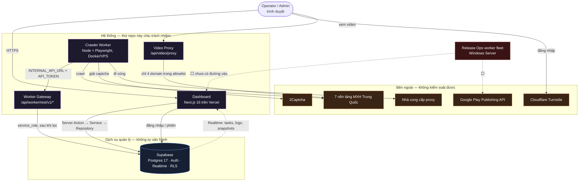

# Ranh giới hệ thống

Cái gì thuộc hệ thống này, cái gì không, và ai nói chuyện với ai.

---

## 1. Sơ đồ ngữ cảnh

---

## 2. Bốn thứ **trong** ranh giới

| Thành phần | Chạy ở đâu | Ai deploy | Nguồn |
|---|---|---|---|
| Dashboard + Server Actions | Vercel | Push `main` → Vercel tự deploy | [dashboard/](../dashboard/) |
| Worker Gateway | Cùng tiến trình với dashboard | như trên | [route.ts](../dashboard/app/api/worker/rest/v1/) |
| Video Proxy | Cùng tiến trình với dashboard | như trên | [video/proxy/route.ts](../dashboard/app/api/video/proxy/route.ts) |
| Crawler Worker | Docker trên VPS Linux | GitHub Actions build image → kéo tay trên VPS | [crawler-pipeline/](../crawler-pipeline/) |

Migration schema ([supabase/migrations/](../supabase/migrations/)) cũng trong ranh giới, dù bản thân Postgres thì không.

---

## 3. Thứ **không** chịu trách nhiệm

Phần này quan trọng ngang phần trên. Nó chặn việc mở rộng phạm vi trong im lặng.

| Không chịu trách nhiệm | Ai chịu | Hệ quả khi hỏng |
|---|---|---|
| **Uptime của Postgres, Auth, Realtime** | Supabase | Supabase down = toàn hệ thống down. Không có chế độ chạy suy giảm. Xem [runbook.md](runbook.md) §6 |
| **Uptime của Vercel** | Vercel | Dashboard **và** Worker Gateway cùng chết → crawler mất luôn đường ghi dữ liệu |
| **Thuật toán ký request của nền tảng** | Douyin / XHS / … | Nền tảng đổi thuật toán → crawler nền tảng đó 403. Các nền tảng khác không ảnh hưởng |
| **Chất lượng và tuổi thọ proxy** | Nhà cung cấp proxy | Proxy chết → crawl chậm hoặc bị chặn |
| **Tỉ lệ giải captcha** | 2Captcha | Hết credit → crawl dừng ở bước có captcha |
| **Build AAB** | Pipeline Android bên ngoài repo | Release Ops chỉ nhận artifact, không tạo ra nó |
| **Nội dung mình crawl** | Nền tảng nguồn | Không kiểm duyệt, không sở hữu, không lưu bản sao dài hạn |
| **Media binary** | CDN của nền tảng | Đã cố ý **bỏ** việc tự lưu — xem [learn.md](learn.md) §2 |

---

## 4. Thư mục trong repo **ngoài** ranh giới

Repo này chứa nhiều thứ hơn hệ thống. Bốn thư mục dưới ở chung git nhưng không thuộc luồng vận hành, không được tài liệu hoá, và **không nên** kéo vào thiết kế:

| Thư mục | Là gì | Vì sao ngoài ranh giới |
|---|---|---|
| `auto-gen-image/` | Pipeline sinh ảnh, có HAR và cookie của dịch vụ ngoài | Công cụ rời, không có đường chạy nào từ dashboard tới nó |
| `desktop-app/` | Client desktop + installer Inno Setup | Chưa nối vào luồng nào |
| `tests/scripts/` | ~60 script thăm dò tay khi phát triển crawler | Script một lần, không phải bộ test. Bộ test thật ở `automation-test/` |
| `external/`, `builds/`, `init-design/`, `plans/`, `assets/` | Tham chiếu, artifact build, bản nháp thiết kế, kế hoạch cũ | Không có code chạy |

`helps/` và `.agents/` là tài liệu/công cụ cho người và AI, không phải hệ thống — nhưng có ảnh hưởng: xem [agent-instructions.md](agent-instructions.md).

---

## 5. Ba ranh giới tin cậy

Mỗi mũi tên vượt một trong ba ranh giới này phải qua một cổng. Chi tiết cổng ở [security.md](security.md).

| Ranh giới | Cổng | Cái gì đi qua |
|---|---|---|
| Trình duyệt → Dashboard | Phiên Supabase (cookie) + `requireUser()`/`requireAdmin()` + `verifyCSRF()` cho mọi thao tác ghi | Thao tác của người |
| Worker → Gateway | Token SHA-256 + scope + danh sách bảng/cột/filter cho phép | Dữ liệu crawl, log, trạng thái task |
| Gateway → Supabase | `service_role` key — **bỏ qua toàn bộ RLS** | Tất cả. Đây là chỗ nguy hiểm nhất trong hệ thống |

Ranh giới thứ ba là lý do tồn tại của toàn bộ phần lọc trong `route.ts`: một khi request đã qua gateway, không còn hàng rào nào phía sau nữa.
