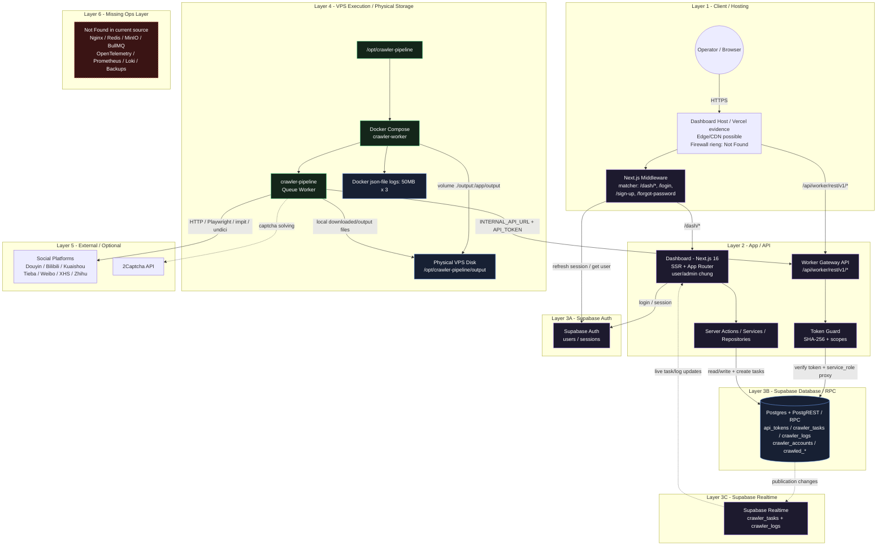
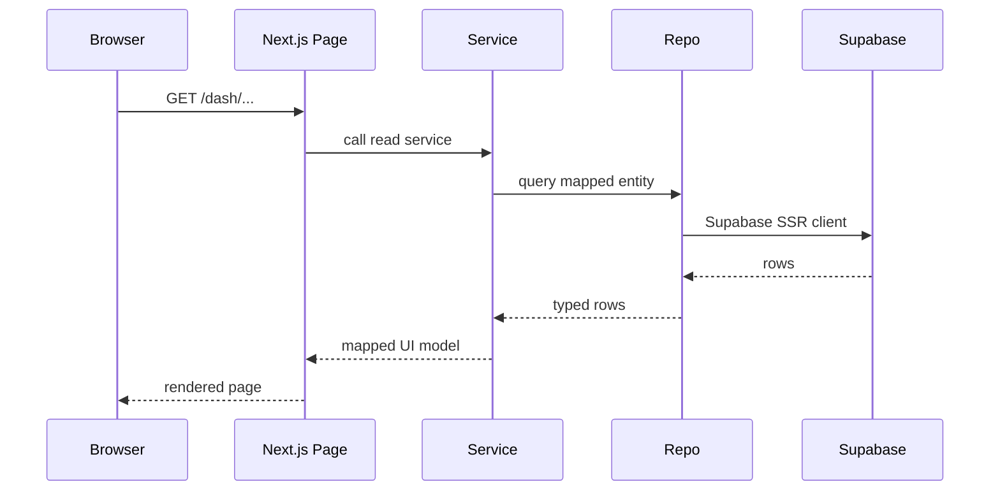
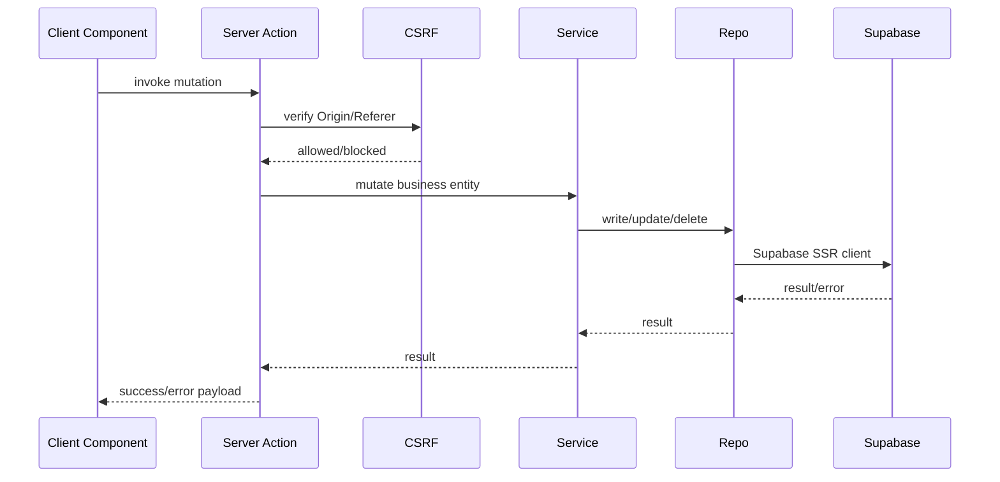
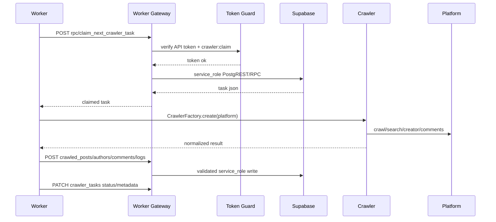
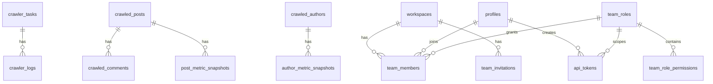
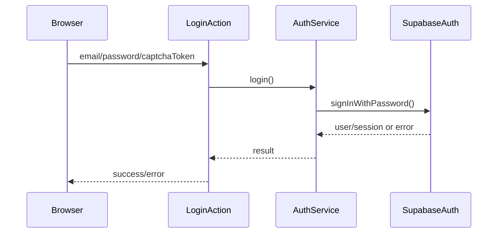
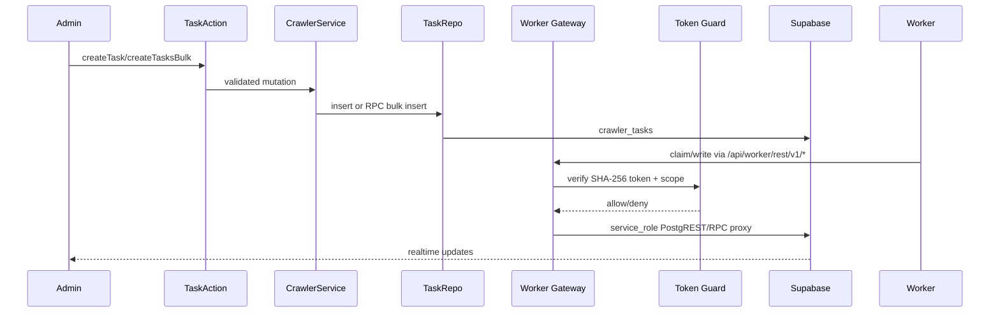
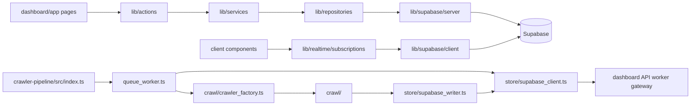
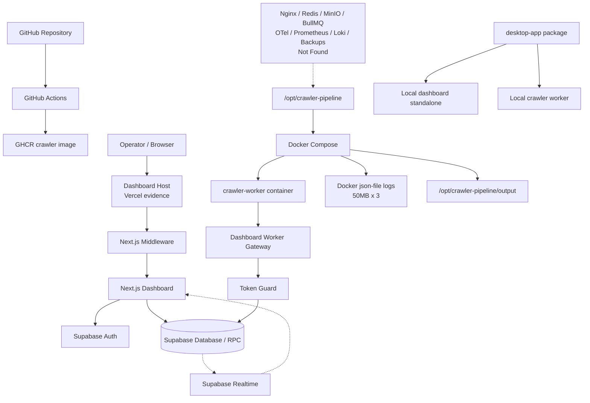

# SinoMedia Architecture

Cap nhat: 2026-07-29

Tai lieu nay la architecture document chinh thuc cho SinoMedia, duoc cap nhat theo `.agents/skills/achitecture-plan.md` va lay so do system architecture chuan trong muc 4 lam source of truth. Moi mo ta ben duoi phai bam theo source code, migrations, manifest, GitNexus context hien tai va so do chuan da xac nhan. Neu khong tim thay bang chung trong code, muc do duoc ghi ro la `> Not Found`.

Nguyen tac doc tai lieu:

- `Dashboard` la control plane: UI, auth, server actions, services, repositories va API route handlers.
- `Worker Gateway API` la duong vao noi bo cho crawler worker; worker khong duoc mo ta nhu dang goi truc tiep Supabase trong kien truc chuan.
- `Supabase` duoc tach thanh Auth, Database/RPC va Realtime vi source co bang chung rieng cho tung vai tro.
- `VPS Execution / Physical Storage` la execution tier cua crawler worker; output hien tai la disk volume tren VPS/container, khong phai MinIO/S3.
- Cac thanh phan ops nhu Nginx, Redis, MinIO, BullMQ, OpenTelemetry, Prometheus, Loki va backups phai duoc ghi `> Not Found` neu khong co bang chung trong source.

## Table Of Contents

1. [Project Overview](#1-project-overview)
2. [Tech Stack](#2-tech-stack)
3. [Folder Structure](#3-folder-structure)
4. [System Architecture](#4-system-architecture)
5. [Module Breakdown](#5-module-breakdown)
6. [Request Flow](#6-request-flow)
7. [Authentication](#7-authentication)
8. [Authorization](#8-authorization)
9. [Database](#9-database)
10. [API Architecture](#10-api-architecture)
11. [Business Flow](#11-business-flow)
12. [Dependency Graph](#12-dependency-graph)
13. [External Services](#13-external-services)
14. [Configuration](#14-configuration)
15. [Logging](#15-logging)
16. [Error Handling](#16-error-handling)
17. [Security](#17-security)
18. [Performance](#18-performance)
19. [Scalability](#19-scalability)
20. [Deployment](#20-deployment)
21. [Testing](#21-testing)
22. [Coding Convention](#22-coding-convention)
23. [Design Pattern](#23-design-pattern)
24. [Strengths](#24-strengths)
25. [Technical Debt](#25-technical-debt)
26. [Improvement Proposal](#26-improvement-proposal)
27. [Appendix](#27-appendix)

## 1. Project Overview

SinoMedia la he thong dieu khien crawler mang xa hoi va van hanh du lieu creative. Source hien tai la monorepo gom dashboard Next.js, crawler worker TypeScript, Supabase schema/migrations, desktop packaging workspace va automation test runner.

| Area | Hien trang trong code |
|---|---|
| Business domain | Quan ly crawler, account/proxy, task queue, du lieu bai viet/tac gia/binh luan, creative analytics, mot khu Release Ops UI dang dung fixture. |
| Architecture style | Layered monorepo voi runtime tach rieng: dashboard/control plane, worker execution tier, automation runner, desktop packaging. Khong phai microservice day du; ranh gioi runtime quan trong nhat la Dashboard/Worker Gateway va crawler worker tren VPS. |
| Frontend | `dashboard/` dung Next.js App Router, React 19, Server Components, Client Components va Server Actions. |
| Backend/API | Backend nam trong Next.js Server Actions, Services, Repositories va Route Handlers. Worker chi di vao backend qua gateway `/api/worker/rest/v1/[...path]`, sau do gateway dung service role proxy sang Supabase. |
| Database | Supabase/Postgres qua migrations trong `supabase/migrations`. Co RLS, RPC, realtime publications va cac bang queue/log/account/content. |
| Worker | `crawler-pipeline/` Node/TypeScript ESM, CLI va queue loop. Runtime chuan la Docker Compose tren VPS voi output volume `./output:/app/output`; crawler cac platform Douyin, Bilibili, Kuaishou, Tieba, Weibo, XHS, Zhihu. |
| Desktop | `desktop-app/` dong goi dashboard standalone, worker va Node runtime vao runtime package Windows. |
| Mobile | > Not Found |

## 2. Tech Stack

| Layer | Stack thuc te |
|---|---|
| Dashboard runtime | Next.js `16.2.10`, React `19.2.4`, React DOM `19.2.4`, TypeScript 5. |
| Dashboard UI | CSS/Tailwind v4, `lucide-react`, `clsx`, `tailwind-merge`, Zustand, `idb-keyval`. |
| Auth/DB client | `@supabase/ssr`, `@supabase/supabase-js`. |
| Captcha UI | `@marsidev/react-turnstile` duoc khai bao trong dashboard dependencies va auth actions truyen `captchaToken` vao Supabase Auth. |
| Worker runtime | Node >= 18, TypeScript, ESM, `tsx`, `nodemon` dev. |
| Worker HTTP/Browser | `undici`, `impit`, `playwright`. |
| Database | Supabase local config dung Postgres major version 17, API port 54321, DB port 54322, realtime enabled, storage enabled. |
| Testing | Playwright Test, TypeScript, custom Node runner dashboard/SSE. |
| Docker | `crawler-pipeline/Dockerfile` dung `node:18-bookworm-slim`; `docker-compose.yml` chay service `crawler`. |
| CI/CD | GitHub Actions build va push crawler image len GHCR khi `main` thay doi trong `crawler-pipeline/**`. |
| Cloud deploy | Vercel co dau vet `.vercel/` va `.vercelignore`; dashboard production deploy config cu the ngoai source: > Not Found |
| Queue | Queue duoc model bang bang `crawler_tasks` + RPC `claim_next_crawler_task`; message broker Redis/RabbitMQ/Kafka/BullMQ: > Not Found |
| Cache | `crawler-pipeline/src/cache/memory_cache.ts` ton tai; Redis/Memcached: > Not Found |
| Monitoring | Playwright reports, crawler logs DB; APM/Sentry/OpenTelemetry: > Not Found |

## 3. Folder Structure

| Folder | Purpose |
|---|---|
| `.agents/` | Agent instructions, project docs va skills local. File nay nam trong `.agents/docs/`. |
| `.github/workflows/` | CI workflow build/push crawler Docker image. |
| `dashboard/` | Next.js dashboard, UI, server actions, services, repositories, Supabase clients va API route handlers. |
| `dashboard/app/` | App Router pages, layouts, auth pages, dashboard routes va API routes. |
| `dashboard/lib/actions/` | Server Actions lam cau noi UI -> service. Mutation actions thuong goi `verifyCSRF()`. |
| `dashboard/lib/services/` | Business logic cho auth, crawler, data, creative, member, settings, system, dashboard metrics. |
| `dashboard/lib/repositories/` | Supabase table access wrappers theo entity. |
| `dashboard/lib/supabase/` | Browser/server/middleware Supabase clients va auth helper. |
| `dashboard/lib/guards/` | API token guard cho worker gateway. |
| `dashboard/lib/realtime/` | Browser realtime subscription cho `crawler_tasks` va `crawler_logs`. |
| `crawler-pipeline/` | Worker CLI/queue runtime, Docker setup va crawler implementation. |
| `crawler-pipeline/src/crawl/` | Platform crawlers va `crawler_factory.ts`. |
| `crawler-pipeline/src/store/` | Supabase REST gateway client, writers, account pool. |
| `crawler-pipeline/src/downloader/` | Stream downloader, media validator, concurrency pool, local disk destination only. |
| `crawler-pipeline/src/challenge/` | Captcha solver abstraction va 2Captcha provider. |
| `supabase/` | Supabase CLI config, migrations, seed. |
| `automation-test/` | Playwright test suite, test module registry, local runner dashboard, reports/artifacts. |
| `desktop-app/` | Windows desktop runtime package scripts/contracts/launcher workspace. |
| `assets/`, `auto-gen-image/`, `init-design/`, `external/`, `tests/`, `builds/`, `configs/` | Phu tro/asset/workspace. Vai tro runtime chinh khong duoc xac nhan day du trong source da doc. |

## 4. System Architecture

Day la so do system architecture chuan cua project. Cac section khac trong tai lieu phai nhat quan voi so do nay: request tu operator di vao dashboard host/middleware; dashboard lam viec voi Supabase Auth/DB/Realtime; worker tren VPS chi noi vao he thong qua Worker Gateway API va Token Guard; output hien tai nam tren physical VPS disk.

### Layer Contracts

| Layer | Contract kien truc | Bang chung / trang thai |
|---|---|---|
| L1 - Client / Hosting | Operator truy cap dashboard qua browser/HTTPS. Middleware cua Next.js la diem bao ve route `/dash/*` va auth pages. | `dashboard/proxy.ts` matcher `/dash/:path*`, `/login`, `/sign-up`, `/forgot-password`; dau vet Vercel co trong repo. Firewall rieng: > Not Found |
| L2 - App / API | Dashboard Next.js 16 gom SSR/App Router, Server Actions, Services, Repositories va Route Handlers. Worker Gateway la API noi bo cho crawler worker. | `dashboard/package.json`, `dashboard/app`, `dashboard/lib/actions`, `dashboard/lib/services`, `dashboard/lib/repositories`, `dashboard/app/api/worker/rest/v1/[...path]/route.ts` |
| L3A - Supabase Auth | Quan ly user/session cua dashboard. Middleware refresh session va doc user. | `@supabase/ssr`, `dashboard/lib/supabase/middleware.ts`, auth actions/services. |
| L3B - Supabase Database / RPC | Postgres/PostgREST/RPC la source of truth cho tokens, queue, logs, accounts va crawled data. | `supabase/migrations/*.sql`, `claim_next_crawler_task`, `create_crawler_tasks`. |
| L3C - Supabase Realtime | Day live changes cua task/log/metrics ve dashboard. | migration enable realtime va `dashboard/lib/realtime/subscriptions.ts`. |
| L4 - VPS Execution / Physical Storage | Crawler worker chay trong Docker Compose tren `/opt/crawler-pipeline`; file output luu tren disk qua volume. | `crawler-pipeline/docker-compose.yml`, `crawler-pipeline/deployment/*`, `docker-help.md`. |
| L5 - External / Optional | Worker goi social platforms va co the dung 2Captcha neu cau hinh. | `crawler-pipeline/src/crawl/*`, `crawler-pipeline/src/challenge/providers/two_captcha.ts`. |
| L6 - Missing Ops Layer | Cac thanh phan ops chua co bang chung trong source khong duoc xem la da ton tai. | Nginx / Redis / MinIO / BullMQ / OpenTelemetry / Prometheus / Loki / Backups: > Not Found |

Ghi chu ha tang:

| Thanh phan | Trang thai theo source |
|---|---|
| Dashboard edge/CDN | Co dau vet dashboard Next.js va `.vercel/`, nhung Cloudflare CDN/Firewall cho dashboard: > Not Found |
| Nginx gateway 80/443 | > Not Found |
| VPS worker path | `crawler-pipeline/deployment/README.md` va `docker-help.md` huong dan deploy vao `/opt/crawler-pipeline`. |
| Luu tru vat ly tren VPS | `docker-compose.yml` mount `./output:/app/output`; tren VPS tuong ung `/opt/crawler-pipeline/output`. |
| Database chinh | Supabase Cloud/Postgres, khong nam tren VPS trong source hien tai. |
| Redis / MinIO / BullMQ / Prometheus / Loki | > Not Found |

## 5. Module Breakdown

| Module | Responsibility | Evidence |
|---|---|---|
| Auth | Login, sign-up, sign-out, optional Turnstile captcha, invitation consumption. | `dashboard/lib/actions/auth.actions.ts`, `dashboard/lib/services/auth.service.ts`. |
| Session/Middleware | Refresh Supabase session, protect `/dash/*`, redirect auth routes, admin-only prefixes. | `dashboard/proxy.ts`, `dashboard/lib/supabase/middleware.ts`. |
| Member/RBAC | Workspaces, profiles, team roles, role permissions, invitations, API tokens. | `members_and_tokens.sql`, `member.service.ts`, `member.actions.ts`. |
| Worker Token Guard | Validate bearer/x-api-key token hash, status, expiry, scopes; reject wildcard token for worker gateway. | `dashboard/lib/guards/token.guard.ts`, worker route handler. |
| Crawler Task Management | CRUD task UI/actions, bulk task RPC, cancel/retry, realtime status/logs. | `crawler.service.ts`, `task.repo.ts`, `subscriptions.ts`, `crawler_tasks`. |
| Account/Proxy Pool | Manage crawler accounts, cookie normalization, proxy assignment, account checkout/checkin in worker. | `crawler.service.ts`, `account.repo.ts`, `proxy.repo.ts`, `crawler-pipeline/src/store/account_pool.ts`. |
| Crawler Worker | Poll pending tasks, execute crawl/search/creator/comments, update progress/status/logs. | `crawler-pipeline/src/queue_worker.ts`. |
| Platform Crawlers | Platform-specific clients/core/extractors for Douyin, Bilibili, Kuaishou, Tieba, Weibo, XHS, Zhihu. | `crawler-pipeline/src/crawl/*`. |
| Data/Creative | Read crawled posts/authors/comments, creative search/trending/growth/advertisers. | `data.service.ts`, `creative.service.ts`, `crawled_*`, `post_metric_snapshots`. |
| Video Proxy | Authenticated media proxy with HTTPS/domain/content-type/size/private-IP checks. | `dashboard/app/api/video/proxy/route.ts`. |
| Settings | Store system settings including 2Captcha/API/webhook flags, encrypt sensitive values. | `settings.service.ts`, `system_settings`. |
| Automation Test Runner | Playwright suite, module registry, local runner dashboard, SSE run events, test case CRUD. | `automation-test/`. |
| Desktop Packaging | Build scaffold/full runtime, bundle dashboard standalone, worker and Node executable. | `desktop-app/README.md`, scripts/contracts. |
| Release Ops | Dashboard route family with UI based mostly on fixtures. | `dashboard/app/(main)/dash/release-ops/*`, `release-ops-fixtures.ts`. |

## 6. Request Flow

### Dashboard read flow

### Dashboard mutation flow

### Worker task flow

## 7. Authentication

| Mechanism | Implementation |
|---|---|
| User auth | Supabase email/password via `supabase.auth.signInWithPassword()` and `signUp()`. |
| Session storage | `@supabase/ssr` cookies in `createClientServer()`; middleware refreshes session. |
| Captcha | Login/sign-up actions accept `captchaToken` and pass it into Supabase Auth options. |
| Dev fallback | `AuthService.login()` has development-only fallback for `testpassword123` or test emails, writing cookie `sinomedia_dev_user`. |
| Route protection | `dashboard/proxy.ts` redirects unauthenticated `/dash/*` to `/login`. |
| API token auth | Worker gateway accepts `Authorization: Bearer <token>` or `x-api-key`, stores only SHA-256 hash in `api_tokens`. |
| OAuth | > Not Found |
| Refresh token policy | Supabase config enables refresh token rotation. |
| MFA | Supabase config has MFA sections disabled. |

## 8. Authorization

| Area | Rule in code |
|---|---|
| Dashboard admin routes | `dashboard/proxy.ts` checks role `admin` for members, accounts, tasks, proxies, audit logs, settings, data management. |
| Server-side admin guard | `requireAdmin()` redirects non-admin users to `/dash/home?error=unauthorized`. |
| Database RBAC | `public.is_admin(user_id)` checks `team_members.role_id = 'admin'`. |
| Roles | `team_roles` seeded with `admin` and `user`; permissions stored in `team_role_permissions`. |
| API token scopes | Worker route maps method/path to scopes like `crawler:claim`, `crawler:read_task`, `crawler:write_data`, `crawler:update_task`. |
| Worker wildcard token | Gateway calls `verifyApiToken(..., allowWildcard=false)` for worker proxy. |
| Public/anon DB access | `harden_anon_access.sql` revokes default privileges and grants selective authenticated access. |

## 9. Database

Database source of truth is `supabase/migrations`. Core schema is converging on generic `crawled_*` tables, but legacy platform tables from `remote_schema.sql` still exist.

### Core Tables

| Table | Key fields / constraints | Relationships / use |
|---|---|---|
| `crawler_tasks` | `id uuid PK`, `platform`, `command`, `target`, `max_count`, `status`, `priority`, `scheduled_at`, `error_message`, `metadata jsonb`; status/priority check constraints. | Queue table claimed by RPC, displayed in dashboard. |
| `crawler_logs` | `id bigint identity PK`, `task_id uuid FK crawler_tasks(id) ON DELETE CASCADE`, `level`, `message`, `created_at`. | Worker writes logs; dashboard subscribes/reads. |
| `crawled_posts` | `id text PK`, `platform`, `author_id`, `platform_id`, `caption`, `cover_url`, `media_urls`, `stats jsonb`, `raw jsonb`, `tags`, `language`, media contract fields, `title`, `content_type`, `source_url`. | Generic post/content table for dashboard creative/data views. |
| `crawled_authors` | `id text PK`, `platform_uid`, `nickname`, `platform`, profile metrics, `raw`, `videos_count`, `interaction_count`. | Generic author table. |
| `crawled_comments` | `id uuid PK`, `platform`, `platform_cid`, `post_id`, `platform_post_id`, `parent_cid`, author fields, `content`, `like_count`, `raw`. | Comments linked to posts by `post_id`/platform ids. |
| `crawler_accounts` | `id uuid PK`, `platform`, `username`, encrypted `cookie_data`, `status`, `failure_count`, `last_used_at`. | Worker account checkout/checkin; dashboard account management. |
| `crawler_proxies` | `id uuid PK`, host/port/credentials/protocol/status, `assigned_account_id`. | Dashboard proxy management and account-proxy assignment. |
| `post_metric_snapshots` | `id uuid PK`, `post_id FK crawled_posts(id) ON DELETE CASCADE`, platform ids, counts, `observed_at`, `source`. | Time-series post metrics. |
| `author_metric_snapshots` | `id uuid PK`, `author_id FK crawled_authors(id) ON DELETE CASCADE`, counts, `observed_at`, `source`. | Time-series author metrics. |
| `system_settings` | `id`, 2Captcha/API/webhook/default task flags, encrypted sensitive fields by service layer. | Dashboard settings. |
| `audit_logs` | actor/action/entity/payload/ip/timestamp. | Admin audit log page. |
| `exported_files` | filename/type/filter snapshot/size/creator/download URL. | Export tracking. |
| `creative_advertisers`, `creative_ads` | Creative-specific advertiser/ad tables. | Present in migrations; newer dashboard also reads generic crawled tables. |
| `workspaces`, `profiles`, `team_roles`, `team_role_permissions`, `team_members`, `team_invitations`, `api_tokens` | Workspace/team/RBAC/token schema. | Auth, member management, worker token access. |

### Legacy Platform Tables

| Platform | Tables |
|---|---|
| Bilibili | `bilibili_contact_info`, `bilibili_up_dynamic`, `bilibili_up_info`, `bilibili_video`, `bilibili_video_comment` |
| Douyin | `douyin_aweme`, `douyin_aweme_comment`, `dy_creator` |
| Kuaishou | `kuaishou_video`, `kuaishou_video_comment` |
| Tieba | `tieba_note`, `tieba_comment`, `tieba_creator` |
| Weibo | `weibo_note`, `weibo_note_comment`, `weibo_creator` |
| XHS | `xhs_note`, `xhs_note_comment`, `xhs_creator` |
| Zhihu | `zhihu_content`, `zhihu_comment`, `zhihu_creator` |

### RPC / Functions

| Function | Purpose |
|---|---|
| `public.create_crawler_tasks(jsonb)` | Bulk insert up to 50 tasks, skips duplicate pending/running targets, requires admin or service role. |
| `public.claim_next_crawler_task()` | Atomically updates first pending task to `running` using `FOR UPDATE SKIP LOCKED`, service role only. |
| `public.is_admin(uuid)` | Checks admin membership. |
| `public.handle_new_user()` | Auth trigger creates profile and team member, consumes invitation if available. |

### Indexes And Realtime

Important indexes include `idx_crawler_accounts_rotation(platform,status,last_used_at)`, platform-specific legacy indexes, `crawled_posts_tags_idx`, `crawled_posts_published_at_idx`, JSON stat indexes, metric snapshot `(id, observed_at DESC)` indexes, and content contract indexes for `content_type`/`source_url`.

Realtime publication includes `crawler_tasks`, `crawler_logs`, `post_metric_snapshots`, and `author_metric_snapshots`.

### ER Diagram

## 10. API Architecture

| API surface | Details |
|---|---|
| Server Actions | Main dashboard backend path. Files under `dashboard/lib/actions/*` call services and return success/error payloads. |
| Next Route Handler: worker gateway | `/api/worker/rest/v1/[...path]`, methods GET/POST/PATCH, proxy to Supabase PostgREST using service role after token/scope/payload validation. |
| Next Route Handler: video proxy | `/api/video/proxy?url=...`, GET/OPTIONS, authenticated media proxy. |
| Supabase PostgREST | Consumed by dashboard clients and by worker through gateway. |
| Supabase RPC | `create_crawler_tasks`, `claim_next_crawler_task`. |
| GraphQL | Kuaishou client posts to `/graphql` on external platform; project does not expose its own GraphQL API. |
| WebSocket/realtime | Supabase Realtime subscriptions for tasks/logs. |
| Versioning | Worker gateway path includes `rest/v1`. Other Server Actions are not versioned. |
| Pagination/filtering | Some services/repositories use range/order/filter; no unified API-wide pagination contract found. |
| Error format | Server Actions mostly return `{ success, error }`; Route Handlers return JSON or text `Response`. Unified error envelope: > Not Found |

### Worker Gateway Allowed Surface

Gateway `/api/worker/rest/v1/[...path]` is intentionally narrow. `handleProxy()` maps each method/path to at least one crawler scope, rejects unsupported endpoints, blocks wildcard worker tokens, limits dangerous query patterns, validates select/order/body fields, then forwards to `${SUPABASE_URL}/rest/v1/*` with service role credentials.

| Method / path | Required scope | Purpose |
|---|---|---|
| `POST rpc/claim_next_crawler_task` | `crawler:claim` | Claim next pending task through RPC. |
| `GET crawler_tasks` | `crawler:read_task` | Read task state/metadata. |
| `PATCH crawler_tasks` | `crawler:update_task` | Update task status/error/metadata. |
| `POST crawler_logs` | `crawler:write_logs` | Push worker logs to DB. |
| `GET crawler_accounts` | `crawler:read_accounts` | Checkout active account or read account status with forced-safe select. |
| `PATCH crawler_accounts` | `crawler:update_accounts` | Update account usage/failure/status. |
| `POST crawler_accounts` | `crawler:write_accounts` | Create account, encrypting `cookie_data` before DB write. |
| `GET/POST/PATCH crawled_posts` | `crawler:read_data` / `crawler:write_data` / `crawler:update_data` | Read/write/update crawled post data. |
| `GET/POST/PATCH crawled_authors` | `crawler:read_data` / `crawler:write_data` / `crawler:update_data` | Read/write/update crawled author data. |
| `POST crawled_comments` | `crawler:write_data` | Write crawled comments. |
| `POST post_metric_snapshots`, `POST author_metric_snapshots` | `crawler:write_data` | Write metric snapshots. |

## 11. Business Flow

### Login

### Create And Execute Crawler Task

### Creative/Data Read

Dashboard pages call `data.actions.ts` / `creative.actions.ts`, which call `data.service.ts` / `creative.service.ts`, then Supabase tables `crawled_posts`, `crawled_authors`, `crawled_comments`, `post_metric_snapshots`.

### Release Ops

Routes under `/dash/release-ops/*` import `MOCK_*` fixtures. Persistence/mutation/backend tables for Release Ops apps/releases/upload/ASO/batch were not found in the inspected source.

## 12. Dependency Graph

## 13. External Services

| Service | How integrated |
|---|---|
| Supabase | Dashboard SSR/browser clients; worker gateway proxy; migrations; auth; realtime; storage enabled locally. |
| Social platforms | Platform crawler modules call Douyin/Bilibili/Kuaishou/Tieba/Weibo/XHS/Zhihu APIs/pages. |
| 2Captcha | `TwoCaptchaProvider` supports slider/click/Turnstile solving; settings include 2Captcha key/balance path. |
| GHCR | GitHub Actions pushes `ghcr.io/daclong120-del/sinomedia-crawler:latest`. |
| Vercel | `.vercel/` present and docs mention dashboard cloud, but complete project deployment config is not in source. |
| Redis/RabbitMQ/Kafka/Elastic/Stripe/MoMo/VNPay/Firebase | > Not Found |

## 14. Configuration

| Area | Config |
|---|---|
| Dashboard env | `NEXT_PUBLIC_SUPABASE_URL`, `NEXT_PUBLIC_SUPABASE_ANON_KEY`, `SUPABASE_SERVICE_ROLE_KEY`, `NEXT_PUBLIC_SITE_URL`, encryption keys used by crypto helpers/settings. |
| Worker env | `INTERNAL_API_URL`, `API_TOKEN`, `CRAWLER_PROXY`, `CRAWLER_HEADLESS`, `SUPERMIUM_PATH`/`BROWSER_EXECUTABLE_PATH`. Loaded from `.env` and `.env.local`. |
| Supabase local | `supabase/config.toml` ports, auth, realtime, storage, seed, Postgres 17. |
| Docker | `crawler-pipeline/docker-compose.yml` uses `.env`, volume `./output:/app/output`, memory limit 2GB, JSON-file log rotation. |
| Test env | `automation-test/.env`, dashboard `.env.local`, `BASE_URL`, `PARALLEL_WORKERS`, `HEADLESS`, `TEST_USER_EMAIL`, `TEST_USER_PASSWORD`. |
| Nginx/PM2 | > Not Found |

## 15. Logging

| Source | Strategy |
|---|---|
| Worker runtime | `logger` methods are wrapped in `queue_worker.ts`, secrets are redacted, logs are written to console and `crawler_logs` when a task is active. |
| Dashboard services | Uses `console.error`/`console.warn` in service/action failure paths. |
| Audit | `audit_logs` table and audit log dashboard page. |
| Docker | Compose config rotates JSON logs at 50MB x 3 files. |
| Structured centralized logging | > Not Found |

## 16. Error Handling

| Area | Behavior |
|---|---|
| Server Actions | Catch errors and return `{ success: false, error }` for auth/member/settings paths; some service errors are rethrown. |
| Worker task execution | Per-task dynamic timeout, `Promise.race`, status update to `failed`, metadata `phase/result_state`, process exit on timeout for cleanup/restart. |
| Worker REST client | Throws on non-OK Supabase gateway/PostgREST response with status/body text. |
| Gateway | Returns 400/401/403/500/502 JSON for invalid token/scope/query/payload/backend failures. |
| Video proxy | Fail-closed auth; validates URL/protocol/domain/DNS/private IP/range/content type/size; returns precise HTTP status. |
| Global exception handler | > Not Found |
| Retry | Downloader service has retry/backoff; Playwright retries on CI. General worker crawl retry policy via task status/UI retry, not automatic multi-attempt queue retry. |

## 17. Security

| Control | Evidence |
|---|---|
| RLS | Enabled for crawler/accounts/proxies/data/members/settings/audit-related tables via migrations. |
| Privilege hardening | `harden_anon_access.sql` revokes default public/anon/authenticated privileges and grants selective access. |
| Admin guard | Middleware and `requireAdmin()` protect sensitive dashboard routes. |
| CSRF | `verifyCSRF()` checks Origin/Referer for mutations. |
| Token hashing | API tokens stored as SHA-256 hash, not plaintext. |
| Token scopes | Gateway enforces per-path scopes and rejects wildcard for worker proxy. |
| Cookie encryption | Worker gateway encrypts `crawler_accounts.cookie_data` on POST and decrypts only forced-safe checkout response. |
| Settings encryption | `settings.service.ts` and crypto helpers encrypt sensitive settings. |
| Security headers | `next.config.ts` sets frame, content type, referrer, XSS and Permissions-Policy headers. |
| Video SSRF defense | Video proxy uses HTTPS-only, domain allowlist, DNS lookup, private/local IP block, redirect validation, size/type limit. |
| Captcha | Login/sign-up supports Turnstile token. |
| Rate limiting | Supabase Auth local config rate limits sign-in/sign-up; app-level rate limiter: > Not Found |
| Helmet | > Not Found |

## 18. Performance

| Area | Current implementation |
|---|---|
| Task claim | `FOR UPDATE SKIP LOCKED` prevents duplicate worker claims. |
| Worker timeout | Dynamic timeout based on command/max_count/comments; cap 30 minutes. |
| DB indexes | Task/account rotation and content metric indexes exist. |
| Realtime | Dashboard avoids polling for task/log updates by using Supabase Realtime. |
| Video proxy | Supports Range requests and streams response body. |
| Downloader | Streams media, validates magic bytes, concurrency pool exists. |
| Dashboard query timeout | `crawler.service.ts` wraps several reads with 1200ms timeout. |
| Server cache/CDN strategy | > Not Found |

## 19. Scalability

### Current Constraints

| Scale point | Expected issue from current code |
|---|---|
| Many workers | DB queue can support safe claims via `SKIP LOCKED`, but gateway and Supabase limits become bottleneck; no worker registration/heartbeat/capacity model found. |
| Large task volume | Bulk creation capped at 50 tasks per RPC; no archival/partition strategy for `crawler_tasks`/`crawler_logs`. |
| Large media | Video proxy caps 100MB; downloader can stream, but storage/offline policy is not fully codified. |
| Many dashboard users | RLS and Supabase SSR are in place, but app-level rate limiting/cache not found. |
| 1M+ posts | Indexes exist for tags/time/stats/content type/source URL, but no partitioning/search engine/full-text service found. |
| Crawler account health | Account/proxy pool exists, but advanced health policy and rotation scoring remain limited in code read. |

## 20. Deployment

| Component | Deployment evidence |
|---|---|
| Dashboard | Next.js app. `.vercel/` and `.vercelignore` present; production deployment details beyond that: > Not Found |
| Crawler worker | Dockerfile + compose, `crawler-worker` container, memory limit, output volume, healthcheck. |
| CI/CD | `.github/workflows/deploy-crawler.yml` builds and pushes crawler image to GHCR on `main`. |
| Supabase | Supabase CLI config and migrations. |
| Desktop | `desktop-app` builds scaffold/full package with dashboard standalone, crawler worker, embedded Node, launcher scripts and health check. |
| Nginx/PM2/Kubernetes | > Not Found |

## 21. Testing

| Area | Evidence |
|---|---|
| Automation test suite | `automation-test` Playwright TS suite. |
| Test modules | `accounts`, `api-tokens`, `auth`, `crawler-contracts`, `crawler-live-smoke`, `douyin-creative`, `members`, `navigation`, `proxies`, `roles`, `settings`, `tasks`, `video-proxy`. |
| Runner UI | `automation-test/runner/server.js` serves local dashboard, `/api/modules`, `/api/runs`, SSE events, `/api/results`, `/report/`. |
| Reports | HTML and JSON reports configured; runtime artifacts should not be committed. |
| Typecheck | `npm run typecheck` exists in automation workspace; dashboard has lint; crawler has no explicit test script in package.json. |
| Unit tests | > Not Found |
| E2E | Playwright. |

## 22. Coding Convention

| Convention | Evidence |
|---|---|
| Dashboard layering | Page/Client Component -> Server Action -> Service -> Repository -> Supabase. |
| Repository naming | `*.repo.ts` classes per entity. |
| Service naming | `*.service.ts` functions/classes per business domain. |
| Worker modules | Platform folders under `src/crawl/<platform>` with `client/core/field/extractor/index` pattern where applicable. |
| TypeScript path aliases | Dashboard imports use `@/`. |
| Runtime language | Mixed Vietnamese comments/messages and English identifiers. |
| DTO/schema validation library | > Not Found |
| Formatter config | > Not Found |

## 23. Design Pattern

| Pattern | Detected use |
|---|---|
| Repository | Dashboard repositories wrap Supabase table access. |
| Service layer | Dashboard services hold business logic and mapping. |
| Factory | `CrawlerFactory.create(platform)` instantiates platform crawler. |
| Adapter/Provider | Challenge solver abstraction and `TwoCaptchaProvider`. |
| Proxy/Gateway | Worker REST gateway validates and forwards to Supabase. |
| Queue table | `crawler_tasks` + claim RPC acts as DB-backed queue. |
| Page Object Model | Automation tests use `src/pages/*Page.ts`. |
| Clean/Hexagonal architecture | Partial layering exists, but not a strict Clean/Hexagonal architecture across repo. |
| CQRS/Event-driven | > Not Found |

## 24. Strengths

| Strength | Why it matters |
|---|---|
| Clear runtime separation | Dashboard/control plane and crawler execution tier are separated in code and deployment path. |
| Security-first worker gateway | Worker token scopes, field whitelists, query restrictions and encrypted cookies reduce DB exposure. |
| Supabase RLS hardening | Multiple migrations explicitly lock down anon/authenticated access. |
| Generic content contract | `crawled_posts` supports media and text content, including Zhihu content-aware fields. |
| Real-time operations UX | Tasks and logs can update live via Supabase Realtime. |
| Test runner investment | Automation runner has module registry, SSE and test case CRUD, enabling incremental coverage. |
| Desktop packaging path | There is a concrete plan/code path for self-contained Windows runtime packaging. |

## 25. Technical Debt

| Debt | Evidence / risk |
|---|---|
| Encoding drift in older docs | Existing `.agents/docs/system-architecture.md` and `project-status.md` render mojibake in terminal output. |
| Legacy + generic schema overlap | Platform-specific legacy tables coexist with generic `crawled_*` tables, increasing migration/data ownership complexity. |
| Release Ops mostly fixture-backed | Routes exist, but persistence/backend integration not found. |
| Unified error contract missing | Server Actions and route handlers use multiple response shapes. |
| App-level rate limiting missing | Security relies on Supabase Auth limits and guards, but route-level limiter not found. |
| Worker settings path incomplete | Settings exist in dashboard; worker reads env directly for runtime token/proxy/headless. |
| Monitoring missing | No APM/alerting/centralized structured logging found. |
| Test runner partial risks | README flags stale result/event replay/live counter issues. |
| GitNexus FTS unavailable | Index works for graph, but full-text/BM25 search disabled during this doc run. |

## 26. Improvement Proposal

| Priority | Proposal | Reason |
|---|---|---|
| High | Define source-of-truth schema ownership: generic `crawled_*` vs legacy platform tables. | Avoid duplicate ingestion paths and unclear analytics source. |
| High | Add worker registration/heartbeat/capabilities table and UI. | Needed before scaling multiple remote/local workers. |
| High | Standardize error envelope for Server Actions and Route Handlers. | Makes UI, tests and operations more predictable. |
| High | Finish worker settings endpoint with narrow scope, e.g. `crawler:read_settings`. | Avoid env-only runtime config for captcha/settings. |
| Medium | Add app-level rate limiting for sensitive routes/actions. | Complements Supabase Auth rate limits. |
| Medium | Add archival/retention policy for `crawler_logs`, old tasks and large metrics. | Prevents operational tables from growing without bound. |
| Medium | Convert Release Ops from fixtures to explicit status: Draft or backed by real persistence. | Prevents route presence being mistaken for done feature. |
| Medium | Add dashboard/crawler unit tests around token guard, CSRF, task RPC mapping and cookie encryption. | Covers high-risk security/business logic without only relying on E2E. |
| Low | Repair older docs encoding or supersede them with this file. | Improves future agent/onboarding readability. |
| Low | Restore/replace GitNexus FTS extension if keyword search is important. | Current graph analysis works, but concept search is degraded. |

## 27. Appendix

### Mermaid: Deployment View

### Evidence Files Read

| Category | Files / tools |
|---|---|
| Architecture plan | `.agents/skills/achitecture-plan.md`; user-provided canonical Mermaid system architecture in this update. |
| GitNexus | `context({ name: "verifyApiToken", repo: "SinoMedia" })` confirmed `handleProxy -> verifyApiToken -> extractTokenFromRequest`; GitNexus query warned FTS indexes are missing/degraded. |
| Dashboard | `dashboard/package.json`, `dashboard/app/**`, `dashboard/lib/actions/**`, `dashboard/lib/services/**`, `dashboard/lib/repositories/**`, `dashboard/lib/supabase/**`, `dashboard/lib/guards/token.guard.ts`, `dashboard/proxy.ts`, `dashboard/next.config.ts` |
| Worker gateway | `dashboard/app/api/worker/rest/v1/[...path]/route.ts`, `dashboard/lib/guards/token.guard.ts`. |
| Worker | `crawler-pipeline/package.json`, `Dockerfile`, `docker-compose.yml`, `src/index.ts`, `src/queue_worker.ts`, `src/config.ts`, `src/store/supabase_client.ts`, `src/store/**`, `src/crawl/crawler_factory.ts`, `src/challenge/**`, `src/downloader/**` |
| Database | `supabase/config.toml`, `supabase/migrations/*.sql`, `supabase/seed.sql` |
| Testing | `automation-test/package.json`, `playwright.config.ts`, `runner/server.js`, `tests/**/module.json`, `tests/**/*.spec.ts`, `automation-test/README.md` |
| Deployment | `.github/workflows/deploy-crawler.yml`, `desktop-app/README.md` |

### Explicit Not Found Inventory

- Mobile app.
- Redis/RabbitMQ/Kafka/BullMQ queue.
- Nginx, PM2, Kubernetes deployment.
- MinIO/S3-compatible physical object storage layer for crawler output.
- OpenTelemetry, Prometheus, Loki, Sentry/APM.
- Backup/restore automation.
- App-level rate limiter.
- Centralized APM/monitoring.
- Strict global error envelope.
- First-party GraphQL/gRPC API.
- Unit test suite outside Playwright E2E/contract tests.
