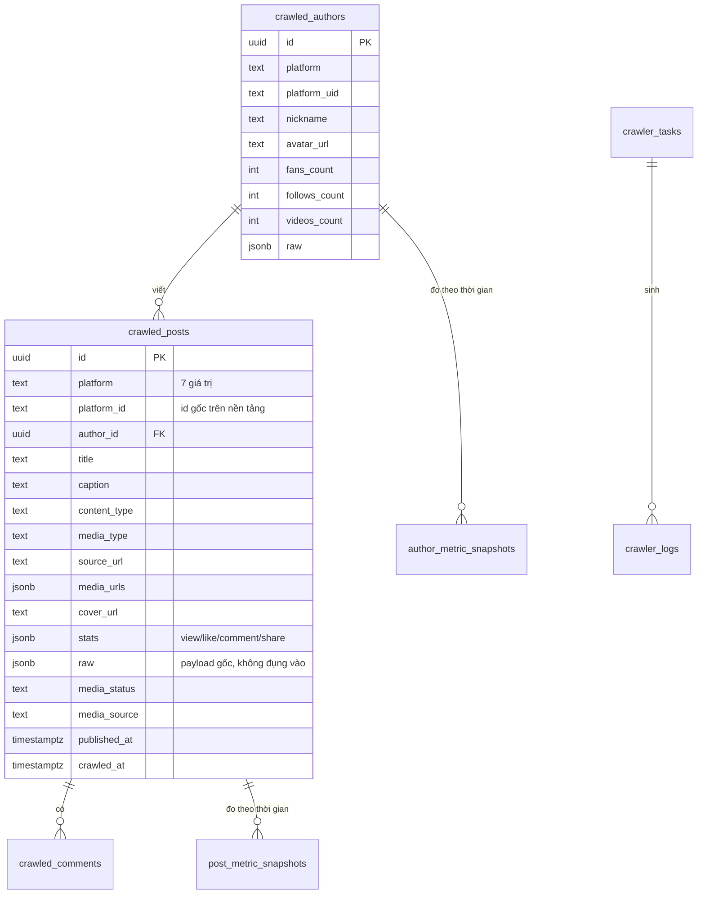

# Thiết kế cơ sở dữ liệu

Supabase Postgres 17. **53 bảng** trong schema `public`, **9 hàm** gọi được qua PostgREST, **23 file migration**.

<!-- gen: awk 'NR>=41 && NR<=2681' dashboard/types/supabase.ts | grep -cE '^      [a-z_]+: \{' -->

Nguồn sự thật cho **hình dạng** là [types/supabase.ts](../dashboard/types/supabase.ts), sinh bằng `npm run types:gen` từ DB đang chạy. Nguồn sự thật cho **cách dựng lại** là `supabase/migrations/`. Hai nguồn này **đang lệch nhau** — xem §6.

---

## 1. Năm nhóm bảng

| Nhóm | Bảng | Ai ghi |
|---|---|---|
| **Điều khiển crawler** | `crawler_tasks` `crawler_logs` `crawler_accounts` `crawler_proxies` | Dashboard tạo task; worker cập nhật trạng thái + ghi log |
| **Dữ liệu đã crawl (hợp đồng chung)** | `crawled_posts` `crawled_authors` `crawled_comments` `post_metric_snapshots` `author_metric_snapshots` | Chỉ worker |
| **Bảng nền tảng (di sản)** | `douyin_aweme` `bilibili_video` `xhs_note` `weibo_note` `tieba_note` `zhihu_content` `kuaishou_video` + bảng comment/creator tương ứng — **22 bảng** | Không ai ghi nữa. Xem §3 |
| **Creative & phân tích** | `creative_ads` `creative_advertisers` `exported_files` | Dashboard |
| **Quản trị & auth** | `profiles` `workspaces` `team_members` `team_roles` `team_role_permissions` `team_invitations` `api_tokens` `audit_logs` `system_settings` | Dashboard |
| **Release Ops** | 10 bảng `release_ops_*` | Dashboard. **Không có worker nào ghi** |

---

## 2. Hợp đồng nội dung hợp nhất — quyết định quan trọng nhất

7 nền tảng trả về 7 hình dạng dữ liệu khác nhau. Thiết kế đầu tiên là **một bộ bảng cho mỗi nền tảng** (`douyin_aweme`, `bilibili_video`, …). Nó thất bại ở đúng chỗ dự đoán được: mọi trang dashboard muốn hiển thị "bài viết mới nhất trên mọi nền tảng" đều phải `UNION` 7 bảng có cột khác nhau, và mỗi nền tảng mới là một lần sửa mọi truy vấn.

Migration [`20260710000001_unified_content_contract.sql`](../supabase/migrations/20260710000001_unified_content_contract.sql) chốt hợp đồng chung:



Ba luật đi kèm hợp đồng:

| Luật | Vì sao |
|---|---|
| Cột `raw jsonb` giữ **nguyên** payload gốc | Nền tảng trả về trường mới → không mất dữ liệu, không cần migration gấp. Khi cần trường đó thật thì mới nâng lên thành cột |
| Khoá tự nhiên là `(platform, platform_id)` | Crawl lại cùng một bài phải là upsert, không phải bản ghi trùng. Worker gửi `Prefer: resolution=merge-duplicates` |
| Số đo tách sang bảng snapshot, **không** cập nhật đè lên `stats` | `stats` cho biết *bây giờ*; snapshot cho biết *tăng trưởng*. Ghi đè là mất trục thời gian vĩnh viễn |

### Phương án đã loại

| Phương án | Vì sao loại |
|---|---|
| Giữ mỗi nền tảng một bộ bảng | 7 lần `UNION` cho mọi truy vấn; mỗi nền tảng mới sửa mọi trang |
| Một bảng `content` với 60 cột nullable | Không đọc nổi, và không biết cột nào áp dụng cho nền tảng nào |
| Lưu tất cả trong `jsonb`, không có cột | Không index được, không lọc theo `platform` + `published_at` được — hai chiều lọc dùng nhiều nhất |

---

## 3. 22 bảng nền tảng vẫn còn — cố ý

Chúng đến từ [`20260703090505_remote_schema.sql`](../supabase/migrations/20260703090505_remote_schema.sql), là schema kế thừa từ trước khi có hợp đồng chung.

**Không xoá**, vì:
- Chúng chứa dữ liệu crawl của giai đoạn đầu, chưa migrate sang hợp đồng chung.
- Xoá bảng là thao tác không đảo ngược được, và chưa ai cần chỗ trống đó.

**Nhưng không dùng nữa**: không repository nào chạm tới chúng, và chúng không nằm trong `ALLOWED_COLUMNS` của gateway — worker **không** ghi vào được.

Dấu hiệu nhận biết một bảng thuộc nhóm này: tên có tiền tố tên nền tảng (`douyin_`, `bilibili_`, `xhs_`, `weibo_`, `tieba_`, `zhihu_`, `kuaishou_`, `dy_`).

---

## 4. RLS và hàm

<!-- gen: grep -rhoiE 'create (or replace )?function [a-z_.]+' supabase/migrations | sort -u -->

24 lệnh `enable row level security`, 41 policy. Bốn migration `2026070900000*_harden_*` là một đợt siết riêng: khoá `anon`, khoá `api_tokens`, khoá bảng còn lại, siết quyền trên `crawler_tasks`.

| Hàm | Có migration | Ai gọi | Việc |
|---|---|---|---|
| `claim_next_crawler_task` | ✅ [file](../supabase/migrations/20260703090507_claim_task_rpc.sql) | Crawler worker, qua gateway | Lấy **nguyên tử** 1 task `pending`, set `running` |
| `create_crawler_tasks` | ✅ | Dashboard | Tạo nhiều task một lần |
| `is_admin` | ✅ | Policy RLS | Kiểm vai trong policy |
| `handle_new_user` | ✅ | Trigger `auth.users` | Tạo `profiles` khi có user mới |
| `claim_next_job` | ❌ | *(chưa ai)* | Claim job Release Ops |
| `heartbeat_job` | ❌ | *(chưa ai)* | Gia hạn lease job |
| `succeed_job` | ❌ | *(chưa ai)* | Đóng job thành công |
| `fail_job` | ❌ | *(chưa ai)* | Đóng job thất bại |
| `heartbeat_worker` | ❌ | *(chưa ai)* | Báo worker còn sống |
| `sync_aso_metrics` | ❌ | *(chưa ai)* | Nạp số liệu ASO |

**Quan trọng:** RLS **không** bảo vệ được đường đi của worker. Gateway dùng `service_role`, bỏ qua toàn bộ policy. Xem [architecture.md](architecture.md) §4.

---

## 5. Realtime

Đúng 4 bảng trong publication `supabase_realtime`: `crawler_tasks`, `crawler_logs`, `post_metric_snapshots`, `author_metric_snapshots`.

Bảng `release_ops_*` **không** có realtime — cố ý, vì chưa có worker nào sinh sự kiện.

---

## 6. Chỗ hỏng nghiêm trọng nhất: 10 bảng không có migration

10 bảng `release_ops_apps`, `release_ops_play_accounts`, `release_ops_releases`, `release_ops_jobs`, `release_ops_job_events`, `release_ops_workers`, `release_ops_artifacts`, `release_ops_batch_operations`, `release_ops_aso_metrics`, `release_ops_audits` — cùng 6 hàm ở §4 — **tồn tại trên DB đang chạy nhưng không có file migration nào tạo ra chúng.**

Kiểm lại bất cứ lúc nào:

```bash
# Có trên DB (từ type đã generate)
grep -c 'release_ops_' dashboard/types/supabase.ts     # > 0

# Có trong migration
grep -rl 'release_ops' supabase/migrations/ | wc -l    # = 0
```

Hệ quả **cụ thể**:

| Việc | Kết quả hôm nay |
|---|---|
| `supabase db reset` trên máy dev | Dựng lại crawler + quản trị. Release Ops **không có bảng** → mọi trang `/dash/release-ops/*` lỗi |
| Dựng môi trường staging mới | Không dựng lại được Release Ops |
| Biết bảng có index gì | Không biết. Không có DDL để đọc |
| Review một thay đổi schema Release Ops | Không có gì để review — thay đổi xảy ra trên Studio, không qua git |

Đây là mục T-01 ở [task-plan.md](task-plan.md), và là một trong ba tiêu chí "xong" ở [requirements.md](requirements.md) §6.

---

## 7. Đổi schema thì làm gì

| Bước | Lệnh |
|---|---|
| 1. Tạo migration | `supabase migration new <tên>` |
| 2. Viết DDL — **kể cả** khi đã sửa tay trên Studio | — |
| 3. Kiểm trên máy trắng | `supabase db reset` |
| 4. Sinh lại type | `cd dashboard && npm run types:gen` |
| 5. Nếu worker cần cột mới | Thêm vào `ALLOWED_COLUMNS` **và** whitelist tương ứng trong [route.ts](../dashboard/app/api/worker/rest/v1/) — xem [api-design.md](api-design.md) §4 |
| 6. Nếu cần realtime | `alter publication supabase_realtime add table …` |

Bỏ bước 5 là chế độ hỏng phổ biến nhất: cột có trong DB, có trong type, mà worker ghi vào thì bị gateway trả 400.
