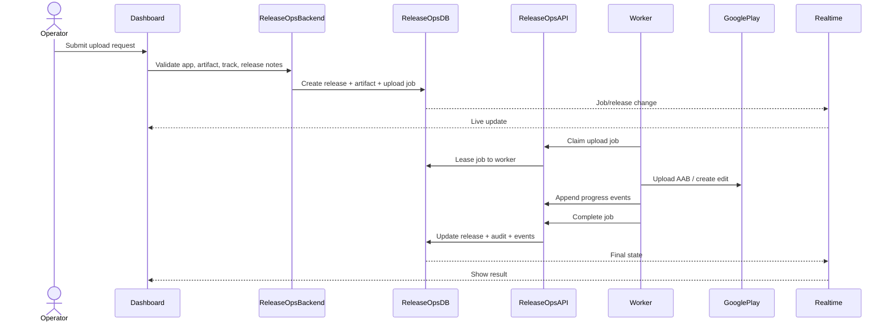
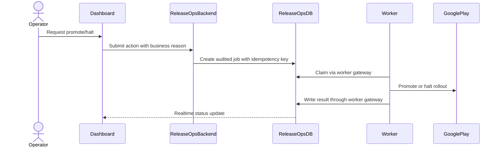
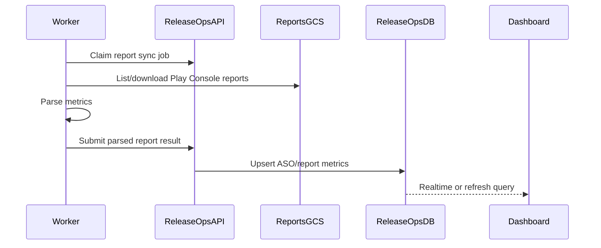

# Release Ops Architecture Plan

## Table of Contents

- [Purpose](#purpose)
- [Source Grounding](#source-grounding)
- [Target System Architecture](#target-system-architecture)
- [Architecture Reading](#architecture-reading)
- [Release Ops Scope](#release-ops-scope)
- [Module Breakdown](#module-breakdown)
- [Data Model Plan](#data-model-plan)
- [Worker API Plan](#worker-api-plan)
- [Worker Runtime Plan](#worker-runtime-plan)
- [Main Business Flows](#main-business-flows)
- [Authentication And Authorization](#authentication-and-authorization)
- [Realtime And Observability](#realtime-and-observability)
- [Artifact And Storage Plan](#artifact-and-storage-plan)
- [Configuration Plan](#configuration-plan)
- [Security Requirements](#security-requirements)
- [Reliability Requirements](#reliability-requirements)
- [Development Phases](#development-phases)
- [Acceptance Checklist](#acceptance-checklist)
- [Not Found In Current Source](#not-found-in-current-source)

## Purpose

This document is the development architecture plan for adding the `release-ops` capability to SinoMedia.

The existing project already has:

- A Next.js dashboard.
- Supabase Auth, Database, RPC, and Realtime usage.
- A crawler worker gateway API at `/api/worker/rest/v1/*`.
- API token verification through SHA-256 token hashes and scoped tokens.
- A crawler runtime based on Docker Compose.
- Release Ops dashboard pages using mock data.

This plan keeps the Release Ops target shape as designed in the diagram below and uses it as the implementation direction.

## Source Grounding

Current source evidence in SinoMedia:

| Area | Current source evidence |
| --- | --- |
| Dashboard framework | `dashboard/package.json` uses Next.js 16. |
| Dashboard routes | `dashboard/app/(main)/dash/release-ops/*` contains Release Ops pages. |
| Release Ops UI data | `dashboard/lib/fixtures/release-ops-fixtures.ts` contains mock Release Ops data. |
| Sidebar navigation | `dashboard/components/Sidebar.tsx` contains the Release Ops navigation group. |
| Crawler worker API | `dashboard/app/api/worker/rest/v1/[...path]/route.ts`. |
| Token guard | `dashboard/lib/guards/token.guard.ts`. |
| Supabase crawler migrations | `supabase/migrations/20260703090506_crawler_schema.sql`. |
| Supabase crawler realtime | `supabase/migrations/20260703090509_enable_realtime_crawler.sql`. |
| API tokens | `supabase/migrations/20260707000002_members_and_tokens.sql` and `20260709000002_harden_api_tokens.sql`. |
| Crawler runtime | `crawler-pipeline/docker-compose.yml`. |
| Crawler Docker build workflow | `.github/workflows/deploy-crawler.yml`. |

## Target System Architecture

The following Mermaid diagram is the required Release Ops target architecture.

```mermaid
flowchart TB
    subgraph L1["Layer 1 - Client / Hosting"]
        User(("Operator / Browser"))
        Host["Dashboard Host / Vercel evidence"]
        Middleware["Next.js Middleware<br/>/dash/*, /login, /sign-up"]
        User -->|HTTPS| Host
        Host --> Middleware
    end

    subgraph L2["Layer 2 - App / API"]
        Dashboard["Dashboard - Next.js 16<br/>SSR + App Router<br/>user/admin chung"]

        subgraph CrawlerAPIGroup["Crawler Control API"]
            AppBackend["Server Actions / Services / Repositories"]
            WorkerAPI["Worker Gateway API<br/>/api/worker/rest/v1/*"]
            TokenGuard["Token Guard<br/>SHA-256 + crawler scopes"]
        end

        subgraph ReleaseAPIGroup["Release Ops Control API"]
            ReleaseOpsBackend["Release Ops Services / Repositories<br/>apps / releases / upload / batch / ASO"]
            ReleaseOpsAPI["Release Ops Worker Gateway API<br/>/api/release-ops/worker/v1/*"]
            ReleaseOpsGuard["Release Ops Token Guard<br/>SHA-256 + release_ops scopes"]
        end

        Middleware -->|/dash/*| Dashboard
        Host -->|crawler worker API| WorkerAPI
        Host -->|release worker API| ReleaseOpsAPI

        Dashboard --> AppBackend
        Dashboard --> ReleaseOpsBackend

        WorkerAPI --> TokenGuard
        ReleaseOpsAPI --> ReleaseOpsGuard
    end

    subgraph L3A["Layer 3A - Supabase Auth"]
        SupabaseAuth["Supabase Auth<br/>users / sessions"]
    end

    subgraph L3B["Layer 3B - Supabase Database / RPC"]
        SupabaseDB[("Core DB + RPC<br/>api_tokens / crawler_tasks / crawler_logs<br/>crawler_accounts / crawled_*")]
        ReleaseOpsDB[("Release Ops DB + RPC<br/>release_ops_apps / releases / artifacts<br/>workers / jobs / events / aso_metrics / audits")]
    end

    subgraph L3C["Layer 3C - Supabase Realtime"]
        SupabaseRealtime["Realtime<br/>crawler_tasks + crawler_logs"]
        ReleaseOpsRealtime["Realtime<br/>release_ops_jobs + events + releases"]
    end

    subgraph L4["Layer 4 - Execution / Physical Storage"]
        subgraph CrawlerRuntime["Crawler VPS Runtime"]
            VPSPath["/opt/crawler-pipeline"]
            Docker["Docker Compose<br/>crawler-worker"]
            Worker["crawler-pipeline<br/>Queue Worker"]
            OutputDisk["Physical VPS Disk<br/>/opt/crawler-pipeline/output"]
            DockerLogs["Docker json-file logs<br/>50MB x 3"]

            VPSPath --> Docker
            Docker --> Worker
            Docker --> OutputDisk
            Docker --> DockerLogs
        end

        subgraph ReleaseRuntime["Release Ops Worker Fleet"]
            ReleaseFleet["Many Win Server 2012 VPS<br/>release-ops-worker service<br/>outbound polling only"]
            ReleaseWorkerDisk["Local temp / logs / artifact cache<br/>per Windows VPS"]
            ReleaseFleet --> ReleaseWorkerDisk
        end
    end

    subgraph L5["Layer 5 - External / Optional"]
        CrawlerExternal["Social Platforms + 2Captcha<br/>Douyin / Bilibili / Kuaishou / Tieba<br/>Weibo / XHS / Zhihu"]
        ReleaseExternal["Google Play + Reports + CI Artifacts<br/>Publishing API / Reporting-GCS / AAB builds"]
    end

    subgraph L6["Layer 6 - Missing Ops Layer"]
        Missing["Not Found in current source<br/>Nginx / Redis / MinIO / BullMQ<br/>OpenTelemetry / Prometheus / Loki / Backups"]
    end

    Middleware -->|refresh session / get user| SupabaseAuth
    Dashboard -->|login / session| SupabaseAuth

    TokenGuard -->|verify crawler token + service_role proxy| SupabaseDB
    ReleaseOpsGuard -->|verify release_ops token + service_role proxy| ReleaseOpsDB

    AppBackend -->|read/write + create crawler tasks| SupabaseDB
    ReleaseOpsBackend -->|read/write release ops state| ReleaseOpsDB

    SupabaseDB -.->|publication changes| SupabaseRealtime
    SupabaseRealtime -.->|live crawler updates| Dashboard

    ReleaseOpsDB -.->|publication changes| ReleaseOpsRealtime
    ReleaseOpsRealtime -.->|live release/job updates| Dashboard

    Worker -->|INTERNAL_API_URL + API_TOKEN| WorkerAPI
    Worker -->|crawl / captcha| CrawlerExternal

    ReleaseFleet -->|RELEASE_OPS_API_URL + RELEASE_OPS_TOKEN| ReleaseOpsAPI
    ReleaseFleet -->|upload / promote / sync reports| ReleaseExternal

    classDef missing fill:#3a1414,stroke:#e06666,color:#fff,stroke-dasharray:4 3
    classDef storage fill:#172033,stroke:#75a7ff,color:#fff
    classDef exec fill:#14261a,stroke:#4ad98a,color:#fff
    classDef app fill:#1d1a2e,stroke:#b48cff,color:#fff
    classDef release fill:#2a1d33,stroke:#e0aaff,color:#fff

    class Missing missing
    class SupabaseDB,ReleaseOpsDB,OutputDisk,DockerLogs,ReleaseWorkerDisk storage
    class VPSPath,Docker,Worker,ReleaseFleet exec
    class Dashboard,AppBackend,Middleware,WorkerAPI,TokenGuard,SupabaseAuth,SupabaseRealtime app
    class ReleaseOpsBackend,ReleaseOpsAPI,ReleaseOpsGuard,ReleaseOpsRealtime,ReleaseExternal release
```



## Architecture Reading

The Release Ops feature should follow the same high-level pattern as the crawler control plane:

1. Dashboard users operate Release Ops screens under `/dash/release-ops/*`.
2. Dashboard actions call Release Ops services and repositories.
3. Release Ops services write state to Supabase `release_ops_*` tables.
4. Worker machines poll a dedicated Release Ops worker gateway API.
5. The gateway verifies API tokens by hash and scope.
6. Workers run upload, promote, report sync, batch, and ASO jobs.
7. Workers write job progress and events back through the gateway.
8. Supabase Realtime streams job, event, and release changes back to the dashboard.

## Release Ops Scope

Release Ops should own:

| Capability | Responsibility |
| --- | --- |
| App registry | Track app package names, Play accounts, metadata, owners, policy readiness, target SDK. |
| Releases | Track release version, track, rollout percentage, review status, policy status, and lifecycle. |
| Upload jobs | Validate AAB artifact metadata, release notes, package name, version code, signing fingerprint, and target track. |
| Batch operations | Create controlled multi-app operations such as canary rollout, mass promote, SDK upgrade, or halt all. |
| ASO metrics | Store Play reports and conversion metrics imported from Reporting GCS or other Play Console exports. |
| Worker orchestration | Claim jobs, maintain lease, receive heartbeat, retry failed work, and preserve idempotency. |
| Audit | Record who requested, approved, executed, retried, cancelled, promoted, or halted each release operation. |

Release Ops should not own:

| Out of scope | Reason |
| --- | --- |
| Crawler tasks | Already owned by crawler modules and crawler worker API. |
| Social platform crawling | Already owned by crawler runtime. |
| Supabase Auth identity lifecycle | Existing Supabase Auth flow remains the identity provider. |
| General app shell navigation | Existing dashboard shell owns layout, header, sidebar, and middleware. |

## Module Breakdown

### Release Ops Dashboard

Location target:

- `dashboard/app/(main)/dash/release-ops/*`
- `dashboard/components/dashboard/release-ops/*`

Responsibilities:

- Show apps, releases, upload jobs, batch operations, ASO, target SDK, and Play accounts.
- Replace mock fixtures with service-backed data.
- Subscribe to realtime job and release updates.
- Trigger server actions or API calls for Release Ops operations.

### Release Ops Services

Location target:

- `dashboard/lib/services/release-ops.service.ts`
- `dashboard/lib/services/release-ops-job.service.ts`
- `dashboard/lib/services/release-ops-play.service.ts`

Responsibilities:

- Validate user intent before creating jobs.
- Enforce business rules for upload, promote, halt, retry, and batch operations.
- Normalize UI input into DB records.
- Avoid direct Play API access from dashboard UI.

### Release Ops Repositories

Location target:

- `dashboard/lib/repositories/release-ops-app.repo.ts`
- `dashboard/lib/repositories/release-ops-release.repo.ts`
- `dashboard/lib/repositories/release-ops-job.repo.ts`
- `dashboard/lib/repositories/release-ops-audit.repo.ts`

Responsibilities:

- Encapsulate Supabase reads/writes.
- Keep table access centralized.
- Provide strongly typed return objects for UI and service layers.

### Release Ops Worker Gateway API

Location target:

- `dashboard/app/api/release-ops/worker/v1/[...path]/route.ts`

Responsibilities:

- Verify release worker tokens.
- Restrict endpoint access by `release_ops:*` scopes.
- Proxy or execute controlled DB/RPC operations using service role.
- Accept job claim, heartbeat, progress, event, result, and failure updates.

### Release Ops Token Guard

Location target:

- Reuse `dashboard/lib/guards/token.guard.ts` where possible.
- Add release-specific required scopes in the Release Ops worker gateway.

Responsibilities:

- Hash raw token with SHA-256.
- Verify active token.
- Reject expired or revoked tokens.
- Reject wildcard token usage for worker endpoints if strict worker isolation is required.
- Require release-specific scopes.

### Release Ops Worker

Location target:

- Can live in this repo as a new worker package, or be integrated from the separate Release Ops worker codebase.

Responsibilities:

- Poll for jobs through `RELEASE_OPS_API_URL`.
- Authenticate with `RELEASE_OPS_TOKEN`.
- Execute Google Play Publishing API operations.
- Sync Google Play report data from Reporting GCS.
- Cache local artifacts temporarily.
- Report progress and final result.

## Data Model Plan

Target table family:

| Table | Purpose |
| --- | --- |
| `release_ops_apps` | App registry and package identity. |
| `release_ops_play_accounts` | Google Play developer account metadata and auth status. |
| `release_ops_releases` | Release lifecycle state per app, version, and track. |
| `release_ops_artifacts` | AAB/build artifact metadata, checksums, provenance, signing fingerprint. |
| `release_ops_jobs` | Worker-executable jobs and their lifecycle state. |
| `release_ops_job_events` | Append-only job timeline and worker progress events. |
| `release_ops_workers` | Registered worker machines, heartbeat, capacity, status. |
| `release_ops_batch_operations` | Multi-app operations with plan, eligibility, and rollback metadata. |
| `release_ops_aso_metrics` | Store performance, conversion, geo, traffic source, and report-derived metrics. |
| `release_ops_audits` | Approval and mutation audit log. |

### Core Job Fields

`release_ops_jobs` should include at minimum:

| Field | Purpose |
| --- | --- |
| `id` | Job identifier. |
| `job_type` | Upload, promote, halt, sync_report, batch_step, aso_sync. |
| `status` | queued, claimed, running, succeeded, failed, cancelled, retrying, dead_letter. |
| `priority` | Scheduling priority. |
| `release_id` | Optional release target. |
| `app_id` | Optional app target. |
| `worker_id` | Worker currently holding the job. |
| `lease_until` | Prevents another worker from claiming an active job. |
| `heartbeat_at` | Last worker heartbeat. |
| `attempt_count` | Retry count. |
| `max_attempts` | Retry limit. |
| `idempotency_key` | Prevents duplicate release mutation. |
| `payload` | Job input JSON. |
| `result` | Worker result JSON. |
| `error_message` | Last error summary. |
| `created_by` | User/system that created the job. |
| `created_at` | Creation timestamp. |
| `updated_at` | Last mutation timestamp. |

### Release State

`release_ops_releases.status` should be constrained to known states:

- `draft`
- `queued`
- `validating`
- `uploading`
- `uploaded`
- `submitted`
- `in_review`
- `rolling_out`
- `live`
- `halted`
- `rejected`
- `failed`
- `policy_blocked`

## Worker API Plan

Base route:

```text
/api/release-ops/worker/v1/*
```

Recommended endpoints:

| Method | Path | Required scope | Purpose |
| --- | --- | --- | --- |
| `POST` | `/workers/register` | `release_ops:worker:register` | Register or refresh worker identity. |
| `POST` | `/workers/heartbeat` | `release_ops:worker:heartbeat` | Update worker status and capacity. |
| `POST` | `/jobs/claim` | `release_ops:job:claim` | Atomically claim next job. |
| `POST` | `/jobs/:id/heartbeat` | `release_ops:job:heartbeat` | Extend job lease while running. |
| `POST` | `/jobs/:id/events` | `release_ops:job:event` | Append progress event. |
| `POST` | `/jobs/:id/succeed` | `release_ops:job:complete` | Mark job succeeded and write result. |
| `POST` | `/jobs/:id/fail` | `release_ops:job:complete` | Mark job failed with retry/dead-letter logic. |
| `GET` | `/artifacts/:id` | `release_ops:artifact:read` | Fetch artifact metadata or signed download handoff. |
| `POST` | `/reports/sync-result` | `release_ops:report:write` | Store report sync results. |

The worker API must not expose arbitrary Supabase table access. It should expose purpose-built operations only.

## Worker Runtime Plan

The Release Ops worker fleet should run on many Windows Server 2012 VPS machines as shown in the target diagram.

Worker behavior:

1. Load `RELEASE_OPS_API_URL` and `RELEASE_OPS_TOKEN`.
2. Register or heartbeat worker identity.
3. Poll `/jobs/claim`.
4. If no job exists, wait with jitter.
5. If a job is claimed, write `running` event.
6. Execute the operation.
7. Heartbeat while the operation runs.
8. Upload progress and logs as structured events.
9. Submit success or failure result.
10. Clean local temp files and artifact cache.

Local disk is only for:

- Temporary AAB staging.
- Short-lived report downloads.
- Worker logs.
- Artifact cache.

## Main Business Flows

### Upload AAB Flow



### Promote Or Halt Release Flow



### Report Sync Flow



## Authentication And Authorization

Dashboard user authentication:

- Supabase Auth remains the login/session provider.
- Existing dashboard middleware handles protected dashboard routes.

Worker authentication:

- Worker sends `Authorization: Bearer <token>` or `x-api-key`.
- API hashes token with SHA-256.
- API checks `api_tokens.token_hash`.
- API requires `status = active`.
- API rejects expired tokens.
- API checks release-specific scopes.

Recommended Release Ops scopes:

| Scope | Purpose |
| --- | --- |
| `release_ops:worker:register` | Worker registration. |
| `release_ops:worker:heartbeat` | Worker fleet health. |
| `release_ops:job:claim` | Claim queued jobs. |
| `release_ops:job:heartbeat` | Extend job lease. |
| `release_ops:job:event` | Write job progress events. |
| `release_ops:job:complete` | Write final result. |
| `release_ops:artifact:read` | Read artifact metadata/download handoff. |
| `release_ops:report:write` | Write report sync output. |

## Realtime And Observability

Realtime targets:

- `release_ops_jobs`
- `release_ops_job_events`
- `release_ops_releases`

Dashboard should use realtime for:

- Running upload progress.
- Batch operation progress.
- Worker job status.
- Release lifecycle updates.

Dashboard can use normal paginated reads for:

- Audit history.
- Artifact list.
- Historical ASO metrics.
- Play account registry.

Event payloads should be structured:

```json
{
  "level": "info",
  "stage": "upload",
  "message": "AAB uploaded to internal track",
  "progress": 62,
  "external_ref": "google-play-edit-id",
  "metadata": {}
}
```

## Artifact And Storage Plan

The diagram keeps local worker disk as temp/log/cache storage. That is valid for worker execution.

For durable artifacts, add a durable storage decision during implementation:

| Option | Use when |
| --- | --- |
| Supabase Storage | Simple integration with existing Supabase project. |
| S3-compatible storage | Better fit for large AAB artifacts and lifecycle policies. |
| GCS | Natural fit if Play report sync and Google infrastructure dominate. |
| MinIO | Self-hosted option, currently not found in source. |

Artifact metadata must always be stored in `release_ops_artifacts`, even if binary storage is external.

## Configuration Plan

Dashboard environment variables:

| Variable | Purpose |
| --- | --- |
| `NEXT_PUBLIC_SUPABASE_URL` | Existing Supabase project URL. |
| `SUPABASE_SERVICE_ROLE_KEY` | Existing server-side privileged Supabase access. |
| `RELEASE_OPS_ARTIFACT_STORAGE_BUCKET` | Durable artifact bucket if implemented. |

Worker environment variables:

| Variable | Purpose |
| --- | --- |
| `RELEASE_OPS_API_URL` | Base URL for Release Ops worker gateway. |
| `RELEASE_OPS_TOKEN` | Scoped worker API token. |
| `RELEASE_OPS_WORKER_ID` | Stable worker machine identity. |
| `GOOGLE_APPLICATION_CREDENTIALS` | Service account credential path if Google client libraries are used. |
| `RELEASE_OPS_TEMP_DIR` | Local temp folder. |
| `RELEASE_OPS_LOG_DIR` | Local worker logs. |
| `RELEASE_OPS_CACHE_DIR` | Local artifact/report cache. |

## Security Requirements

Required controls:

- Never expose raw Google service account keys in dashboard client code.
- Never allow worker API to proxy arbitrary tables or arbitrary filters.
- Require scoped worker tokens for every Release Ops worker endpoint.
- Use idempotency keys for upload, promote, halt, and batch mutations.
- Store audit logs for every user-triggered release mutation.
- Validate package name, version code, track, rollout percentage, and artifact checksum before queueing jobs.
- Reject stale worker leases before allowing completion updates.
- Redact tokens, service account keys, and signed URLs from job events.

## Reliability Requirements

Release operations are risky because duplicate execution can mutate Google Play state. The implementation must include:

| Requirement | Reason |
| --- | --- |
| Job lease | Prevent two workers from running the same job. |
| Heartbeat | Detect stuck or dead workers. |
| Idempotency key | Prevent duplicate upload/promote/halt execution. |
| Retry limit | Avoid infinite failure loops. |
| Dead-letter status | Preserve failed jobs for manual review. |
| Append-only events | Keep operation timeline inspectable. |
| Audit records | Preserve operator and approval history. |
| Rollback metadata | Support halt or rollback planning for risky rollouts. |

## Development Phases

### Phase 1 - Database And Types

- Add `release_ops_*` migrations.
- Add generated Supabase types.
- Add Release Ops domain types mapped to DB records.
- Add RLS policies for dashboard users.
- Add service-role-only RPCs for worker claim/update operations.

### Phase 2 - Dashboard Data Layer

- Add Release Ops repositories.
- Add Release Ops services.
- Replace UI mock reads with repository/service calls.
- Keep existing UI routes and navigation.

### Phase 3 - Worker Gateway API

- Add `/api/release-ops/worker/v1/[...path]/route.ts`.
- Reuse SHA-256 token guard.
- Add release-specific scope checks.
- Implement job claim, heartbeat, event, success, and failure operations.

### Phase 4 - Worker Runtime

- Add Release Ops worker package/service.
- Implement outbound polling.
- Implement local temp/cache/log paths.
- Implement Google Play report sync first if safer than write mutations.
- Add upload/promote/halt only after idempotency and audit are stable.

### Phase 5 - Realtime And Operations

- Enable realtime for jobs, events, and releases.
- Add dashboard subscriptions.
- Add worker health view.
- Add retry/dead-letter admin actions.
- Add production deployment/runbook.

## Acceptance Checklist

- [ ] Release Ops dashboard no longer depends on mock fixtures for core pages.
- [ ] Supabase contains `release_ops_*` tables and RPCs.
- [ ] Worker API exists at `/api/release-ops/worker/v1/*`.
- [ ] Worker API rejects missing, invalid, expired, revoked, wildcard, or insufficient-scope tokens.
- [ ] Jobs can be claimed atomically.
- [ ] Running jobs maintain heartbeat and lease.
- [ ] Failed jobs retry only within configured limits.
- [ ] Dangerous operations use idempotency keys.
- [ ] Job events are append-only and visible from dashboard.
- [ ] Release/job updates appear live through Supabase Realtime.
- [ ] Every upload/promote/halt action writes an audit record.
- [ ] Worker local temp/cache files are cleaned after completion.
- [ ] Secrets never appear in dashboard client bundles, job events, or logs.

## Not Found In Current Source

The following items are part of the target Release Ops architecture but are not currently found as implemented SinoMedia source modules:

- `dashboard/app/api/release-ops/worker/v1/*`
- `dashboard/lib/services/release-ops*.ts`
- `dashboard/lib/repositories/release-ops*.ts`
- Supabase migrations for `release_ops_*` tables.
- Supabase realtime publication for `release_ops_jobs`, `release_ops_job_events`, or `release_ops_releases`.
- Windows Server `release-ops-worker` service definition inside SinoMedia.
- Durable artifact object storage implementation for AAB files.
- Nginx, Redis, MinIO, BullMQ, OpenTelemetry, Prometheus, Loki, and backup automation.
