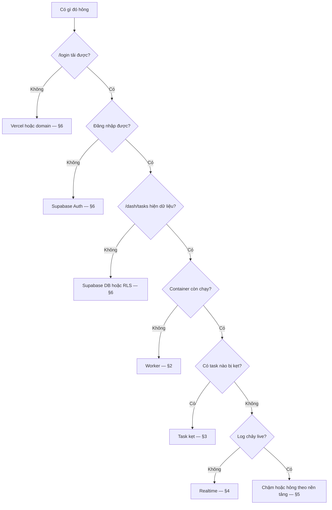

# Runbook — triệu chứng → hành động

Sự cố lúc **vận hành**. Sự cố lúc **dựng lần đầu**: [kickstart.md](kickstart.md) §7.

Trước khi làm gì: đọc [observability.md](observability.md) §4 để biết bình thường trông như thế nào. Không có mốc thì không phân biệt được chậm với hỏng.

---

## 1. Khoanh vùng trong 60 giây



Nhớ: **`docker compose ps` báo `healthy` không có nghĩa là worker còn làm việc.** Healthcheck luôn xanh — [containerization.md](containerization.md) §2.

---

## 2. Worker không chạy

### 2.1 Container restart liên tục

```bash
docker compose ps
docker compose logs --tail 50
```

| Trong log | Nguyên nhân | Sửa |
|---|---|---|
| `Thiếu biến INTERNAL_API_URL` | `.env` không được đọc hoặc thiếu biến | Kiểm `.env` tồn tại tại `/opt/crawler-pipeline`, `env_file` đúng trong compose |
| `Thiếu biến API_TOKEN` | như trên | như trên |
| Lỗi tải `tsx` | `tsx` là devDependency, `npx` phải tải lúc chạy — [containerization.md](containerization.md) §1 | Kiểm mạng ra npm registry từ VPS |
| Bị OOM kill | Vượt hạn mức 2 GB | §2.3 |

### 2.2 Container chạy nhưng không claim task

```bash
docker compose logs --tail 100 | grep -iE "401|403|error"
```

| Mã | Nghĩa | Sửa |
|---|---|---|
| `401 Invalid API token` | Hash không khớp | Token đã bị thay? Tính lại hash bằng `printf`, **không** dùng `echo` — [environment.md](environment.md) §5 |
| `401 Token is revoked` | Ai đó đã thu hồi | Cấp token mới, cập nhật `.env`, restart |
| `401 Token has expired` | `expires_at` đã qua | như trên |
| `403 Insufficient scope` | Thiếu scope | Đối chiếu `api_tokens.scopes` với bảng ở [api-design.md](api-design.md) §2 |
| `403 Wildcard tokens (*) are not permitted` | Token cấp scope `*` | Cấp lại với đúng danh sách scope |
| `403 Endpoint not allowed` | Path/method không có trong `determineRequiredScopes` | Code worker gọi endpoint chưa được phép |
| `400 Disallowed fields in POST body` | Cột không có trong whitelist | Thêm cột vào `POST_WHITELISTS` — [api-design.md](api-design.md) §8 |

Kiểm token trực tiếp:

```sql
select name, status, expires_at, scopes, last_used_at from api_tokens;
```

`last_used_at` không nhúc nhích = request chưa bao giờ tới được bước xác thực. Kiểm mạng, kiểm `INTERNAL_API_URL`.

### 2.3 Bị OOM kill

```bash
docker stats --no-stream
free -h
```

Hạn mức là 2 GB. Ba nguyên nhân theo thứ tự khả năng:

1. **Có đường crawl dùng Playwright đang chạy trong container.** Image cố ý **không có** trình duyệt ([containerization.md](containerization.md) §1) — nếu Playwright vẫn được gọi thì nó vừa ngốn RAM vừa sai thiết kế. Đây là nguyên nhân đáng nghi nhất.
2. Swap chưa bật. Chạy `deployment/setup-swap.sh` (4 GB cho VPS 2 GB).
3. Thật sự cần thêm RAM → nâng `deploy.resources.limits.memory` rồi `docker compose up -d`.

### 2.4 Đĩa đầy

```bash
df -h
du -sh /opt/crawler-pipeline/output/* | sort -rh | head
```

Log đã có trần cứng 150 MB. Thủ phạm gần như luôn là `./output`.

**Trước khi xoá:** xác nhận dữ liệu đã lên Supabase. `./output` là bản ghi phụ; nguồn sự thật là bảng `crawled_*`.

```sql
select platform, count(*) from crawled_posts
where crawled_at > now() - interval '7 days' group by platform;
```

---

## 3. Task kẹt ở `running`

```sql
select id, platform, command, target, updated_at
from crawler_tasks
where status = 'running' and updated_at < now() - interval '1 hour';
```

| Kiểm | Kết luận |
|---|---|
| Container còn chạy? | Không → §2. Worker chết giữa chừng để lại task ở `running` vĩnh viễn |
| `crawler_logs` của task đó có dòng mới? | Không → worker mất kết nối hoặc treo |
| Dòng log cuối nói gì? | "đang chờ captcha" → §5.2 · "403" → §5.1 |

**Gỡ kẹt:** không có cơ chế tự nhả lease. `claim_next_crawler_task` chỉ lấy task `pending`, nên task kẹt ở `running` sẽ không bao giờ được nhận lại.

```sql
update crawler_tasks
set status = 'pending', error_message = 'reset thủ công: worker chết'
where id = '<task-id>';
```

> Đây là khoảng trống thiết kế đã biết: hàng đợi crawler **không có lease timeout**. Bảng `release_ops_jobs` có `lease_until` và `heartbeat_at`; `crawler_tasks` thì không. Ghi ở [task-plan.md](task-plan.md) T-12.

---

## 4. Realtime im lặng

Triệu chứng: dữ liệu đúng khi F5, nhưng không tự cập nhật.

| Kiểm | Sửa |
|---|---|
| Bảng có trong publication? `select * from pg_publication_tables where pubname='supabase_realtime'` | Chỉ 4 bảng có — [database-design.md](database-design.md) §5 |
| Policy RLS có cho user hiện tại `select` không? | Realtime tôn trọng RLS. Không select được thì không nhận được sự kiện |
| Console trình duyệt có `CHANNEL_ERROR` / `TIMED_OUT`? | Callback `onStatusChange` báo. Thường là rò rỉ channel — [ui-structure.md](ui-structure.md) §5 |
| Đã điều hướng qua lại nhiều lần chưa? | Quên `unsubscribe` tích luỹ channel cho tới khi Supabase từ chối. Tải lại trang là hết tạm thời |

---

## 5. Hỏng theo nền tảng

Dấu hiệu nhận biết: **đúng một** nền tảng gãy, các nền tảng khác bình thường. Nếu mọi nền tảng cùng gãy thì đó không phải mục này — quay lại §2.

### 5.1 403/401 từ chính nền tảng

Đây là tầng ký, không phải token của mình. Phân biệt:

| Ai trả lỗi | Nghĩa |
|---|---|
| Gateway của mình (`INTERNAL_API_URL`) | Vấn đề token/scope → §2.2 |
| Domain của nền tảng | Vấn đề ký hoặc cookie → mục này |

Khoanh vùng, theo thứ tự:

1. Cookie tài khoản còn hạn không? → `crawler_accounts.status`, `failure_count`
2. Đổi sang tài khoản khác cùng nền tảng còn lỗi không? Còn → không phải tài khoản, mà là thuật toán ký.
3. Nền tảng đó có module ký riêng không? Chỉ Douyin, Bilibili, Zhihu có — [component-deep-dive.md](component-deep-dive.md) §2.

Thuật toán ký lỗi thời thì **không có cách sửa nhanh**. Cần đọc lại thuật toán. Trong lúc đó: tắt nền tảng đó, để các nền tảng khác chạy tiếp.

### 5.2 Captcha thất bại liên tục

| Kiểm | Sửa |
|---|---|
| Credit 2Captcha còn không | Nạp thêm |
| `CAPTCHA_ENABLED` có bật | Bật trong `.env` hoặc `/dash/settings` |
| Khoá còn đúng | Khoá lưu **mã hoá** trong `system_settings` — nếu `SETTINGS_ENCRYPTION_KEY` đã đổi thì giải mã ra rác **mà không báo lỗi** ([security.md](security.md) §4). Nhập lại khoá qua giao diện |
| Credit còn mà vẫn trượt | Nền tảng đổi loại captcha → phải cập nhật `src/challenge/providers/two_captcha.ts` |

### 5.3 Proxy chết

```sql
select count(*) filter (where status='active') as song, count(*) as tong from crawler_proxies;
```

Health check tự đánh dấu `inactive`, **im lặng**. Hết proxy sống thì worker đi bằng IP thật của VPS và bị chặn nhanh. Thêm proxy mới vào bảng với `status='active'`; worker nhận ở vòng claim tiếp theo.

---

## 6. Dịch vụ ngoài hỏng

Không có chế độ chạy suy giảm nào. Xem [integrations.md](integrations.md) §2.

| Hỏng | Biểu hiện | Làm được gì |
|---|---|---|
| Supabase down | Mọi thứ chết: đăng nhập, dashboard, worker | Chờ. Kiểm status page. Có thể `docker compose stop` để khỏi đốt proxy |
| Vercel down | Dashboard chết **và** worker mất đường ghi | Chờ. Dữ liệu worker đang giữ trong RAM sẽ mất |
| Domain/DNS | `/login` không tải | Kiểm cấu hình domain ở Vercel |
| Ngoài Internet của VPS | Worker 5xx tới gateway, đồng thời không crawl được | `curl -I https://<domain>` từ VPS |

---

## 7. Rollback

Bảng đầy đủ ở [deployment.md](deployment.md) §4. Rút gọn:

| Cần rollback | Lệnh |
|---|---|
| Dashboard | Vercel → Deployments → bản trước → Promote to Production |
| Crawler | `docker compose down` rồi chạy lại bằng tag image cũ — **lưu ý CI chỉ đẩy `:latest`**, phải build lại từ commit cũ ([cicd.md](cicd.md) §1) |
| Migration | Viết migration đảo rồi `supabase db push`. Không có `db down` |

---

## 8. Khi nào dừng lại và gọi người

| Tình huống | Vì sao đừng tự xử |
|---|---|
| Nghi ngờ token hoặc service_role key bị lộ | Thu hồi trước, điều tra sau — nhưng phải có người biết chuyện gì đang xảy ra |
| Cần chạy `update`/`delete` trên bảng `crawled_*` | Không có backup dữ liệu đã crawl. Sai là mất vĩnh viễn |
| Đang định đổi `DB_ENCRYPTION_KEY` hoặc `SETTINGS_ENCRYPTION_KEY` | Xoay khoá làm hỏng **âm thầm** mọi dữ liệu đã mã hoá — [security.md](security.md) §4. Chưa có quy trình xoay |
| Thuật toán ký của một nền tảng gãy | Không sửa được trong lúc trực. Tắt nền tảng đó, ghi lại, xử lý sau |
