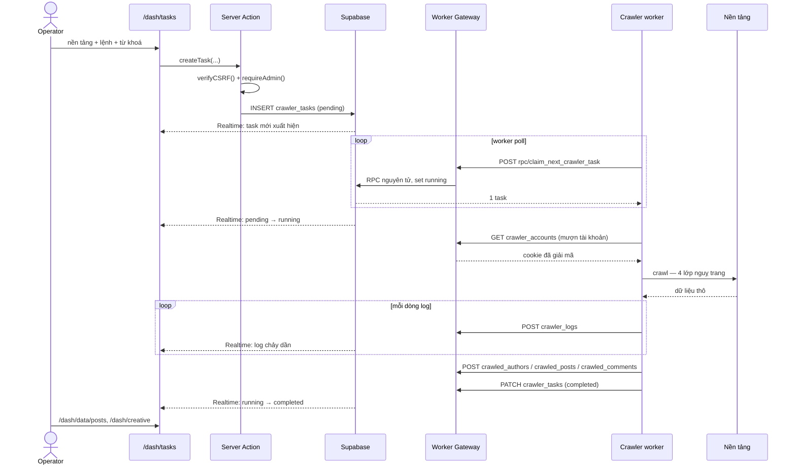

# Toàn cảnh từ đầu tới cuối

Một vòng đầy đủ: operator gõ từ khoá → dữ liệu hiện trong thư viện creative. Ai đọc file này rồi thì hiểu được hầu hết những gì hệ thống làm.

---

## 1. Vòng crawl dữ liệu



Bảy chặng, mỗi chặng có một chủ sở hữu tài liệu:

| # | Chặng | Chi tiết ở |
|---|---|---|
| 1 | Operator tạo task, qua cổng CSRF + admin | [auth-model.md](auth-model.md) §2 |
| 2 | Worker claim nguyên tử qua RPC | [architecture.md](architecture.md) §3 |
| 3 | Mượn tài khoản, cookie giải mã ở gateway | [api-design.md](api-design.md) §5 |
| 4 | Crawl — proxy → TLS → ký → trình duyệt | [component-deep-dive.md](component-deep-dive.md) §2 |
| 5 | Ghi dữ liệu theo hợp đồng nội dung chung | [database-design.md](database-design.md) §2 |
| 6 | Log chảy về giao diện | [observability.md](observability.md) §2 |
| 7 | Realtime đẩy trạng thái lên UI | [ui-structure.md](ui-structure.md) §5 |

---

## 2. Bảy hiểu nhầm thường gặp

Đây là phần đáng đọc nhất của file này.

### "Worker nói chuyện thẳng với Supabase"

**Không.** Worker chỉ biết một địa chỉ: `INTERNAL_API_URL` — Worker Gateway của dashboard. Nó **không** có `SUPABASE_SERVICE_ROLE_KEY`.

Hiểu nhầm này đến từ `crawler-pipeline/.env.example`, file đã lỗi thời và liệt kê đúng những biến đó. Xem [learn.md](learn.md) §1.

**Hệ quả thật:** Vercel down thì crawler không ghi được dữ liệu, dù nền tảng và VPS vẫn bình thường.

### "Worker Gateway là REST API"

**Không.** Nó là proxy PostgREST đã siết, đi qua một route catch-all. Worker gửi cú pháp PostgREST (`?platform=eq.douyin`), không gửi tới `/tasks/claim`.

**Hệ quả thật:** không có tài liệu endpoint theo kiểu OpenAPI. Nguồn sự thật là hàm `determineRequiredScopes()` — [api-design.md](api-design.md) §2.

### "RLS bảo vệ dữ liệu khỏi worker"

**Không.** Gateway chuyển tiếp bằng `service_role`, bỏ qua toàn bộ RLS. 9 lớp lọc trong `route.ts` **là** toàn bộ bảo vệ. Xem [security.md](security.md) §3.

### "`proxy.ts` bảo vệ mọi thứ"

**Không.** `config.matcher` chỉ khớp `/dash/*` và ba trang auth. Nó **không** chạy trên Server Action, **không** chạy trên `/api/*`.

**Hệ quả thật:** cổng bảo mật thật nằm trong từng Server Action (`requireAdmin()`), không nằm ở middleware. Xoá `requireAdmin()` khỏi một action là mở nó ra cho mọi người đăng nhập, dù trang vẫn bị chặn.

### "Release Ops đang chạy"

**Một nửa.** 17 trang có thật, đọc dữ liệu thật từ 10 bảng thật. Promote/halt ghi thật vào DB.

Nhưng **không có worker nào thực thi job**: không có gateway cho fleet, và 10 bảng đó **không có migration**. Job tạo ra nằm mãi ở `queued`.

Nghĩa là hôm nay Release Ops là **sổ ghi chép**, không phải hệ thống điều khiển. Xem [features.md](features.md).

### "Crawl lại thì tạo bản ghi trùng"

**Không.** Khoá tự nhiên là `(platform, platform_id)` và worker gửi `Prefer: resolution=merge-duplicates`. Crawl lại là **upsert**.

Nhưng số đo thì **không** bị đè: mỗi lần đo ghi một hàng mới vào `post_metric_snapshots`. Đó là cách hệ thống có được trục thời gian. Xem [database-design.md](database-design.md) §2.

### "Có CI nên code được kiểm trước khi merge"

**Không.** Workflow duy nhất chỉ build image Docker cho crawler. Không chạy test, không lint, không build dashboard, không chặn merge. Xem [cicd.md](cicd.md) §2.

---

## 3. Vòng của một thay đổi code

```
Ý tưởng
  → đối chiếu requirements.md   (ngoài phạm vi? → sửa bảng scope TRƯỚC)
  → sửa doc hợp đồng            (api-design / database-design / auth-model …)
  → người duyệt                 ← cổng hay bị bỏ nhất
  → code
  → kiểm (lint + build + Playwright — chạy TAY, xem cicd.md)
  → đồng bộ doc trạng thái      (features / changelog / learn)
  → commit
```

Cổng đầy đủ và bảng "đổi X thì sửa doc nào": [checklist.md](checklist.md).

Hai chỗ hay trượt nhất:

- **Sửa doc và code trong cùng một lượt rồi mới đưa duyệt.** Lúc duyệt thì code đã viết, không ai muốn bỏ nữa — nên bước duyệt mất hết tác dụng phản biện.
- **Làm một thứ nằm ở cột Out of scope.** Đó là dời đích, không phải chi tiết kỹ thuật. Phải quay về sửa [requirements.md](requirements.md) §3 trước.

---

## 4. Cái gì chạy khi không ai bấm gì

| Chạy hoài | Ở đâu | Chu kỳ |
|---|---|---|
| Vòng poll của crawler | Container trên VPS | Liên tục |
| Làm mới phiên Supabase | `proxy.ts`, mỗi request khớp matcher | Theo request |
| Xoay log Docker | Docker daemon | Khi vượt 50 MB |
| `crawler-refresh.timer` (chỉ khi deploy bằng systemd) | VPS | Mỗi 3 giờ — **và thất bại mỗi lần**, xem [containerization.md](containerization.md) §4 |

Không có cron nào khác. Không có job dọn dẹp, không có tổng hợp định kỳ, không có health check định kỳ. `crawler_logs` chỉ lớn lên mãi.
