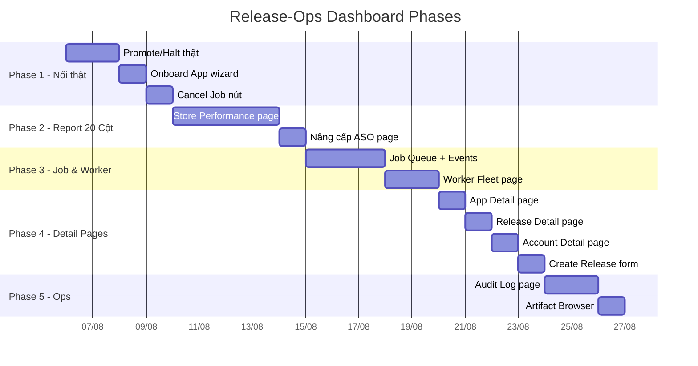

# Release-Ops Dashboard — Kế hoạch Triển khai theo Phase

> Tài liệu này chia nhỏ công việc xây dựng / nối thật giao diện release-ops trên Dashboard SinoMedia thành **5 Phase** độc lập. Mỗi phase có thể triển khai và kiểm thử riêng lẻ.

> [!NOTE]
> Tham khảo [release-ops-dashboard-gap-analysis.md](./release-ops-dashboard-gap-analysis.md) để hiểu chi tiết từng gap.

---

## Tổng quan Phase



---

## Phase 1 — Nối Thật Giao Diện Giả (3-4 ngày)

> **Mục tiêu**: Tất cả nút bấm trên UI hiện tại phải gọi Server Action thật, không còn local state giả.

### 1.1 Nối thật Promote & Halt trên Releases Page

**File cần sửa:** [releases/page.tsx](file:///d:/Python/SinoMedia/dashboard/app/(main)/dash/release-ops/releases/page.tsx)

**Vấn đề hiện tại:**
- Dòng 86-116: `confirmAction()` chỉ gọi `setReleases(prev => prev.map(...))` — thay đổi local state
- Không có Server Action nào cho promote/halt

**Cần làm:**

1. **Tạo 2 Server Actions mới** trong [release-ops.actions.ts](file:///d:/Python/SinoMedia/dashboard/lib/actions/release-ops.actions.ts):
   ```ts
   export async function promoteRelease(releaseId: string, input: { targetRolloutPercentage: number; reason: string }) { ... }
   export async function haltRelease(releaseId: string, input: { reason: string }) { ... }
   ```

2. **Tạo 2 Service functions** trong `release-ops.service.ts`:
   - Gọi Supabase update `release_ops_releases` set rollout % hoặc status = 'halted'
   - Tạo job tương ứng trong `release_ops_jobs` (job_type = 'promote' hoặc 'halt')
   - Ghi audit log vào `release_ops_audits`

3. **Sửa `confirmAction()`** trong releases page:
   - Thay `setReleases(prev => ...)` bằng:
     ```ts
     if (action === 'increase') await promoteRelease(release.id, { targetRolloutPercentage: nextPct, reason: businessReason });
     if (action === 'halt') await haltRelease(release.id, { reason: businessReason });
     ```
   - Sau khi thành công, gọi `loadData()` để refresh từ DB

**Kiểm thử:**
- Promote 1 release → reload page → rollout % phải giữ nguyên giá trị mới
- Halt 1 release → reload → status = 'halted'
- Kiểm tra `release_ops_audits` table có bản ghi

---

### 1.2 Nối thật Onboard App Wizard

**File cần sửa:** [apps/page.tsx](file:///d:/Python/SinoMedia/dashboard/app/(main)/dash/release-ops/apps/page.tsx)

**Vấn đề hiện tại:**
- Dòng 177-242: Modal wizard chỉ hiển thị checklist tĩnh, không có form nhập liệu và không gọi `createApp()`

**Cần làm:**

1. **Thêm form fields** vào wizard modal:
   - `packageName` (text, required)
   - `appName` (text, required)
   - `playAccountId` (dropdown, chọn từ danh sách accounts)
   - `targetSdk` (number, default 34)

2. **Gọi Server Action** khi submit:
   ```ts
   import { createApp } from '@/lib/actions/release-ops.actions';
   // Trong handler submit:
   await createApp({ packageName, appName, playAccountId, targetSdk });
   ```

3. **Refresh list** sau khi tạo thành công

**Kiểm thử:**
- Tạo app mới → xuất hiện trong bảng → reload → vẫn còn

---

### 1.3 Thêm nút Cancel Job

**File cần sửa:** [upload/page.tsx](file:///d:/Python/SinoMedia/dashboard/app/(main)/dash/release-ops/upload/page.tsx)

**Cần làm:**
1. Import `cancelJob` từ actions
2. Thêm nút "Hủy" cho mỗi job có status `queued` hoặc `pending`
3. Gọi `await cancelJob(job.id)` khi click
4. Refresh list

---

## Phase 2 — Trang Store Performance Report 20 Cột (4-5 ngày)

> **Mục tiêu**: Xây trang báo cáo chính của release-ops V3 — feature quan trọng nhất.

### 2.1 Tạo trang Store Performance Report

**Route mới:** `/dash/release-ops/reports`

**File mới cần tạo:**
```
dashboard/app/(main)/dash/release-ops/reports/
└── page.tsx
```

**Cấu trúc trang:**

```
┌─────────────────────────────────────────────────────────┐
│ Header: "Báo cáo Hiệu suất Store Performance (20 Cột)" │
├─────────────────────────────────────────────────────────┤
│ Filter Panel (collapsible):                             │
│ ┌──────────┐ ┌──────────┐ ┌──────────┐ ┌────────────┐  │
│ │ Preset ▼ │ │ Store  ▼ │ │ Group  ▼ │ │ Search 🔍  │  │
│ └──────────┘ └──────────┘ └──────────┘ └────────────┘  │
│ ┌──────────────┐ ┌──────────────┐                      │
│ │ Start Date   │ │ End Date     │  (khi preset=custom) │
│ └──────────────┘ └──────────────┘                      │
│ ┌────────────────┐ ┌────────────────┐                  │
│ │ Min Visitors   │ │ Min Acquis.    │  (threshold)     │
│ └────────────────┘ └────────────────┘                  │
├─────────────────────────────────────────────────────────┤
│ Summary Row:                                            │
│ Total Visitors: 530K | Total Acq: 132K | Avg CR: 25%   │
├─────────────────────────────────────────────────────────┤
│ Data Table (20 cột, sortable headers):                  │
│ Store | App | PIC | CR App | CR Comp | Visitors | ...   │
│ ─────────────────────────────────────────────────────── │
│ LDream | App Alpha | Châu | 25% | 22.1% | 10,000 | ..  │
│ ...                                                     │
├─────────────────────────────────────────────────────────┤
│ Pagination: ← 1 2 3 → | Page size: [20 ▼]             │
└─────────────────────────────────────────────────────────┘
```

**Hướng dẫn chi tiết:**

1. **Tạo Server Action mới** `getStorePerformanceReport(params)`:
   ```ts
   // release-ops.actions.ts
   export async function getStorePerformanceReport(params: {
     presetRange?: string;
     startDate?: string;
     endDate?: string;
     appIds?: string[];
     search?: string;
     store?: string;
     groupBy?: string;
     sortBy?: string;
     sortOrder?: 'asc' | 'desc';
     page?: number;
     pageSize?: number;
     minVisitors?: number;
     minAcquisitions?: number;
   }) {
     await requireAdmin();
     return await getStorePerformanceReportService(params);
   }
   ```

2. **Tạo Service function** `getStorePerformanceReportService()`:
   - Gọi Supabase RPC `get_store_performance_report(p_app_ids, p_start_date, p_end_date)`
   - Resolve preset date range (tham khảo `ReportService.resolvePresetDateRange()` trong release-ops source)
   - Apply threshold filter, sort, paginate ở Service Layer
   - Tính summary row
   - Format percentages và N/A

3. **Tạo Repository function** nếu cần — hoặc gọi RPC trực tiếp từ service

4. **Page component** (`reports/page.tsx`):
   - State: `filters`, `reports`, `pagination`, `summary`, `loading`
   - Filter panel: dùng `DropdownSelect` component có sẵn
   - Date picker: dùng native `<input type="date" />`
   - Table: horizontal scroll, sortable headers (click header → set `sortBy` + `sortOrder` → refetch)
   - Pagination controls: page buttons + pageSize selector
   - Summary row: sticky bottom hoặc top card

5. **20 cột bảng** (tham khảo response format từ ARCHITECTURE_V3.md mục 10.2):

   | # | Header | Field | Format |
   |---|---|---|---|
   | 1 | Store | `store` | text |
   | 2 | Tên App | `appName` | text |
   | 3 | PIC | `pic` | text |
   | 4 | CR App YTD | `crAppYtd` | `%` hoặc `N/A` |
   | 5 | CR Competitor | `crCompetitorMedian` | `%` |
   | 6 | Total Visitors | `totalVisitors` | number |
   | 7 | Explore Visitors | `exploreVisitors` | number |
   | 8 | Search Visitors | `searchVisitors` | number |
   | 9 | Total Acquisitions | `totalAcquisitions` | number |
   | 10 | Explore Acq. | `exploreAcquisitions` | number |
   | 11 | Search Acq. | `searchAcquisitions` | number |
   | 12 | CR Delta | `crDelta` | `+X.XX%` hoặc `-X.XX%`, pastel color |
   | 13 | Organic Visitors | `organicVisitors` | number |
   | 14 | Organic Visitor Ratio | `organicVisitorRatio` | `%` |
   | 15 | Organic Acq. | `organicAcquisitions` | number |
   | 16 | Organic Acq. Ratio | `organicAcquisitionRatio` | `%` |
   | 17 | CR Organic | `crOrganic` | `%` |
   | 18 | Ads Acq. | `adsAcquisitions` | number |
   | 19 | CR Explore | `crExplore` | `%` |
   | 20 | CR Search | `crSearch` | `%` |

6. **Thêm vào nav tabs**: Sửa `ReleaseOpsNavTabs` component, thêm tab "Reports"

---

### 2.2 Nâng cấp ASO Page

**File cần sửa:** [aso/page.tsx](file:///d:/Python/SinoMedia/dashboard/app/(main)/dash/release-ops/aso/page.tsx)

**Vấn đề:** Hiện tại query raw `release_ops_aso_metrics` table, thiếu filter/sort/paginate V3

**Cần làm:**
- Thay `getASOMetrics()` bằng `getStorePerformanceReport()` mới (Phase 2.1)
- Giữ nguyên CR trend chart + GEO scan, nhưng data source lấy từ report service
- Hoặc: chuyển ASO page thành redirect sang `/reports` với preset filter

---

## Phase 3 — Job Queue & Worker Fleet (4-5 ngày)

> **Mục tiêu**: Quản lý đầy đủ vòng đời job và giám sát worker fleet.

### 3.1 Trang Job Queue Đầy đủ

**Route mới:** `/dash/release-ops/jobs`

**File mới:**
```
dashboard/app/(main)/dash/release-ops/jobs/
└── page.tsx
```

**Giao diện:**

```
┌──────────────────────────────────────────────────┐
│ Header: "Hàng chờ Tác vụ (Job Queue)"            │
├──────────────────────────────────────────────────┤
│ Filters: [All Types ▼] [All Status ▼] [Search]  │
├──────────────────────────────────────────────────┤
│ Job Table:                                        │
│ ID | Type | App | Status | Worker | Progress | ⏱ │
│ ─────────────────────────────────────────────────│
│ j-1 | upload | App A | running | vps-01 | 65% |  │
│ j-2 | promote | App B | succeeded | vps-02 | ✅ │
│ j-3 | sync_report | — | failed | vps-01 | ❌    │
│ Click row → Job Detail Modal                     │
├──────────────────────────────────────────────────┤
│ Pagination                                        │
└──────────────────────────────────────────────────┘
```

**Job Detail Modal khi click 1 row:**
```
┌──────────────────────────────────────────┐
│ Job: j-1 | upload | App Alpha            │
├──────────────────────────────────────────┤
│ Status: running | Worker: vps-01         │
│ Lease expires: 45s remaining             │
├──────────────────────────────────────────┤
│ Event Timeline:                          │
│ 14:52:01 [info] upload_aab: Uploading..  │
│ 14:52:15 [info] upload_aab: Chunk 2/3..  │
│ 14:52:30 [info] commit: Committing edit  │
├──────────────────────────────────────────┤
│ Artifact: app-alpha-v1.8.0.aab           │
│ [📥 Download Artifact]                   │
├──────────────────────────────────────────┤
│ Error (nếu failed):                      │
│ "Google Play API 403: Quota exceeded"    │
│ [🔄 Retry Job]                           │
└──────────────────────────────────────────┘
```

**Cần tạo:**
1. **Server Action** `getJobDetail(jobId)` → trả về job + events + artifact info
2. **Service function** query `release_ops_jobs` + `release_ops_job_events` + `release_ops_artifacts`
3. **Repository** cho job events và artifacts
4. **Page component** với table + modal

---

### 3.2 Trang Worker Fleet Management

**Route mới:** `/dash/release-ops/workers`

**File mới:**
```
dashboard/app/(main)/dash/release-ops/workers/
└── page.tsx
```

**Giao diện:**
```
┌──────────────────────────────────────────────────┐
│ Header: "Worker Fleet (Đội ngũ Worker)"          │
├──────────────────────────────────────────────────┤
│ Worker Cards Grid:                                │
│ ┌─────────────────┐ ┌─────────────────┐          │
│ │ win-vps-01      │ │ win-vps-02      │          │
│ │ 🟢 Online       │ │ 🔴 Offline      │          │
│ │ Last HB: 12s    │ │ Last HB: 5m ago │          │
│ │ Jobs: 2/3 slots │ │ Jobs: 0/3 slots │          │
│ │ Uptime: 14d 3h  │ │ Uptime: —       │          │
│ └─────────────────┘ └─────────────────┘          │
├──────────────────────────────────────────────────┤
│ Recent Job History per Worker (bảng)             │
└──────────────────────────────────────────────────┘
```

**Cần tạo:**
1. Server Action `getWorkers()` — **đã có** trong actions file, chỉ cần tạo page
2. Page component hiển thị worker list
3. Health indicator logic: `lastHeartbeat < 30s` → online, `< 5m` → stale, else → offline

---

## Phase 4 — Detail Pages & Create Forms (3-4 ngày)

> **Mục tiêu**: Trang chi tiết cho từng entity và form tạo mới.

### 4.1 Trang App Detail

**Route:** `/dash/release-ops/apps/[id]`

**File mới:**
```
dashboard/app/(main)/dash/release-ops/apps/[id]/
└── page.tsx
```

**Nội dung:**
- Metadata đầy đủ (hiện modal chỉ show cơ bản)
- Danh sách releases thuộc app này
- Danh sách jobs thuộc app này
- ASO metrics summary cho app này
- Link sang account chủ sở hữu

**Server Action:** `getApp(id)` — đã có, chỉ cần tạo page

---

### 4.2 Trang Release Detail

**Route:** `/dash/release-ops/releases/[id]`

**File mới:**
```
dashboard/app/(main)/dash/release-ops/releases/[id]/
└── page.tsx
```

**Nội dung:**
- Full release timeline trace (hiện đã có trong modal, chuyển ra page riêng)
- Readiness Gate checklist đầy đủ
- Health Guard metrics
- Job history cho release này
- Promote/Halt buttons (nối thật từ Phase 1)

**Server Action:** `getRelease(id)` — đã có

---

### 4.3 Trang Account Detail

**Route:** `/dash/release-ops/accounts/[id]`

**File mới:**
```
dashboard/app/(main)/dash/release-ops/accounts/[id]/
└── page.tsx
```

**Nội dung:**
- Full account info (quota, key age, scopes)
- Danh sách apps thuộc account
- Key rotation history
- Connection test history

---

### 4.4 Form Tạo Release Mới

**Vị trí:** Thêm vào [releases/page.tsx](file:///d:/Python/SinoMedia/dashboard/app/(main)/dash/release-ops/releases/page.tsx) hoặc page riêng

**Cần làm:**
1. Button "+ Tạo Release" mở modal form
2. Form fields: `appId` (dropdown), `versionName`, `versionCode`, `track`, `releaseNotes`
3. Gọi `createRelease(input)` — **Server Action đã có**
4. Refresh list sau khi tạo

---

## Phase 5 — Operational Pages (2-3 ngày)

> **Mục tiêu**: Audit trail và artifact management.

### 5.1 Trang Audit Log

**Route:** `/dash/release-ops/audit`

**File mới:**
```
dashboard/app/(main)/dash/release-ops/audit/
└── page.tsx
```

**Giao diện:**
```
┌──────────────────────────────────────────────────┐
│ Header: "Nhật ký Kiểm toán (Audit Log)"         │
├──────────────────────────────────────────────────┤
│ Filters: [All Actions ▼] [Date Range] [Actor]   │
├──────────────────────────────────────────────────┤
│ Timeline:                                         │
│ 14:52 | admin@sino | PROMOTE | App Alpha | +20%  │
│ 14:30 | admin@sino | HALT | App Beta | crash rate│
│ 13:15 | admin@sino | CREATE_RELEASE | App Gamma  │
│ ...                                               │
└──────────────────────────────────────────────────┘
```

**Cần tạo:**
1. **Server Action** `getAuditLogs(filters?)` 
2. **Service** query `release_ops_audits` table
3. **Repository** cho audits
4. **Page component** với timeline view

---

### 5.2 Trang Artifact Browser

**Route:** `/dash/release-ops/artifacts`

**File mới:**
```
dashboard/app/(main)/dash/release-ops/artifacts/
└── page.tsx
```

**Nội dung:**
- Danh sách artifacts (AAB bundles đã upload, CSV reports đã sync)
- Metadata: commit SHA, CI build ID, branch, checksum, file size
- Download button
- Link sang job tương ứng

---

## Checklist Tổng hợp

### Files cần TẠO MỚI

| Phase | File | Mô tả |
|---|---|---|
| 2 | `dashboard/app/(main)/dash/release-ops/reports/page.tsx` | Store Performance 20 Cột |
| 3 | `dashboard/app/(main)/dash/release-ops/jobs/page.tsx` | Job Queue + Event Timeline |
| 3 | `dashboard/app/(main)/dash/release-ops/workers/page.tsx` | Worker Fleet Management |
| 4 | `dashboard/app/(main)/dash/release-ops/apps/[id]/page.tsx` | App Detail |
| 4 | `dashboard/app/(main)/dash/release-ops/releases/[id]/page.tsx` | Release Detail |
| 4 | `dashboard/app/(main)/dash/release-ops/accounts/[id]/page.tsx` | Account Detail |
| 5 | `dashboard/app/(main)/dash/release-ops/audit/page.tsx` | Audit Log |
| 5 | `dashboard/app/(main)/dash/release-ops/artifacts/page.tsx` | Artifact Browser |

### Files cần SỬA

| Phase | File | Thay đổi |
|---|---|---|
| 1 | `dashboard/lib/actions/release-ops.actions.ts` | Thêm `promoteRelease()`, `haltRelease()`, `getStorePerformanceReport()`, `getAuditLogs()`, `getJobDetail()` |
| 1 | `dashboard/lib/services/release-ops.service.ts` | Thêm service functions tương ứng |
| 1 | `dashboard/app/(main)/dash/release-ops/releases/page.tsx` | Nối thật promote/halt, thêm create release form |
| 1 | `dashboard/app/(main)/dash/release-ops/apps/page.tsx` | Nối thật onboard wizard |
| 1 | `dashboard/app/(main)/dash/release-ops/upload/page.tsx` | Thêm cancel job button |
| 2 | `dashboard/app/(main)/dash/release-ops/aso/page.tsx` | Nâng cấp data source |
| All | `dashboard/components/dashboard/release-ops/ReleaseOpsNavTabs.tsx` | Thêm tabs: Reports, Jobs, Workers, Audit |

### Repositories cần TẠO MỚI

| Phase | File | Mô tả |
|---|---|---|
| 2 | `dashboard/lib/repositories/release-ops-report.repo.ts` | Gọi RPC `get_store_performance_report` |
| 3 | `dashboard/lib/repositories/release-ops-job-event.repo.ts` | Query `release_ops_job_events` |
| 3 | `dashboard/lib/repositories/release-ops-artifact.repo.ts` | Query `release_ops_artifacts` |
| 5 | `dashboard/lib/repositories/release-ops-audit.repo.ts` | Query `release_ops_audits` |

---

## Ước lượng Thời gian

| Phase | Mô tả | Ước lượng |
|---|---|---|
| **Phase 1** | Nối thật UI giả (promote, halt, onboard, cancel) | 3-4 ngày |
| **Phase 2** | Store Performance Report 20 Cột + ASO upgrade | 4-5 ngày |
| **Phase 3** | Job Queue + Worker Fleet | 4-5 ngày |
| **Phase 4** | Detail pages + Create Release | 3-4 ngày |
| **Phase 5** | Audit Log + Artifact Browser | 2-3 ngày |
| **Tổng** | | **16-21 ngày** |

> [!TIP]
> Phase 1 nên làm trước vì nó fix những chỗ **nguy hiểm nhất** — user có thể tưởng đã promote/halt thật nhưng thực tế chỉ là local state.
