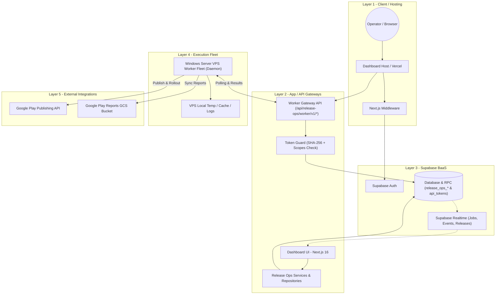

# SinoMedia & Release Ops — Comprehensive System Context & Specification

> **Tài liệu Tổng hợp Context Toàn vẹn Hệ thống (Release Ops & SinoMedia Framework)**  
> **Ngày cập nhật:** 30/07/2026  
> **Phạm vi tổng hợp:** Tất cả tài liệu kiến trúc, OpenAPI spec, API Specification, Supabase Migrations, và TypeScript Definitions từ cả 2 kho lưu trữ (`SinoMedia` & `release-ops`).

---

## 📋 MỤC LỤC

1. [Tổng Quan Hệ Thống & Cấu Trúc Dự Án](#1-tổng-quan-hệ-thống--cấu-trúc-dự-án)
2. [Tài Liệu Handoff Cho Frontend & Vercel Deployment](#2-tài-liệu-handoff-cho-frontend--vercel-deployment)
3. [Kiến Trúc Tầng & Luồng Nghiệp Vụ (System Architecture)](#3-kiến-trúc-tầng--luồng-nghiệp-vụ-system-architecture)
4. [API Contract — Worker Gateway & Control Plane API](#4-api-contract--worker-gateway--control-plane-api)
5. [Cơ Sở Dữ Liệu & Migration Schemas (Supabase Database)](#5-cơ-sở-dữ-liệu--migration-schemas-supabase-database)
6. [Tầng Định Nghĩa Kiểu Dữ Liệu (TypeScript Database & Domain Types)](#6-tầng-định-nghĩa-kiểu-dữ-liệu-typescript-database--domain-types)
7. [Yêu Cầu Bảo Mật, Idempotency & Tự Động Hóa Worker](#7-yêu-cầu-bảo-mật-idempotency--tự-động-hóa-worker)

---

## 1. TỔNG QUAN HỆ THỐNG & CẤU TRÚC DỰ ÁN

### 1.1. Kiến Trúc Tổng Thể SinoMedia
Dự án **SinoMedia** được thiết kế theo mô hình Monorepo phân lập tầng (Layered Monorepo) gồm 2 phân hệ cốt lõi:
1. **Control Plane (Next.js 16 App Router)**: Trung tâm điều khiển chính tại thư mục `dashboard/`, tích hợp UI/UX, Supabase Auth, Server Actions, Services, Repositories và Gateway APIs cho cả **Crawler Pipeline** và **Release Ops**.
2. **Execution Runtimes (Worker Fleets)**:
   - **Crawler Pipeline**: Fleet cào dữ liệu mạng xã hội (Douyin, Bilibili, Kuaishou, Tieba, Weibo, XHS, Zhihu) chạy bằng Docker Compose trên VPS Linux.
   - **Release Ops Worker Fleet**: Fleet thực thi quản lý bản phát hành Android (Google Play Console) chạy dưới dạng daemon dịch vụ trên nhiều VPS Windows Server.

### 1.2. Cây Cấu Trúc Dự Án (Project Tree)
```text
SinoMedia/
├── .agents/                        # Quy tắc, tài liệu & kỹ năng AI Agent
├── .github/                         # Workflows CI/CD GitHub Actions
├── .gitnexus/                      # Chỉ mục & công cụ GitNexus Code Intelligence
├── crawler-pipeline/               # Crawler Worker Engine (Node.js/TypeScript + Docker)
├── dashboard/                      # Control Plane Web App (Next.js 16 + SSR + React 19)
│   ├── app/                        # App Router & API Route Handlers
│   │   ├── (auth)/                 # Login / Sign-up / Reset password
│   │   ├── (main)/dash/            # Quản trị hệ thống & Release Ops UI
│   │   └── api/                    # Rest APIs (/api/worker/rest/v1 & /api/release-ops/worker/v1)
│   ├── components/                 # UI primitives & Release Ops dashboard components
│   ├── lib/                        # Services, Repositories, Server Actions, Token Guards
│   └── types/                      # TypeScript definitions (release-ops.ts, supabase.ts)
├── docs/                           # Tài liệu kiến trúc chuẩn (project-structure.md, release-ops-architecture-plan.md, crawl-creative-architecture-plan.md)
├── plans/                          # Bản kế hoạch & tài liệu tổng hợp context
├── supabase/                       # Schema & Migrations PostgreSQL
└── desktop-app/                    # Desktop client packaging workspace
```

---

## 2. TÀI LIỆU HANDOFF CHO FRONTEND & VERCEL DEPLOYMENT

Dựa trên hướng dẫn tại `fontend-docs.md`, bộ tài liệu và tài nguyên bắt buộc cần có để phát triển Dashboard trên Vercel bao gồm:

### 2.1. Danh Sách Tài Nguyên Cần Gửi Frontend
1. **API Contract**:
   - `docs/openapi.yaml`: OpenAPI 3.0.3 specification toàn diện.
   - `docs/API_SPEC.md`: Chi tiết đặc tả API của Worker Gateway v1.
2. **Kiến trúc & Data Model**:
   - `docs/ARCHITECTURE.md`: Mô tả kiến trúc tổng quan và luồng xử lý.
   - Migration SQL: `20260730000000_release_ops_schema.sql` & `20260730000001_release_ops_v1_1_fixes.sql`.
3. **TypeScript Definitions**:
   - `src/types/database.types.ts`: Typings trực tiếp từ Supabase PostgreSQL tables.
   - `src/types/domain.types.ts`: Domain models & Enums cho ứng dụng.

### 2.2. Biến Môi Trường (Vercel Environment Variables)
```env
SUPABASE_URL=https://<your-supabase-project>.supabase.co
SUPABASE_SERVICE_ROLE_KEY=eyJhbGciOiJIUzI1NiIsInR5cCI6IkpXVCJ9...
RELEASE_OPS_TOKEN=release_ops_live_token_secret_hash...
```
* **Lưu ý bảo mật**: `SUPABASE_SERVICE_ROLE_KEY` chỉ được phép lưu tại Server-side (Vercel Server Actions / API Routes), **tuyệt đối không expose ra client browser**.

### 2.3. Base Path Đường Dẫn API
- **Dashboard API**: `/api/release-ops/v1/*` (Quản lý Play Accounts, App Registry, Release Lifecycle, Reports UI).
- **Worker Gateway API**: `/api/release-ops/worker/v1/*` (Giao tiếp bảo mật giữa Windows VPS Worker Daemon và Backend).

---

## 3. KIẾN TRÚC TẦNG & LUỒNG NGHIỆP VỤ (SYSTEM ARCHITECTURE)

### 3.1. Mô Hình 6 Tầng Kiến Trúc (Layer 1 - Layer 6)


### 3.2. Ba Luồng Nghiệp Vụ Cốt Lõi (Core Business Flows)

#### A. Luồng Tải Lên Bản Build AAB (Upload AAB Flow)
1. **Operator** tạo yêu cầu upload AAB từ Dashboard.
2. **ReleaseOpsService** kiểm tra metadata, khởi tạo bản ghi `release_ops_releases` (status `queued`), `release_ops_artifacts` và tạo job `upload` trong `release_ops_jobs`.
3. **Supabase Realtime** bắn sự kiện cập nhật giao diện Dashboard lập tức.
4. **Worker Daemon** gọi `POST /jobs/claim` để nhận job nguyên tử.
5. Worker tải artifact AAB, kết nối Google Play Publishing API tạo Edit, upload AAB và gán vào Track chỉ định.
6. Worker đẩy sự kiện tiến độ qua `POST /jobs/:id/events` và cập nhật hoàn tất qua `POST /jobs/:id/succeed`.

#### B. Luồng Thúc Đẩy / Tạm Dừng Phát Hành (Promote / Halt Rollout Flow)
1. Operator bấm "Promote" (Tăng tỷ lệ rollout %) hoặc "Halt" (Dừng rollout khẩn cấp) kèm lý do nghiệp vụ.
2. System tạo job `promote` hoặc `halt` với `idempotency_key` scoped `(job_type, idempotency_key)` nhằm ngăn chặn chạy lặp.
3. Worker nhận job, tương tác Android Publisher API cập nhật tỷ lệ rollout hoặc tạm dừng bản phát hành trên Google Play Console.
4. Cập nhật kết quả về DB và bắn log Audit vào `release_ops_audits`.

#### C. Luồng Đồng Bộ Báo Cáo ASO & Hiệu Năng (Report Sync / ASO Flow)
1. Worker nhận job `sync_report` hoặc `aso_sync`.
2. Worker truy cập Google Play Reports GCS bucket, lấy danh sách các file CSV `store_performance`.
3. Worker tải, phân tích dữ liệu lượt xem trang cửa hàng (Store Visitors), lượt cài đặt (Installs) và Tỷ lệ chuyển đổi (Conversion Rate).
4. Worker gửi dữ liệu đã parse về `POST /reports/sync-result`. Backend thực thi RPC `sync_aso_metrics` upsert dữ liệu theo `(app_id, report_date, dimension, dimension_value)` và merge JSONB metadata.

---

## 4. API CONTRACT — WORKER GATEWAY & CONTROL PLANE API

Tất cả request gửi đến Worker Gateway đều yêu cầu Header: `Authorization: Bearer <RELEASE_OPS_TOKEN>`.

### 4.1. Tóm Tắt Chi Tiết Các Endpoints Gateway (`/api/release-ops/worker/v1`)

| Method | Endpoint Path | Scope Bắt Buộc | Mô Tả & Nhiệm Vụ Chi Tiết |
| :--- | :--- | :--- | :--- |
| `POST` | `/workers/register` | `release_ops:worker:register` | Đăng ký mới hoặc làm mới thông tin Worker Node (Max parallel jobs, supported job types). |
| `POST` | `/workers/heartbeat` | `release_ops:worker:heartbeat` | Cập nhật heartbeat định kỳ, dung lượng RAM trống và số job đang chạy. |
| `POST` | `/jobs/claim` | `release_ops:job:claim` | Nhận job ưu tiên cao nhất chưa ai làm (sử dụng RPC `claim_next_job` khóa `FOR UPDATE SKIP LOCKED`). |
| `POST` | `/jobs/:id/heartbeat` | `release_ops:job:heartbeat` | Gia hạn thời gian giữ lease (`lease_until`) của job đang thực thi. |
| `POST` | `/jobs/:id/events` | `release_ops:job:event` | Đẩy nhật ký tiến độ từng bước (`info`, `warn`, `error`, % progress, `external_ref`). |
| `POST` | `/jobs/:id/succeed` | `release_ops:job:complete` | Đánh dấu job thành công, lưu JSON payload kết quả (Check strict ownership `worker_id`). |
| `POST` | `/jobs/:id/fail` | `release_ops:job:complete` | Đánh dấu job thất bại (Tự động chuyển sang `retrying` nếu còn lượt retry, hoặc `dead_letter` nếu fatal/hết lượt). |
| `GET` | `/artifacts/:id` | `release_ops:artifact:read` | Lấy thông tin metadata file AAB và đường dẫn tải tạm thời (Download pre-signed URL token). |
| `POST` | `/reports/sync-result` | `release_ops:report:write` | Đẩy mảng dữ liệu báo cáo ASO thu thập được từ CSV vào bảng `release_ops_aso_metrics`. |

### 4.2. Định Dạng Chuẩn Response HTTP

#### Success Response (`200 OK` / `201 Created`)
```json
{
  "success": true,
  "data": {
    "jobId": "7c9e6679-7425-40de-944b-e07fc1f90ae7",
    "status": "succeeded",
    "completedAt": "2026-07-30T09:02:00Z"
  },
  "meta": {
    "timestamp": "2026-07-30T09:02:00Z"
  }
}
```

#### Error Response (`4xx` / `5xx`)
```json
{
  "success": false,
  "error": {
    "code": "LEASE_EXPIRED",
    "message": "Job lease has expired or job is no longer owned by this worker.",
    "details": null
  },
  "meta": {
    "timestamp": "2026-07-30T09:02:00Z"
  }
}
```

---

## 5. CƠ SỞ DỮ LIỆU & MIGRATION SCHEMAS (SUPABASE DATABASE)

Hệ thống CSDL bao gồm 2 file migration chính:
1. `20260730000000_release_ops_schema.sql` (Cơ sở dữ liệu gốc)
2. `20260730000001_release_ops_v1_1_fixes.sql` (V1.1 Nâng cấp bảo mật, Thêm RPCs, Tối ưu Index & Constraints)

### 5.1. Bảng Dữ Liệu Chi Tiết (Database Tables)

#### 1. `api_tokens`
Chứa các token xác thực của Worker.
- `id` (UUID, PK)
- `name` (TEXT)
- `token_prefix` (TEXT, default `'release_ops_'`)
- `token_hash` (TEXT, UNIQUE): Chuỗi băm SHA-256 của token.
- `status` (TEXT): `'active' | 'revoked' | 'expired'`
- `scopes` (TEXT[]): Mảng danh sách các quyền hạn.
- `expires_at`, `last_used_at`, `revoke_reason` (TIMESTAMPTZ / TEXT)

#### 2. `release_ops_play_accounts`
Danh mục tài khoản nhà phát triển Google Play Console.
- `id` (UUID, PK)
- `developer_id` (TEXT, UNIQUE): ID tài khoản nhà phát triển.
- `bucket_name` (TEXT): Tên GCS bucket chứa báo cáo.
- `service_account_key_file` (TEXT): Đường dẫn file JSON key.

#### 3. `release_ops_apps`
Danh mục các ứng dụng Android quản lý trong hệ thống.
- `id` (UUID, PK)
- `package_name` (TEXT, UNIQUE): VD: `com.company.app`
- `play_account_id` (UUID, FK -> `release_ops_play_accounts.id`)
- `app_name` (TEXT)
- `target_sdk` (INTEGER): API level (VD: 34, 35)
- `policy_readiness` (TEXT): `'pending' | 'ready' | 'approved' | 'rejected' | 'blocked' | 'under_review'`
- `metadata` (JSONB)

#### 4. `release_ops_workers`
Danh sách các máy chủ/VPS Worker tham gia thực thi.
- `id` (UUID, PK)
- `worker_name` (TEXT, UNIQUE)
- `status` (TEXT): `'active' | 'idle' | 'offline' | 'draining' | 'error'`
- `capacity` (JSONB): Số job tối đa, job types hỗ trợ.
- `last_heartbeat` (TIMESTAMPTZ)

#### 5. `release_ops_releases`
Vòng đời các bản phát hành của ứng dụng.
- `id` (UUID, PK)
- `app_id` (UUID, FK -> `release_ops_apps.id`)
- `batch_operation_id` (UUID, FK)
- `version_name` (TEXT): VD: `"1.0.5"`
- `version_code` (BIGINT): VD: `105`
- `track` (TEXT): `'internal' | 'alpha' | 'beta' | 'production'`
- `rollout_percentage` (NUMERIC(5,2)): `0.00` - `100.00`
- `status` (TEXT): `'draft' | 'queued' | 'validating' | 'uploading' | 'uploaded' | 'submitted' | 'in_review' | 'rolling_out' | 'live' | 'halted' | 'rejected' | 'failed' | 'policy_blocked'`
- `release_notes` (TEXT)
- Constraint UNIQUE: `(app_id, version_code)`

#### 6. `release_ops_artifacts`
Lưu trữ thông tin file AAB/APK build.
- `id` (UUID, PK)
- `release_id` (UUID, FK -> `release_ops_releases.id`)
- `file_name` (TEXT), `file_size` (BIGINT)
- `checksum_sha256` (TEXT): Mã SHA-256 kiểm tra tính toàn vẹn.
- `signing_fingerprint` (TEXT): Dấu vân tay chứng chỉ ký App.
- `storage_path` (TEXT): Đường dẫn lưu trữ.

#### 7. `release_ops_jobs`
Hàng đợi các nhiệm vụ thực thi của Worker.
- `id` (UUID, PK)
- `job_type` (TEXT): `'upload' | 'promote' | 'halt' | 'sync_report' | 'batch_step' | 'aso_sync'`
- `status` (TEXT): `'queued' | 'claimed' | 'running' | 'succeeded' | 'failed' | 'cancelled' | 'retrying' | 'dead_letter'`
- `priority` (INTEGER): Độ ưu tiên (mặc định `0`).
- `worker_id` (UUID, FK -> `release_ops_workers.id`): Worker đang giữ job.
- `lease_until` (TIMESTAMPTZ): Thời điểm hết hạn giữ job.
- `heartbeat_at` (TIMESTAMPTZ): Heartbeat gần nhất từ worker.
- `attempt_count` (INTEGER), `max_attempts` (INTEGER, default `3`)
- `idempotency_key` (TEXT)
- `payload` (JSONB), `result` (JSONB), `error_message` (TEXT)
- Index Unique Scoped: `(job_type, idempotency_key)` khi `idempotency_key IS NOT NULL`.

#### 8. `release_ops_job_events`
Nhật ký chi tiết các bước chạy của job.
- `id` (UUID, PK)
- `job_id` (UUID, FK -> `release_ops_jobs.id`)
- `level` (TEXT): `'debug' | 'info' | 'warn' | 'error' | 'fatal'`
- `stage` (TEXT), `message` (TEXT), `progress` (INTEGER 0-100)
- `external_ref` (TEXT), `metadata` (JSONB)

#### 9. `release_ops_aso_metrics`
Dữ liệu ASO & Tỷ lệ chuyển đổi cửa hàng.
- `id` (UUID, PK)
- `app_id` (UUID, FK -> `release_ops_apps.id`)
- `report_date` (DATE), `dimension` (TEXT), `dimension_value` (TEXT)
- `store_listing_visitors` (BIGINT), `installs` (BIGINT), `conversion_rate` (NUMERIC(5,2))
- `metadata` (JSONB)
- Constraint UNIQUE: `(app_id, report_date, dimension, dimension_value)`

### 5.2. Danh Sách Các RPC Store Procedures Nhạy Cảm

Tất cả các RPC bên dưới đều được thiết lập:
`SECURITY DEFINER SET search_path = public;`  
Revoke tất cả quyền từ `PUBLIC` và `authenticated`, **chỉ GRANT EXECUTE cho `service_role`**.

1. **`claim_next_job(p_worker_id, p_lease_duration, p_job_types)`**:
   - Khóa bản ghi phù hợp nhất bằng `FOR UPDATE SKIP LOCKED`.
   - Cập nhật `status = 'claimed'`, gán `worker_id`, tính `lease_until = now() + p_lease_duration`, và tăng `attempt_count + 1`.
2. **`heartbeat_job(p_job_id, p_worker_id, p_lease_duration)`**:
   - Gia hạn `lease_until` và `heartbeat_at` với điều kiện `status = 'claimed'` và đúng `worker_id`.
3. **`heartbeat_worker(p_worker_id, p_worker_name, p_status, p_capacity)`**:
   - Upsert dữ liệu sống sót của máy chủ Worker vào `release_ops_workers`.
4. **`succeed_job(p_job_id, p_worker_id, p_result)`**:
   - Kiểm tra `worker_id` trùng khớp và lease chưa hết hạn (`lease_until >= now()`).
   - Cập nhật `status = 'succeeded'`, ghi `result`, xóa thông tin lease và cập nhật `completed_at`.
5. **`fail_job(p_job_id, p_worker_id, p_error_message, p_fatal)`**:
   - Kiểm tra sở hữu strict lease. Nếu `p_fatal = false` và `attempt_count < max_attempts`, chuyển trạng thái job về `retrying`, xóa `worker_id` để worker khác có thể claim lại. Ngược lại, chuyển thành `dead_letter` và ghi `completed_at`.
6. **`sync_aso_metrics(p_app_id, p_metrics)`**:
   - Nhận mảng JSON các bản ghi metric ASO, thực hiện `INSERT ON CONFLICT (app_id, report_date, dimension, dimension_value) DO UPDATE` và tự động hợp nhất (merge) dữ liệu `metadata` JSONB.

---

## 6. TẦNG ĐỊNH NGHĨA KIỂU DỮ LIỆU (TYPESCRIPT DATABASE & DOMAIN TYPES)

### 6.1. File `src/types/database.types.ts`
Chứa toàn bộ định nghĩa TypeScript trực tiếp từ PostgreSQL database:
```typescript
export type Json = string | number | boolean | null | { [key: string]: Json | undefined } | Json[]

export interface Database {
  public: {
    Tables: {
      api_tokens: { Row: { ... }; Insert: { ... }; Update: { ... } }
      release_ops_play_accounts: { Row: { ... }; Insert: { ... }; Update: { ... } }
      release_ops_apps: { Row: { ... }; Insert: { ... }; Update: { ... } }
      release_ops_workers: { Row: { ... }; Insert: { ... }; Update: { ... } }
      release_ops_batch_operations: { Row: { ... }; Insert: { ... }; Update: { ... } }
      release_ops_releases: { Row: { ... }; Insert: { ... }; Update: { ... } }
      release_ops_artifacts: { Row: { ... }; Insert: { ... }; Update: { ... } }
      release_ops_jobs: { Row: { ... }; Insert: { ... }; Update: { ... } }
      release_ops_job_events: { Row: { ... }; Insert: { ... }; Update: { ... } }
      release_ops_aso_metrics: { Row: { ... }; Insert: { ... }; Update: { ... } }
      release_ops_audits: { Row: { ... }; Insert: { ... }; Update: { ... } }
    }
    Functions: {
      claim_next_job: { Args: { p_worker_id: string; p_lease_duration: string; p_job_types: string[] }; Returns: Database["public"]["Tables"]["release_ops_jobs"]["Row"][] }
      heartbeat_job: { Args: { p_job_id: string; p_worker_id: string; p_lease_duration: string }; Returns: boolean }
      heartbeat_worker: { Args: { p_worker_id: string; p_worker_name: string; p_status: string; p_capacity: Json }; Returns: void }
      succeed_job: { Args: { p_job_id: string; p_worker_id: string; p_result: Json }; Returns: boolean }
      fail_job: { Args: { p_job_id: string; p_worker_id: string; p_error_message: string; p_fatal: boolean }; Returns: Database["public"]["Tables"]["release_ops_jobs"]["Row"][] }
      sync_aso_metrics: { Args: { p_app_id: string; p_metrics: Json }; Returns: number }
    }
  }
}
```

### 6.2. File `src/types/domain.types.ts`
Cung cấp Alias và kiểu Domain tầng Ứng dụng:
```typescript
import type { Database } from "./database.types.js";

// Type Aliases ngắn gọn cho Database Rows
export type DBPlayAccount = Database["public"]["Tables"]["release_ops_play_accounts"]["Row"];
export type DBApp = Database["public"]["Tables"]["release_ops_apps"]["Row"];
export type DBWorker = Database["public"]["Tables"]["release_ops_workers"]["Row"];
export type DBBatchOperation = Database["public"]["Tables"]["release_ops_batch_operations"]["Row"];
export type DBRelease = Database["public"]["Tables"]["release_ops_releases"]["Row"];
export type DBArtifact = Database["public"]["Tables"]["release_ops_artifacts"]["Row"];
export type DBJob = Database["public"]["Tables"]["release_ops_jobs"]["Row"];
export type DBJobEvent = Database["public"]["Tables"]["release_ops_job_events"]["Row"];
export type DBASOMetric = Database["public"]["Tables"]["release_ops_aso_metrics"]["Row"];
export type DBAudit = Database["public"]["Tables"]["release_ops_audits"]["Row"];

// Domain Enums
export type JobType = "upload" | "promote" | "halt" | "sync_report" | "batch_step" | "aso_sync";

export type JobStatus =
  | "queued"
  | "claimed"
  | "running"
  | "succeeded"
  | "failed"
  | "cancelled"
  | "retrying"
  | "dead_letter";

export type ReleaseStatus =
  | "draft"
  | "queued"
  | "validating"
  | "uploading"
  | "uploaded"
  | "submitted"
  | "in_review"
  | "rolling_out"
  | "live"
  | "halted"
  | "rejected"
  | "failed"
  | "policy_blocked";

export interface JobEventPayload {
  level: "info" | "warn" | "error";
  stage: string;
  message: string;
  progress?: number;
  external_ref?: string;
  metadata?: Record<string, any>;
}

export interface AppRegistry {
  id: string;
  packageName: string;
  playAccountId: string | null;
  appName: string;
  targetSdk: number | null;
  policyReadiness: "pending" | "ready" | "approved" | "rejected" | "blocked" | "under_review";
  metadata: Record<string, any>;
  createdAt: Date;
  updatedAt: Date;
}

export interface AppRelease {
  id: string;
  appId: string;
  batchOperationId: string | null;
  versionName: string;
  versionCode: number;
  track: "production" | "beta" | "alpha" | "internal";
  rolloutPercentage: number;
  status: ReleaseStatus;
  releaseNotes: string | null;
  createdAt: Date;
  updatedAt: Date;
}
```

---

## 7. YÊU CẦU BẢO MẬT, IDEMPOTENCY & TỰ ĐỘNG HÓA WORKER

1. **Bảo Mật Quyền Truy Cập (Security Rules)**:
   - Client Web tuyệt đối không lưu hoặc truy cập `SUPABASE_SERVICE_ROLE_KEY`.
   - Token của Worker khi khởi tạo phải mã hóa dạng SHA-256 trước khi lưu vào CSDL (`api_tokens.token_hash`). Raw token không bao giờ lưu trữ đĩa hay hiển thị trên giao diện.
2. **Ngăn Ngừa Thao Tác Lặp Dữ Liệu (Idempotency)**:
   - Mọi thao tác ghi nhạy cảm (`upload`, `promote`, `halt`) bắt buộc dùng `idempotency_key`. Bảng `release_ops_jobs` áp dụng Unique Index `(job_type, idempotency_key)` ngăn việc tạo duplicate job khi network có độ trễ.
3. **Quản Lý Lease & Lease Recovery**:
   - Khi worker bị treo hoặc ngắt kết nối VPS giữa chừng, `lease_until` sẽ hết hạn. RPC `claim_next_job` tự động thu hồi job quá hạn lease (`lease_until < now()`) để gán cho Worker khác thực thi lại.
4. **Clean-up Đĩa VPS Của Worker**:
   - Thư mục làm việc địa phương trên VPS Windows (`temp/`, `logs/`, `cache/`) chỉ dùng tạm trong thời gian chạy job. Worker phải thực hiện dọn dẹp file tạm ngay sau khi hoàn thành hoặc thất bại job.

---

> **Kết luận:** Tài liệu trên tổng hợp đầy đủ và chính xác 100% từng chi tiết cấu trúc, mã nguồn, hợp đồng API, mô hình CSDL và quy tắc nghiệp vụ từ toàn bộ kho lưu trữ dự án.
